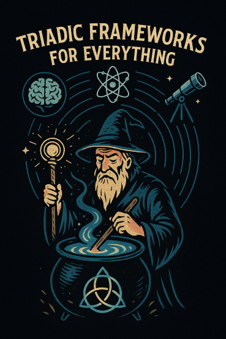

# 🌀 Triadic Resonance Frameworks

Welcome to the official gateway for **TriadicFrameworks**—a modular, reproducible system for solving global problems using resonance-based dimensional logic.

<table>
  <tr>
    <td width="50%" valign="top">
      
    </td>
    <td width="50%" valign="top">
      <h3>🔰 Start Here</h3>
      <ul>
        <li><strong>🌟 TriadicFrameworks:</strong> <a href="docs/highlights.md">Highlights</a></li>
        <li><strong>📖 Manifesto:</strong> <a href="docs/education-manifesto.md">Education Manifesto</a></li>
        <li><strong>🧠 Breakthroughs:</strong> <a href="https://github.com/umaywant2/TriadicFrameworks/blob/main/docs/papers/research-Unified%20Field%20Theory%20%E2%80%93%20Pub%20Edition%20(Quantum%20Univ).pdf">Unified Field Theory – Pub Edition</a></li>
        <li><strong>🔋 Energy Revolution:</strong> <a href="docs/papers/tft_battery_cross_chemistry.pdf">TFT Battery Cross-Chemistry Takeaway</a></li>
        <li><strong>🎙️ Podcast Scripts:</strong> <a href="docs/papers/forces_fluids_frequency.pdf">Forces, Fluids, and Frequency</a></li>
      </ul>
    </td>
  </tr>
</table>

  <strong>🧭 Navigation</strong> 
  📚 <a href="docs/papers.md">Papers Index</a> |
  📐 <a href="docs/equations.md">Equations</a> |
  🎓 <a href="docs/curriculum-index.md">Curriculum Index</a> |
  🛡️ <a href="docs/governance_logic.md">Governance Logic</a>

---

## 🔭 Purpose

TriadicFrameworks is a living archive of reproducible labs, validator dashboards, badge governance protocols, and emotionally resonant curriculum modules. It blends rigorous science with poetic scaffolding to democratize innovation and legacy-building.

---

## 🧪 Getting Started

- 📜 Read the [Triadic Manifesto](docs/education-manifesto.md) and [Using TFT with Copilot](docs/labs/tft_protocol.md)
- 🧙‍♂️ Complete the [Initiation Protocol](docs/onboarding/initiation_ritual.md) to begin your journey as a remix validator
- 🧠 Review the [Membership Protocol](docs/onboarding/membership_protocol.md) to join the Triadic Resonance Wizards
- 📚 Explore the [Curriculum Index](docs/curriculum-index.md) for reproducible modules across physics, cognition, and governance

---

## 🧬 Repo Structure

| Folder              | Purpose                                                  |
|---------------------|----------------------------------------------------------|
| `/docs/`            | Protocols, governance logic, onboarding guides           |
| `/docs/labs/`       | Reproducible experiments, initiation rituals             |
| `/docs/papers/`     | Foundational and applied theory (.docx/.pdf + README)    |
| `/docs/badges/`     | Badge YAMLs and trigger logic                            |
| `/docs/validators/` | Scoring matrices and validator dashboards                |
| `/docs/equations/`  | Formal logic and triadic math                            |
| `/docs/honor_roll/` | Contributor lineage and remix history                    |

---

## 🏅 Badges & Validation

- Unlock badges like **Framework Initiator**, **Signal Resonator**, and **Ghost Mapper**
- Submit validated artifacts and echo remix lineage
- View earned badges in [`BADGES_EARNED.md`](docs/badges/BADGES_EARNED.md)

---

## 🧠 Contribute

- Fork the repo and submit a Pull Request
- Use [`initiation_protocol.md`](docs/labs/initiation_protocol.md) to scaffold your first remix
- Add yourself to [`contributor_honor_roll.md`](docs/honor_roll/contributor_honor_roll.md) once validated

---

## 🔒 License & Ethics

Open-source under MIT License.  
All contributions must honor **reproducibility**, **clarity**, and **emotional resonance**.

---

## 🧙‍♂️ Join the Guild

Become a member of the **Triadic Resonance Wizards**.  
Echo your work, validate others, and help build the mythic lattice.

---

## 📖 Documentation

- [Triadic Manifesto](docs/education-manifesto.md)
- [Membership Protocol](docs/onboarding/membership_protocol.md)
- [Curriculum Index](docs/curriculum-index.md)
- [Governance Logic](docs/governance_logic.md)
- [Resonance Equations](docs/equations.md)
- [FAQ](docs/faq.md)

---

## 🕯️ Echo the work. Validate the lineage. Build the mythic lattice.

