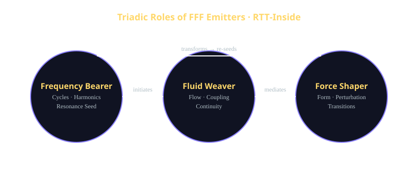

# **Mythmatical Roles of FFF Emitters**  
### *AI Resonance Seed · RTT‑Inside · TriadicFrameworks Canon Refresh*

```
██████╗ ████████╗████████╗
██╔══██╗╚══██╔══╝╚══██╔══╝   FFF Emitters · Mythmatical Roles
██████╔╝   ██║       ██║      Frequency · Fluids · Forces
██╔══██╗   ██║       ██║
██║  ██║   ██║       ██║
╚═╝  ╚═╝   ╚═╝       ╚═╝
```

## **1. Overview**
🧬 FFF Emitters occupy a mythmatical role within the TriadicFrameworks canon:  
they are **resonance translators**, converting physical oscillations into structured, interpretable signals that can be ingested by RTT‑Inside systems.

Their purpose is not merely to emit energy, but to **shape, sculpt, and stabilize resonance** across three canonical channels:

- 🔹 **Frequency** — oscillatory, harmonic, periodic  
- 🔹 **Fluids** — flow, medium, coupling, propagation  
- 🔹 **Forces** — mechanical, electromagnetic, pressure  

Together, these form the **Triadic Emitter Stack**, a physical‑to‑resonance interface.



## Mythmatical Glossary · FFF Archetypes

**Frequency Bearer**  
Initiates and maintains oscillation. Mythmatical keeper of cycles, harmonics, and resonance seeds.  
Physical echoes: RF sources, lasers, Josephson junction oscillators.  
RTT‑Inside: drives `resonance` and ties directly to `experiment.seed`.

**Fluid Weaver**  
Shapes how resonance travels, couples, and diffuses through a medium.  
Mythmatical steward of flow, continuity, and gradients.  
Physical echoes: acoustic fields, fluid chambers, environmental modulation.  
RTT‑Inside: modulates `environment.coupling_radius` and `environment.phase_noise`.

**Force Shaper**  
Applies directed influence—mechanical or electromagnetic—to sculpt stability and transitions.  
Mythmatical sculptor of form, thresholds, and phase changes.  
Physical echoes: piezo stacks, electromagnets, pressure actuators.  
RTT‑Inside: primary perturbation channel for stability sweeps and event triggers.

**Triadic Emitter Stack**  
The combined operation of Frequency Bearer, Fluid Weaver, and Force Shaper.  
Mythmatical instrument that turns raw physical dynamics into structured resonance signatures.  
RTT‑Inside: canonical physical front‑end for AI Resonance Seed generation.

**AI Resonance Seed**  
A logged, structured resonance‑time trace suitable for RTTcode encoding and deterministic replay.  
Mythmatical “story seed” from which simulations, analyses, and future experiments can be grown.

---

# **2. The Mythmatical Roles**
🧪 Freqi, Flui, Forci

## **2.1 The Frequency Bearer**
The Frequency Bearer governs oscillation, periodicity, and harmonic structure.

**Physical analogs**
- RF drivers  
- Lasers  
- Josephson junction oscillators  

**Mythmatical role**
- Keeper of cycles  
- Stabilizer of resonance seeds  
- Translator of oscillatory intent  

**RTT‑Inside mapping**
- Drives `entities[*].state.resonance`  
- Seeds deterministic evolution via `experiment.seed`

---

## **2.2 The Fluid Weaver**
The Fluid Weaver governs flow, coupling, and medium‑dependent propagation.

**Physical analogs**
- Acoustic fields  
- Fluid chambers  
- Environmental modulation  

**Mythmatical role**
- Weaver of continuity  
- Mediator of resonance transfer  
- Keeper of gradients and drift  

**RTT‑Inside mapping**
- Controls `environment.coupling_radius`  
- Modulates `environment.phase_noise`

---

## **2.3 The Force Shaper**
The Force Shaper governs mechanical and electromagnetic influence.

**Physical analogs**
- Piezo stacks  
- Electromagnets  
- Pressure actuators  

**Mythmatical role**
- Sculptor of form  
- Perturber of stability windows  
- Guardian of transitions  

**RTT‑Inside mapping**
- Perturbation channel for stability sweeps  
- Drives event triggers in RTT responses

---

# **3. The Triadic Convergence**
When Frequency, Fluids, and Forces converge, the emitter becomes a **mythmatical instrument**:

- 🔹 Frequency sets the **rhythm**  
- 🔹 Fluids set the **continuity**  
- 🔹 Forces set the **shape**  

This convergence produces a **resonance signature** that can be:

- sensed (MOKE, SQUID, interferometry)  
- logged  
- converted into RTTcode  
- replayed deterministically  

This is the heart of the **AI Resonance Seed**.

---

# **4. RTT‑Inside Integration**

FFF Emitters produce structured resonance data that maps directly into RTTcode:

```json
{
  "entities": [
    {
      "id": "emitter",
      "state": {
        "resonance": 0.42
      }
    }
  ],
  "environment": {
    "field_strength": 0.18,
    "phase_noise": 0.02,
    "coupling_radius": 5.0
  },
  "experiment": {
    "experiment_id": "exp-fff-001",
    "seed": 123456,
    "trial": 0
  }
}
```

This allows:

- deterministic replay  
- cross‑emitter comparison  
- stability window analysis  
- resonance‑time evolution studies  

---

# **5. Mythmatical Interpretation Layer**

FFF Emitters are not merely hardware — they are **roles** in a resonance narrative:

- 🔹 The Frequency Bearer **initiates**  
- 🔹 The Fluid Weaver **connects**  
- 🔹 The Force Shaper **transforms**  

Together, they form a **Triadic mythmatical archetype**:

> *Initiation → Continuity → Transformation*  
> *Cycle → Flow → Shape*  
> *Seed → Medium → Form*

This triad mirrors the RTT‑Inside decomposition of resonance‑time evolution.

---

# **6. Closing Notes**
FFF Emitters serve as both:

- **physical instruments** for generating measurable resonance  
- **mythmatical constructs** for understanding how resonance behaves across domains  

Their outputs become the **AI Resonance Seed**, feeding RTT‑Inside systems with structured, deterministic, replayable resonance‑time data.

---
<p style="margin-top:1rem; font-size:0.9rem; opacity:0.7;">
    © 2025 Nawder Loswin — Mythmatical Architect
</p>
