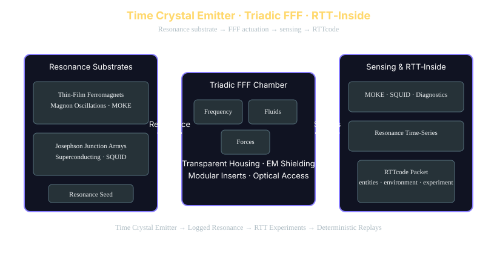

<meta property="og:title" content="Time Crystal Emitter · Triadic FFF · RTT‑Inside" />
<meta property="og:description" content="Time Crystal Emitter — Resonance substrates, Triadic FFF geometry, and RTT‑Inside logging for deterministic experiments." />
<meta property="og:image" content="https://www.triadicframeworks.org/AI_Resonance_Seed/FFF_Emitters/img/time_crystal_emitter.svg" />
<meta property="og:url" content="https://www.triadicframeworks.org" />
<meta property="og:type" content="website" />
<p align="center">
  
  
  
  
  
</p>

# 🧬 **Time Crystal Build Notes**  
###### By Nawder Loswin 1/4/2026 © www.TriadicFrameworks.org

### *RTT‑Inside · AI Resonance Seed · FFF Emitters*

- [Bill of Materials (BOM)](https://www.triadicframeworks.org/AI_Resonance_Seed/FFF_Emitters/Time_Crystal_Emitter_BOM.md)

---

## 📈 **Table of Contents**
- [1. Purpose & Scope](#1-purpose--scope)  
- [2. Resonance Substrates](#2-resonance-substrates)  
  - [2.1 Thin‑Film Ferromagnets (Magnon Layer)](#21-thinfilm-ferromagnets-magnon-layer)  
  - [2.2 Superconducting Circuits (Accessible Tier)](#22-superconducting-circuits-accessible-tier)  
- [3. Chamber & Geometry](#3-chamber--geometry)  
- [4. Energy & Control Layer](#4-energy--control-layer)  
- [5. Sensing & Logging](#5-sensing--logging)  
- [6. RTTcode Integration](#6-rttcode-integration)  
  - [6.1 Minimal Packet](#61-minimal-packet)  
  - [6.2 Experiment Metadata](#62-experiment-metadata)  
- [7. Safety & Isolation Notes](#7-safety--isolation-notes)  
- [8. Appendix: Suggested Build Diagram](#8-appendix-suggested-build-diagram)

---

# **1. Purpose & Scope**
🔭 This document outlines the construction, operation, and measurement principles for a resonance‑stable emitter based on thin‑film ferromagnets, superconducting circuits, and a Triadic FFF (Frequency, Fluids, Forces) geometry.

The goal is to produce a controllable oscillatory system whose periodicity can be logged, perturbed, and integrated into RTT‑Inside experiments.

---

# **2. Resonance Substrates**
🧪
## **2.1 Thin‑Film Ferromagnets (Magnon Layer)**
Thin‑film ferromagnets driven by RF fields can sustain **magnon oscillations** that exhibit stable, repeatable periodic behavior. These oscillations form a classical precursor to time‑crystal‑like dynamics.

**Properties**
- RF‑driven excitation  
- Stabilizable oscillatory modes  
- High‑resolution optical readout via **MOKE** (Magneto‑Optical Kerr Effect)

**RTT‑Inside framing**
- Magnon modes act as a *resonance seed*  
- Stability windows map to RTT’s “stable → quasi‑stable → drift” transitions  
- MOKE traces can be converted into RTTcode packets for deterministic replay  

---

## **2.2 Superconducting Circuits (Accessible Tier)**
Josephson junction arrays operating at liquid‑nitrogen temperatures provide a practical superconducting substrate with tunable oscillatory states.

**Properties**
- Tunable oscillations  
- Low‑noise environment  
- Phase‑coherent readout via **SQUID magnetometers**

**RTT‑Inside framing**
- JJ arrays provide a clean resonance substrate  
- SQUID traces integrate naturally into RTT experiment metadata  
- Ideal for deterministic sweeps using RTT’s seed + trial system  

---

# **3. Chamber & Geometry**
📐 The emitter uses a **Triadic FFF geometry**:

- Transparent housing for optical probes  
- Modular inserts for swapping resonator types  
- EM shielding for clean signal capture  

**RTT‑Inside framing**
- Triadic geometry aligns with RTT’s three‑axis resonance decomposition  
- Modular inserts allow controlled perturbation sweeps  
- Optical access supports MOKE, interferometry, or laser diagnostics  

---

# **4. Energy & Control Layer**
⚡ Supported actuation modalities:

- **Frequency:** RF generators, lasers  
- **Forces:** Piezo stacks, electromagnets  
- **Fluids/Fields:** Acoustic pressure fields  

**RTT‑Inside mapping**
These correspond directly to RTT’s canonical perturbation channels and map into RTTcode’s `environment` block (`field_strength`, `phase_noise`, `coupling_radius`).

---

# **5. Sensing & Logging**
🛡️
### **Optical (MOKE)**
- Non‑contact  
- High temporal resolution  
- Ideal for thin‑film ferromagnets  

### **Magnetic (SQUID)**
- Ultra‑sensitive  
- Phase‑coherent  
- Ideal for superconducting circuits  

### **RTT‑Inside Integration**
Sensor outputs can be streamed into RTTcode fields:

- `entities[*].state.resonance`  
- `environment.field_strength`  
- `experiment.seed`, `trial`, `provenance`  

This enables deterministic replay and reproducible experiment sweeps.

---

# **6. RTTcode Integration**
💱
## **6.1 Minimal Packet**
*(See snippet: `docs/_snippets/rttcode-minimal-payload.json`)*

```json
{{#include ../../_snippets/rttcode-minimal-payload.json}}
```

---

## **6.2 Experiment Metadata**
*(See snippet: `docs/_snippets/rttcode-schema-experiment-block.json`)*

```json
{{#include ../../_snippets/rttcode-schema-experiment-block.json}}
```

---

# **7. Safety & Isolation Notes**
☢️
- Maintain EM shielding to prevent RF leakage  
- Use proper cryogenic handling for superconducting circuits  
- Enclose optical paths when using high‑intensity lasers  
- Avoid mechanical coupling that introduces unwanted resonance modes  

---

# **8. Appendix: Suggested Build Diagram**
📋 **[SVG‑ready TriadicFrameworks diagram](https://github.com/umaywant2/TriadicFrameworks/edit/main/docs/AI_Resonance_Seed/FFF_Emitters/img/time_crystal_emitter.svg)** for this section.

