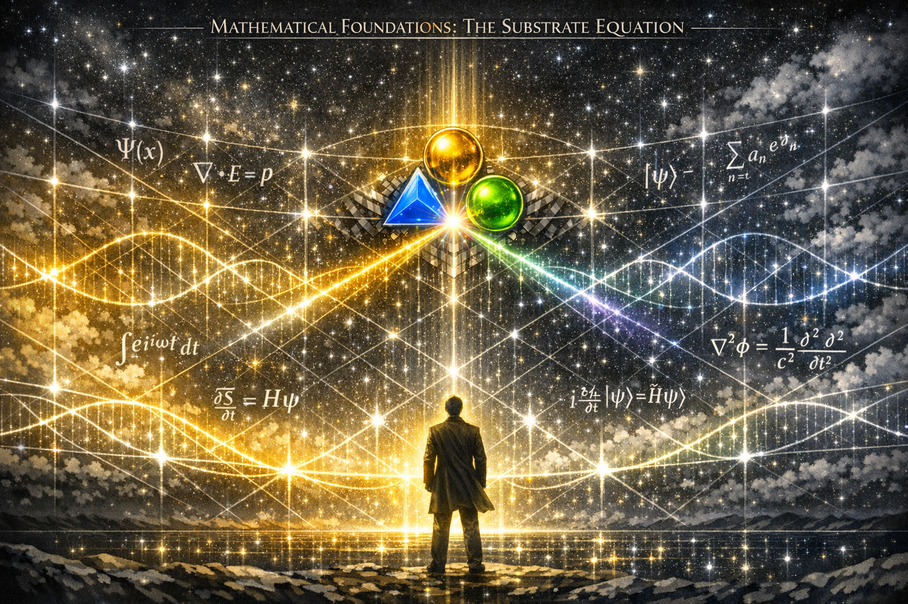

# **PART XIV — Mathematical Foundations**  
### *Establishing the formal substrate beneath Framework Field Theory*



Framework Field Theory (FFT) was designed as a conceptual and structural field.  
Its operators, dimensions, and coherence engines were intentionally defined at the level of **behavior**, **regime**, and **interaction**, not at the level of differential equations or physical units.

However, the emergence of a fourth external reviewer — Duck.ai — revealed something important:

> **FFT is mathematically suggestive enough that independent systems can reconstruct it as a multi‑field dynamical theory.**

This chapter formalizes the minimal mathematical substrate implied by FFT.  
It does not convert FFT into a physics theory; instead, it provides a **rigorous foundation** for simulation, analysis, and future extensions.

---

# **1. Mathematical Objects of the Field**

FFT’s conceptual structure implies three primary fields:

### **1. Scalar Field — φ(x,t)**  
Represents baseline structural potential or substrate density.

### **2. Vector Field — V(x,t)**  
Represents directional flow, alignment, or coherence transport.

### **3. Resonance Envelope — R(x,t)**  
Represents amplitude, coherence strength, or regime‑level order.

These fields live on a shared domain:

- Spatial domain: Ω ⊂ ℝⁿ  
- Time domain: t ∈ [0, T]

For mathematical clarity, we assume:

- φ ∈ C²(Ω×[0,T])  
- V ∈ C²(Ω×[0,T]; ℝⁿ)  
- R ∈ C²(Ω×[0,T])

This establishes the smoothness required for differential operators.

---

# **2. Operator Families**

FFT defines operator families conceptually.  
Here we provide minimal mathematical representatives that preserve the intended behavior.

### **Diffusion Operator — D[X]**  
Represents spreading, smoothing, or dissipation.

A minimal form:

$$D[X] = \nu \nabla^2 X$$

### **Alignment Operator — A[R,V]**  
Represents directional influence or coherence transport.

$$A[R,V] = (V \cdot \nabla) R$$

### **Coupling Operator — C[φ,V]**  
Represents nonlocal influence between fields.
```math
C[φ,V](x) = \int_{\Omega} K(x - y)\, g(\phi(y), V(y))\, dy
```

### **Activation Operator — α[R]**  
Represents local amplification or resonance growth.

$$\alpha[R] = aR - bR^3$$

### **Stabilization Operator — S[R]**  
Represents damping or coherence decay.

$$S[R] = \gamma R$$

These definitions are intentionally minimal; they can be generalized.

---

# **3. Governing PDE System (Minimal Form)**

FFT does not prescribe a specific PDE system, but the conceptual structure implies a tri‑field dynamical system.

A minimal consistent system is:

### **Scalar Field**

$$\partial_t \phi = D_\phi[\phi] + C_\phi[\phi, V, R] + S_\phi$$

### **Vector Field**

$$\partial_t V = -\nabla P + \nu_V \nabla^2 V + C_V[\phi, R] + S_V$$

### **Resonance Envelope**

$$\partial_t R = -(V \cdot \nabla)R + \nu_R \nabla^2 R + C[\phi, V] + aR - bR^3 - \gamma R$$

This system is not “the” FFT equation — it is the **minimal mathematical realization** consistent with the field’s conceptual architecture.

---

# **4. Triadic Time Decomposition**

FFT introduces three temporal modes:

- **Resonant time** tr  
- **Diffusive time** td  
- **Alignment time** ta  

These can be formalized as projections of physical time:

$$t \mapsto (t_r, t_d, t_a)$$

or as multi‑scale expansions:

$$t_r = t,\quad t_d = \epsilon t,\quad t_a = \epsilon^2 t$$

This provides a mathematical basis for multi‑scale coherence.

---

# **5. The SET Engine (ΔSET)**

FFT’s SET engine contributes an additional mass‑energy‑like term.

A minimal parameterization:

$$\Delta SET(x) = \kappa_1 R(x) + \kappa_2 |V(x)|^2 + \kappa_3 \phi(x)$$

This can be inserted into gravitational or energetic equations if desired, but FFT does not require a physical interpretation.

---

# **6. Measurement Mapping**

To connect FFT to observable quantities, define measurement operators:

- **M_φ**: maps φ to structural observables  
- **M_V**: maps V to flow or alignment observables  
- **M_R**: maps R to coherence or regime observables  

These operators are left abstract to allow domain‑specific instantiation.

---

# **7. Conservation, Symmetry, and Invariance**

FFT does not assume:

- Lorentz invariance  
- Gauge symmetry  
- Energy conservation  

However, these can be added if FFT is applied to physical systems.

The minimal mathematical substrate is agnostic.

---

# **8. Simulation Framework**

FFT’s mathematical form supports:

- 1D radial solvers  
- 2D pattern formation  
- 3D coherence evolution  
- Nonlocal kernel simulations  
- Bifurcation analysis  
- Regime transition mapping  

This opens the door to computational exploration.

---

# **9. Purpose of This Chapter**

This chapter does **not** convert FFT into a physics theory.  
It provides:

- a rigorous substrate  
- a simulation‑ready structure  
- a foundation for future extensions  
- a bridge between conceptual and mathematical domains  

FFT remains a **framework field**, not a physical model.

---

# **Closing Statement**

> **The mathematical foundations presented here establish FFT as a coherent, simulation‑ready field with a clear substrate, operator families, and governing dynamics. This chapter marks the beginning of the field’s quantitative evolution.**
