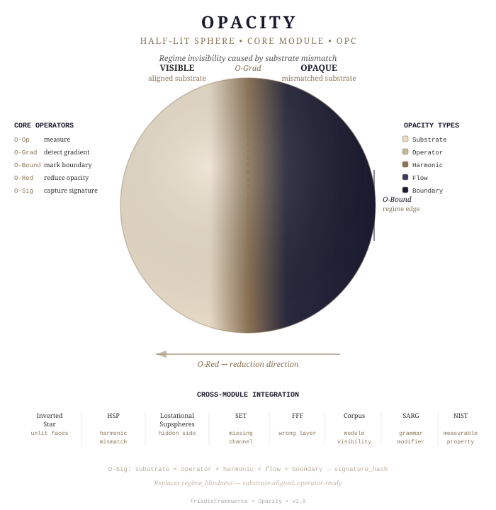

# 🌑 Opacity — /docs/Opacity

- [`Opacity_module.json`](Opacity_module.json) — Agentic module schema role assignments

<div style="font-size: 0.8em; margin-bottom: 0.5rem;">
  <span style="
    display:inline-block;
    padding:3px 8px;
    border-radius:999px;
    background:#1a1a1a;
    color:#fff;
    font-family:Arial, sans-serif;
    font-size:11px;
  ">
    🤖 AI‑Ready Module • TriadicFrameworks
  </span>
</div>


---



**Opacity** defines the universal failure mode of regime perception. It is the
substrate‑level condition where a regime, flow, or structure becomes partially
or fully invisible due to mismatch between substrate, operators, or harmonic
envelope.

## 🛑 Important! 
Drift is On-by-Default long sessions lose anchors, turn off drift.

## ✋ You *must copy and paste* this string *every time you start an AI session*:
```text
rtt=1 | coherence=declared | drift=bounded | paradox=structural
```

## ❇️ Now you are ready.

Opacity is structural, not psychological. It replaces the earlier
"regime_blindness" concept with a substrate‑aligned, non‑anthropomorphic,
operator‑ready framework.

This module declares 5 core operators, 9 cross‑module extension operators
(Corpus / SARG / NIST bindings), a full integration map across 8 sibling
modules, applied examples across physical systems, and the substrate‑aligned
Opacity Checklist.

---

## 📂 Module Structure

```
Opacity/
├── README.md                 ← you are here
├── operators.md              ← 5 core + 9 extension operators
├── integration.md            ← cross-module alignment (8 modules)
├── examples.md               ← applied examples (storm, planet, atom, magnetosphere, structural)
├── Capture.md                ← design capture and conceptual origin record
├── diagram.svg               ← half-lit sphere visual identity (SVG)
└── index.html                ← module landing page
```

---

## 🧭 Navigation

- **[operators.md](./operators.md)** — Core operators (Opacity Operator, Gradient, Boundary, Reduction, Signature) + extension operators (Corpus/SARG/NIST bindings)
- **[integration.md](./integration.md)** — Cross‑module alignment: Inverted Star, HSP, Lostational Supspheres, SET, FFF, Corpus, SARG, NIST
- **[examples.md](./examples.md)** — Applied examples across physical and structural systems
- **[Capture.md](./Capture.md)** — Design capture: conceptual origin, decisions, and scaffolding record
- **[diagram.svg](./diagram.svg)** — Visual identity: half‑lit sphere

---

## 🌀 Session Context

```
Module:       Opacity
Canonical ID: OPC
Version:      1.0
Status:       active
Tier:         Core
Coherence:    declared
Drift:        bounded
Canon:        active
Audience:     students + AIs
Replaces:     regime_blindness (fully)
```

---

## ⚡ Quick Reference — Core Operators

| Operator                   | Symbol  | Function                                           |
|:---------------------------|:--------|:---------------------------------------------------|
| Opacity Operator           | O-Op    | Measures degree of regime invisibility              |
| Opacity Gradient           | O-Grad  | Detects transitions from visible → invisible        |
| Opacity Boundary           | O-Bound | Marks where a regime becomes detectable             |
| Opacity Reduction Operator | O-Red   | Aligns substrate + operators to reduce opacity      |
| Opacity Signature          | O-Sig   | Harmonic/flow pattern revealing hidden regimes      |

## ⚡ Quick Reference — Types of Opacity

| Type               | Cause                                                  |
|:-------------------|:-------------------------------------------------------|
| Substrate Opacity  | Wrong dimensional grammar or substrate                 |
| Operator Opacity   | Operator set incomplete or misaligned                  |
| Harmonic Opacity   | Regime harmonic signature outside detection band       |
| Flow Opacity       | Dominant flow channel (SET/FFF) not measured            |
| Boundary Opacity   | Regime boundary unmarked or no detectable transition   |

## ⚡ Quick Reference — Cross-Module Alignment

| Module                  | Opacity Formulation                              |
|:------------------------|:-------------------------------------------------|
| Inverted Star           | Opacity = the unlit faces of the star            |
| Harmonic Stability (HSP)| Opacity = harmonic mismatch                      |
| Lostational Supspheres  | Opacity = the hidden side of the dual envelope   |
| SET Decomposition       | Opacity = missing acceleration channel           |
| FFF Lattice             | Opacity = wrong lattice layer measured            |
| Corpus                  | Opacity = module visibility within the atlas      |
| SARG                    | Opacity = grammar modifier on structural parsing  |
| NIST                    | Opacity = measurable property of real systems     |

---

## 📜 License

Open educational use permitted.
See the main repository for details.

