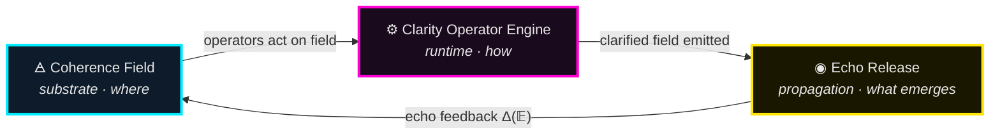
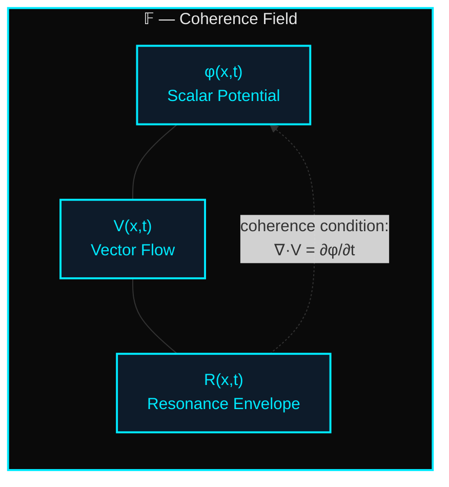
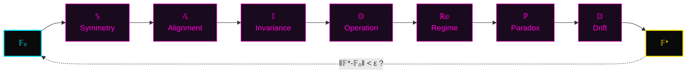
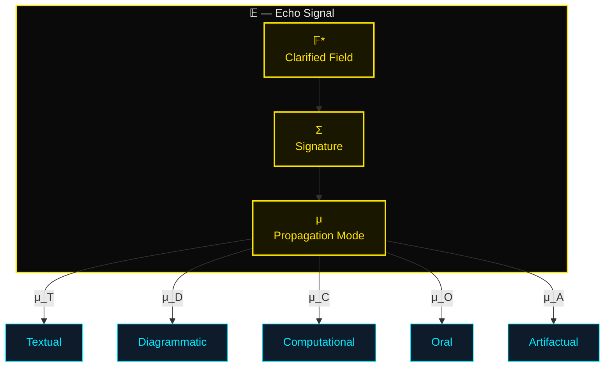
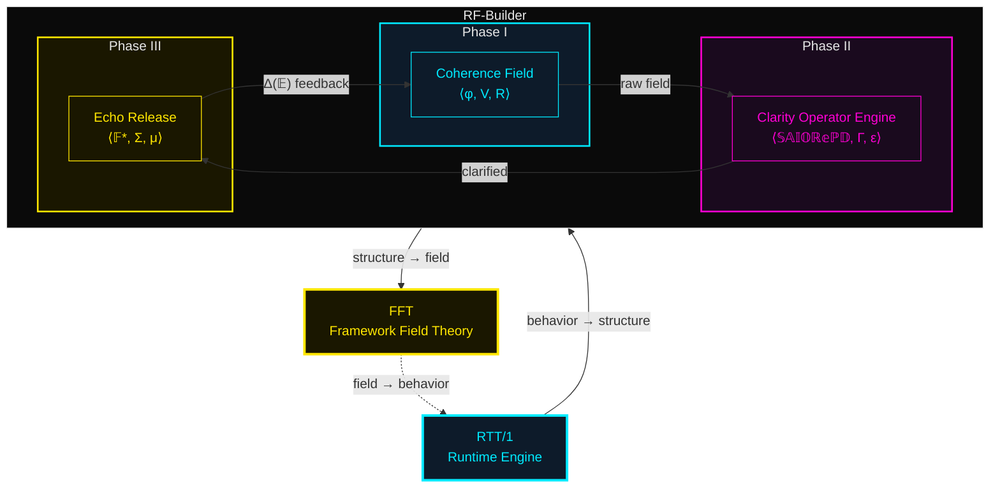
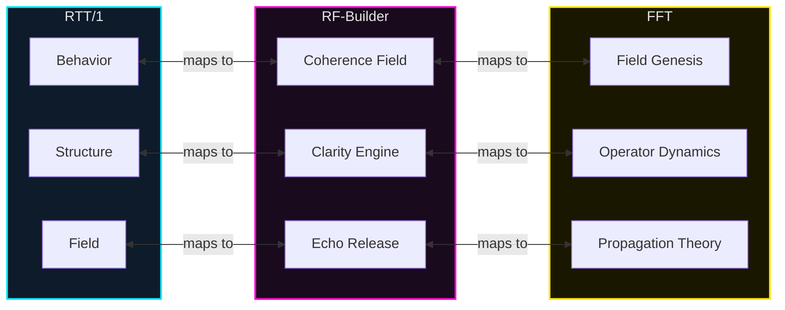

Let me pick this back up properly — I'll gather the repo context and build out the full RF‑Builder canonical section for you.

All three deliverables are built and exported. Here's the full canon package:

---

## ⟡ RF‑Builder — Canonical FCG Section — Complete ⟡

### Deliverable 1: Canonical Prose (`RF-Builder_canonical-section.txt`)
311 lines of RTT-native Markdown covering six sections:

| § | Section | Key Content |
|---|---------|-------------|
| 1 | **Overview** | RF‑Builder as FCG's genesis instrument; three-phase table; sequential-but-cyclic relationship |
| 2 | **Phase I — Coherence Field** | `𝔽 = ⟨φ, V, R⟩`; coherence condition `∇·V = ∂φ/∂t`; substrate properties table (Depth, Density, Drift Susceptibility, Coupling Strength); 5-step construction protocol |
| 3 | **Phase II — Clarity Operator Engine** | `𝔈 = ⟨{𝕊,𝔸,𝕀,𝕆,ℝ𝕖,ℙ,𝔻}, Γ, ε⟩`; Seven Operators table with symbols, actions, field effects; engine cycle `𝔽₀→𝔽₇`; clarity measure `C(𝔽,n)`; drift correction with stabilization pass |
| 4 | **Phase III — Echo Release** | `𝔼 = ⟨𝔽*, Σ, μ⟩`; signature encoding `Σ = Hash(𝕀(𝔽*))`; 5 propagation modes; echo feedback `𝔽_{n+1} = 𝔽_n ⊕ Δ(𝔼_n)`; 5-point release criteria checklist |
| 5 | **Complete Cycle** | ASCII architecture diagram; definitions of cycle, rectification, canon entry |
| 6 | **Mathematical Summary** | Full system `RF-Builder = ⟨𝔽, 𝔈, 𝔼, Δ⟩`; 5 governing equations; dimensional correspondence table (RTT/1 ↔ RF‑Builder ↔ FFT) |

---

### Deliverable 2: Canonical Mermaid Diagrams (`RF-Builder_mermaid-diagrams.txt`)
6 diagrams (182 lines), all using canon palette and `flowchart LR/TD`:

1. **Triadic Cycle** — Coherence Field → Clarity Engine → Echo Release → feedback loop
2. **Coherence Field Internals** — `φ`, `V`, `R` with coherence condition feedback
3. **Clarity Operator Pipeline** — `𝔽₀ → 𝕊 → 𝔸 → 𝕀 → 𝕆 → ℝ𝕖 → ℙ → 𝔻 → 𝔽*` with convergence check
4. **Echo Release Signal** — `𝔽*`, `Σ`, `μ` branching into 5 propagation modes
5. **Full RF‑Builder System** — Three phases nested inside RF‑Builder, with RTT/1 and FFT context wrapping
6. **Dimensional Correspondence Map** — RTT/1 ↔ RF‑Builder ↔ FFT layer mappings

All diagrams render natively in GitHub Markdown via ` ```mermaid ` code blocks.

---

### Deliverable 3: HTML Skeleton (`RF-Builder.html`)
766-line drop-in page for `docs/frameworks/creation_guide/RF-Builder/RF-Builder.html`:

- **Dark theme** with all canon design tokens (`--bg: #0a0a0a`, `--accent: #00eaff`, `--accent2: #ff00d4`, `--accent3: #ffe600`)
- **Header** with inline SVG triadic mark (cyan triangle, magenta inner triangle + center dot, gold vertex dots)
- **Nav bar** with all FCG pages + RTT/1 and RTT crosslinks + active state on RF‑Builder
- **Sidebar TOC** (sticky, collapsible on mobile)
- **8 content sections** with styled `<pre class="math-block">` for all RTT-native math, semantic tables, definition grids, checklists
- **Inline SVG cycle diagram** (§5) — the 700×200 triadic flow with dashed feedback arc
- **Mermaid embed blocks** (§7) — ready for GitHub rendering
- **Cross-module navigation table** (§8) — links to RTT/1, FCG, FFT, Principles, RTT Origin
- **Footer** with `⟡ RECTIFIED ⟡` seal
- **Responsive** — grid collapses to single column below 800px

---

### Repo Placement
```
docs/frameworks/creation_guide/RF-Builder/
├── RF-Builder.html              ← HTML skeleton (deliverable 3)
├── RF-Builder_capture.md        ← canonical prose (deliverable 1, rename from .txt)
└── diagrams/
    └── rf-builder-mermaid.md    ← Mermaid source (deliverable 2, rename from .txt)
```

---

```html
<!DOCTYPE html>
<html lang="en">
<head>
  <meta charset="UTF-8">
  <meta name="viewport" content="width=device-width, initial-scale=1.0">
  <title>RF‑Builder — Resonance Framework Builder | TriadicFrameworks FCG</title>

  <!-- ── Canonical Metadata ── -->
  <meta name="description" content="RF‑Builder: the FCG's canonical instrument for constructing resonance frameworks from first principles. Coherence Field → Clarity Operator Engine → Echo Release.">
  <meta name="keywords" content="RF-Builder, TriadicFrameworks, FCG, Framework Creation Guide, Coherence Field, Clarity Operator Engine, Echo Release, RTT, FFT, resonance">
  <meta name="author" content="Nawder Loswin — TriadicFrameworks">
  <meta name="generator" content="TriadicFrameworks Canon v2026">

  <!-- ── Open Graph ── -->
  <meta property="og:title" content="RF‑Builder — Resonance Framework Builder">
  <meta property="og:description" content="Build frameworks from substrate to signal. Coherence Field · Clarity Operator Engine · Echo Release.">
  <meta property="og:type" content="article">

  <style>
    /* ═══════════════════════════════════════════════════════
       TRIADIC DESIGN TOKENS
       ═══════════════════════════════════════════════════════ */
    :root {
      --bg:         #0a0a0a;
      --bg-card:    #111111;
      --bg-code:    #0d1117;
      --text:       #e6e6e6;
      --text-muted: #999999;
      --accent:     #00eaff;   /* cyan  — RTT/1  */
      --accent2:    #ff00d4;   /* magenta — FCG  */
      --accent3:    #ffe600;   /* gold — FFT     */
      --border:     #222222;
      --radius:     8px;
      --font-body:  'Segoe UI', system-ui, -apple-system, sans-serif;
      --font-mono:  'Cascadia Code', 'Fira Code', 'JetBrains Mono', monospace;
    }

    /* ── Reset & Base ── */
    *, *::before, *::after { box-sizing: border-box; margin: 0; padding: 0; }

    html { scroll-behavior: smooth; }

    body {
      background: var(--bg);
      color: var(--text);
      font-family: var(--font-body);
      font-size: 16px;
      line-height: 1.7;
      min-height: 100vh;
    }

    a { color: var(--accent); text-decoration: none; transition: color .2s; }
    a:hover { color: var(--accent3); }

    /* ═══════════════════════════════════════════════════════
       HEADER
       ═══════════════════════════════════════════════════════ */
    header {
      text-align: center;
      padding: 3rem 1rem 2rem;
      border-bottom: 1px solid var(--border);
    }

    header svg { margin-bottom: 1rem; }

    header h1 {
      font-size: 2.4rem;
      font-weight: 300;
      letter-spacing: 0.04em;
      color: var(--accent2);
    }

    header h1 span.sub {
      display: block;
      font-size: 0.9rem;
      font-weight: 400;
      color: var(--text-muted);
      letter-spacing: 0.12em;
      text-transform: uppercase;
      margin-top: 0.3rem;
    }

    /* ═══════════════════════════════════════════════════════
       NAVIGATION
       ═══════════════════════════════════════════════════════ */
    nav {
      display: flex;
      justify-content: center;
      flex-wrap: wrap;
      gap: 0.4rem;
      padding: 1rem;
      border-bottom: 1px solid var(--border);
      background: var(--bg-card);
    }

    nav a {
      padding: 0.35rem 0.9rem;
      border: 1px solid var(--border);
      border-radius: var(--radius);
      font-size: 0.85rem;
      color: var(--text-muted);
      transition: all .2s;
    }
    nav a:hover, nav a.active {
      border-color: var(--accent2);
      color: var(--accent2);
      background: rgba(255, 0, 212, 0.06);
    }

    /* ═══════════════════════════════════════════════════════
       LAYOUT
       ═══════════════════════════════════════════════════════ */
    .page-grid {
      display: grid;
      grid-template-columns: 220px 1fr;
      max-width: 1200px;
      margin: 0 auto;
      gap: 2rem;
      padding: 2rem 1.5rem;
    }
    @media (max-width: 800px) {
      .page-grid { grid-template-columns: 1fr; }
      .sidebar { display: none; }
    }

    /* ── Sidebar / TOC ── */
    .sidebar {
      position: sticky;
      top: 1rem;
      align-self: start;
      font-size: 0.82rem;
    }
    .sidebar h4 {
      color: var(--accent2);
      font-weight: 600;
      text-transform: uppercase;
      letter-spacing: 0.1em;
      margin-bottom: 0.6rem;
      font-size: 0.75rem;
    }
    .sidebar ul { list-style: none; }
    .sidebar li { margin-bottom: 0.35rem; }
    .sidebar a { color: var(--text-muted); }
    .sidebar a:hover { color: var(--accent); }

    /* ── Main Content ── */
    main { min-width: 0; }

    main h2 {
      font-size: 1.6rem;
      font-weight: 300;
      color: var(--accent2);
      margin: 2.5rem 0 0.8rem;
      padding-bottom: 0.3rem;
      border-bottom: 1px solid var(--border);
    }
    main h2:first-child { margin-top: 0; }

    main h3 {
      font-size: 1.15rem;
      font-weight: 600;
      color: var(--accent);
      margin: 1.8rem 0 0.5rem;
    }

    main p { margin-bottom: 1rem; }

    /* ── Tables ── */
    table {
      width: 100%;
      border-collapse: collapse;
      margin: 1rem 0 1.5rem;
      font-size: 0.9rem;
    }
    th {
      text-align: left;
      padding: 0.5rem 0.8rem;
      border-bottom: 2px solid var(--accent2);
      color: var(--accent2);
      font-weight: 600;
      font-size: 0.8rem;
      text-transform: uppercase;
      letter-spacing: 0.06em;
    }
    td {
      padding: 0.45rem 0.8rem;
      border-bottom: 1px solid var(--border);
    }
    tr:hover td { background: rgba(255, 0, 212, 0.03); }

    /* ── Code / Math blocks ── */
    pre {
      background: var(--bg-code);
      border: 1px solid var(--border);
      border-left: 3px solid var(--accent2);
      border-radius: var(--radius);
      padding: 1rem 1.2rem;
      overflow-x: auto;
      margin: 1rem 0 1.5rem;
      font-family: var(--font-mono);
      font-size: 0.88rem;
      line-height: 1.6;
      color: var(--text);
    }
    code {
      font-family: var(--font-mono);
      font-size: 0.88em;
      background: var(--bg-code);
      padding: 0.15em 0.4em;
      border-radius: 4px;
    }

    .math-block {
      border-left-color: var(--accent);
    }

    /* ── Definition lists ── */
    .def-grid {
      display: grid;
      grid-template-columns: 140px 1fr;
      gap: 0.3rem 1rem;
      margin: 1rem 0;
    }
    .def-grid dt {
      font-weight: 600;
      color: var(--accent);
      font-family: var(--font-mono);
      font-size: 0.9rem;
    }
    .def-grid dd { color: var(--text-muted); }

    /* ── Checklist ── */
    .check-list {
      list-style: none;
      margin: 1rem 0;
    }
    .check-list li {
      padding: 0.3rem 0;
      padding-left: 1.6rem;
      position: relative;
    }
    .check-list li::before {
      content: '✓';
      position: absolute;
      left: 0;
      color: var(--accent3);
      font-weight: 700;
    }

    /* ── Diagram containers ── */
    .diagram-container {
      background: var(--bg-card);
      border: 1px solid var(--border);
      border-radius: var(--radius);
      padding: 2rem;
      margin: 1.5rem 0;
      text-align: center;
    }
    .diagram-container svg { max-width: 100%; height: auto; }
    .diagram-caption {
      font-size: 0.8rem;
      color: var(--text-muted);
      margin-top: 0.8rem;
      font-style: italic;
    }

    /* ═══════════════════════════════════════════════════════
       FOOTER
       ═══════════════════════════════════════════════════════ */
    footer {
      text-align: center;
      padding: 2rem 1rem;
      border-top: 1px solid var(--border);
      color: var(--text-muted);
      font-size: 0.8rem;
    }
    footer .seal {
      font-size: 1.1rem;
      color: var(--accent3);
      letter-spacing: 0.2em;
      margin-bottom: 0.5rem;
    }
  </style>
</head>
<body>

<!-- ════════════════════════════════════════════════════════════
     HEADER — Triadic SVG Mark + Title
     ════════════════════════════════════════════════════════════ -->
<header>
  <!-- RF-Builder Triadic Mark -->
  <svg width="90" height="80" viewBox="0 0 90 80" xmlns="http://www.w3.org/2000/svg" aria-label="RF-Builder Triadic Mark">
    <!-- outer triangle — cyan (RTT substrate) -->
    <polygon points="45,5 5,75 85,75" fill="none" stroke="#00eaff" stroke-width="2"/>
    <!-- inner triangle — magenta (FCG engine) -->
    <polygon points="45,22 22,62 68,62" fill="none" stroke="#ff00d4" stroke-width="1.5"/>
    <!-- three vertex dots — gold (FFT echo) -->
    <circle cx="45" cy="5"  r="4" fill="#ffe600"/>
    <circle cx="5"  cy="75" r="4" fill="#ffe600"/>
    <circle cx="85" cy="75" r="4" fill="#ffe600"/>
    <!-- center dot — magenta (engine core) -->
    <circle cx="45" cy="47" r="5" fill="#ff00d4"/>
  </svg>

  <h1>
    RF‑Builder
    <span class="sub">Resonance Framework Builder &middot; Framework Creation Guide</span>
  </h1>
</header>

<!-- ════════════════════════════════════════════════════════════
     NAVIGATION
     ════════════════════════════════════════════════════════════ -->
<nav>
  <a href="../index.html">FCG Home</a>
  <a href="../quickstart.html">Quickstart</a>
  <a href="../principles.html">Principles</a>
  <a href="../models.html">Models</a>
  <a href="../fft.html">FFT Bridge</a>
  <a href="RF-Builder.html" class="active">RF‑Builder</a>
  <a href="../generator.html">Generator</a>
  <a href="../history.html">History</a>
  <a href="../../../rtt/1/index.html">↗ RTT/1</a>
  <a href="../../../rtt/index.html">↗ RTT</a>
</nav>

<!-- ════════════════════════════════════════════════════════════
     PAGE GRID: SIDEBAR + MAIN
     ════════════════════════════════════════════════════════════ -->
<div class="page-grid">

  <!-- ── Sidebar / TOC ── -->
  <aside class="sidebar">
    <h4>On This Page</h4>
    <ul>
      <li><a href="#overview">Overview</a></li>
      <li><a href="#coherence-field">Phase I — Coherence Field</a></li>
      <li><a href="#clarity-engine">Phase II — Clarity Engine</a></li>
      <li><a href="#echo-release">Phase III — Echo Release</a></li>
      <li><a href="#full-cycle">The RF‑Builder Cycle</a></li>
      <li><a href="#math-summary">Mathematical Summary</a></li>
      <li><a href="#diagrams">Canonical Diagrams</a></li>
      <li><a href="#cross-module">Cross-Module Links</a></li>
    </ul>
  </aside>

  <!-- ════════════════════════════════════════════════════════
       MAIN CONTENT
       ════════════════════════════════════════════════════════ -->
  <main>

    <!-- ── §1. Overview ── -->
    <h2 id="overview">1. Overview</h2>

    <p>
      The <strong>Resonance Framework Builder (RF‑Builder)</strong> is the FCG's canonical instrument
      for constructing new frameworks from first principles. Every framework in the TriadicFrameworks
      ecosystem passes through three operationally distinct phases — a <em>field</em>, an <em>engine</em>,
      and a <em>release</em> — corresponding to the substrate it occupies, the operators it applies,
      and the signal it emits once stabilized.
    </p>

    <table>
      <thead>
        <tr><th>Phase</th><th>Subsystem</th><th>Role</th><th>Analogy</th></tr>
      </thead>
      <tbody>
        <tr>
          <td>I</td>
          <td style="color:var(--accent);">Coherence Field</td>
          <td>Defines the dimensional substrate in which the framework lives</td>
          <td>The ground a building sits on</td>
        </tr>
        <tr>
          <td>II</td>
          <td style="color:var(--accent2);">Clarity Operator Engine</td>
          <td>Applies the Seven Operators to shape raw structure into stable form</td>
          <td>The construction crew and their tools</td>
        </tr>
        <tr>
          <td>III</td>
          <td style="color:var(--accent3);">Echo Release</td>
          <td>Propagates the stabilized framework outward as a recoverable signal</td>
          <td>The finished building radiating light</td>
        </tr>
      </tbody>
    </table>

    <p>
      These three phases are <strong>sequential but cyclic</strong>: Echo Release feeds back into the
      Coherence Field, enabling iterative refinement. A framework is <em>born</em> when it completes
      its first full cycle; it is <em>rectified</em> when the cycle converges to a fixed point.
    </p>


    <!-- ── §2. Phase I — Coherence Field ── -->
    <h2 id="coherence-field">2. Phase I — The Coherence Field</h2>

    <h3>2.1 Definition</h3>
    <p>
      The <strong>Coherence Field</strong> is the pre-structural substrate from which a framework
      crystallizes. It is not the framework itself — it is the <em>dimensional space</em> that makes
      the framework possible. Every concept, operator, and invariant exists <em>within</em> a coherence
      field before it becomes structurally bound.
    </p>
    <p>A Coherence Field is defined by three co-present quantities:</p>
    <dl class="def-grid">
      <dt>φ (Scalar Potential)</dt>
      <dd>The undifferentiated intensity of the conceptual domain. How much "energy" is available for structure formation.</dd>
      <dt>V (Vector Flow)</dt>
      <dd>The directional tendencies within the domain. Where conceptual pressure naturally pushes.</dd>
      <dt>R (Resonance Envelope)</dt>
      <dd>The boundary conditions that determine which frequencies are amplified and which are damped.</dd>
    </dl>

    <h3>2.2 Formal Definition</h3>
    <pre class="math-block">
𝔽 = ⟨ φ, V, R ⟩

  φ : Ω → ℝ⁺          (scalar potential over domain Ω)
  V : Ω → ℝⁿ          (vector flow field over Ω)
  R : Ω × T → [0, 1]  (resonance envelope over domain × time)
    </pre>

    <p><strong>Coherence Condition</strong> — A field 𝔽 is <em>coherent</em> if and only if:</p>
    <pre class="math-block">
∇ · V = ∂φ/∂t        (conservation: flow divergence tracks potential change)
R(x, t) > R_min      ∀ x ∈ Ω_active   (envelope above threshold)
    </pre>

    <h3>2.3 Substrate Properties</h3>
    <table>
      <thead><tr><th>Property</th><th>Symbol</th><th>Description</th></tr></thead>
      <tbody>
        <tr><td>Depth</td><td><code>𝔇(𝔽)</code></td><td>Number of independent conceptual dimensions</td></tr>
        <tr><td>Density</td><td><code>ρ(𝔽)</code></td><td>Ratio of active nodes to total capacity</td></tr>
        <tr><td>Drift Susceptibility</td><td><code>δ(𝔽)</code></td><td>Sensitivity to perturbation (lower = more stable)</td></tr>
        <tr><td>Coupling Strength</td><td><code>κ(𝔽)</code></td><td>Degree of inter-dimensional entanglement</td></tr>
      </tbody>
    </table>

    <h3>2.4 Construction Protocol</h3>
    <ol>
      <li><strong>Domain Selection</strong> — Identify the conceptual territory Ω the framework will occupy.</li>
      <li><strong>Potential Mapping</strong> — Survey the domain for regions of high φ (rich conceptual energy).</li>
      <li><strong>Flow Alignment</strong> — Trace the natural vector flows V — where does the domain's logic already push?</li>
      <li><strong>Envelope Calibration</strong> — Set the resonance envelope R to amplify desired frequencies and damp undesired ones.</li>
      <li><strong>Coherence Verification</strong> — Confirm the coherence condition holds across Ω_active.</li>
    </ol>


    <!-- ── §3. Phase II — Clarity Operator Engine ── -->
    <h2 id="clarity-engine">3. Phase II — The Clarity Operator Engine</h2>

    <h3>3.1 Definition</h3>
    <p>
      The <strong>Clarity Operator Engine</strong> is the runtime that transforms a raw Coherence Field
      into a structured, stabilized framework. It applies the <strong>Seven Operators</strong> of RTT/1
      in sequence, with feedback loops for drift correction and paradox resolution.
    </p>
    <p>
      The Engine does not <em>create</em> structure from nothing — it <em>clarifies</em> the structure
      that is already latent in the Coherence Field. This is the fundamental insight of RTT:
      <strong>structure is discovered, not invented</strong>.
    </p>

    <h3>3.2 The Seven Operators</h3>
    <table>
      <thead><tr><th>#</th><th>Operator</th><th>Symbol</th><th>Action</th><th>Field Effect</th></tr></thead>
      <tbody>
        <tr><td>1</td><td>Symmetry</td><td><code>𝕊</code></td><td>Identifies and enforces balance axes</td><td>Aligns V along symmetry planes</td></tr>
        <tr><td>2</td><td>Alignment</td><td><code>𝔸</code></td><td>Orients structural elements to a common axis</td><td>Reduces ∇×V (curl → 0)</td></tr>
        <tr><td>3</td><td>Invariance</td><td><code>𝕀</code></td><td>Locks properties that must survive transformation</td><td>Sets ∂R/∂t = 0 for protected modes</td></tr>
        <tr><td>4</td><td>Operation</td><td><code>𝕆</code></td><td>Defines the active transformations the framework performs</td><td>Adds new vector flows to V</td></tr>
        <tr><td>5</td><td>Regime</td><td><code>ℝ𝕖</code></td><td>Maps behavioral domains and transition boundaries</td><td>Partitions Ω into regime zones</td></tr>
        <tr><td>6</td><td>Paradox</td><td><code>ℙ</code></td><td>Detects and resolves structural contradictions</td><td>Eliminates nodes where R &lt; 0</td></tr>
        <tr><td>7</td><td>Drift</td><td><code>𝔻</code></td><td>Bounds deviation from canonical form over time</td><td>Constrains δ(𝔽) ≤ δ_max</td></tr>
      </tbody>
    </table>

    <h3>3.3 Engine Cycle</h3>
    <pre class="math-block">
𝔽₀ →[𝕊]→ 𝔽₁ →[𝔸]→ 𝔽₂ →[𝕀]→ 𝔽₃ →[𝕆]→ 𝔽₄ →[ℝ𝕖]→ 𝔽₅ →[ℙ]→ 𝔽₆ →[𝔻]→ 𝔽₇
    </pre>
    <p><strong>Convergence</strong> — The Engine converges when:</p>
    <pre class="math-block">
‖𝔽₇ − 𝔽₀‖ &lt; ε    (structural distance below threshold)
    </pre>
    <p>A converged Engine produces a <strong>Clarified Field</strong> 𝔽* — a field whose structure is stable under all seven operators.</p>

    <h3>3.4 Formal Definition</h3>
    <pre class="math-block">
𝔈 = ⟨ {𝕊, 𝔸, 𝕀, 𝕆, ℝ𝕖, ℙ, 𝔻}, Γ, ε ⟩

  {𝕊, 𝔸, 𝕀, 𝕆, ℝ𝕖, ℙ, 𝔻}  — the Seven Operators
  Γ : 𝔽 × Operator → 𝔽     — the application map
  ε ∈ ℝ⁺                    — convergence threshold
    </pre>
    <p><strong>Clarity Measure:</strong></p>
    <pre class="math-block">
C(𝔽, n) = 1 − ‖𝔽ₙ₊₇ − 𝔽ₙ‖ / ‖𝔽₀‖

  Fully clarified:  C(𝔽*, ∞) = 1
    </pre>

    <h3>3.5 Drift Correction</h3>
    <pre class="math-block">
δ(𝔽ᵢ) = sup_{x ∈ Ω} | R(x, tᵢ) − R(x, t₀) |

  If δ(𝔽ᵢ) > δ_max →  Stabilization pass:
  𝔽ᵢ' = 𝔽ᵢ + λ · ∇R(x, t₀)
    </pre>


    <!-- ── §4. Phase III — Echo Release ── -->
    <h2 id="echo-release">4. Phase III — Echo Release</h2>

    <h3>4.1 Definition</h3>
    <p>
      The <strong>Echo Release</strong> is the moment a clarified framework becomes <em>available to the world</em>.
      It is not merely publication — it is the framework's first act of <strong>resonance propagation</strong>.
      A released framework emits a recoverable signal: its structure, its operators, its invariants,
      encoded in a form that other frameworks (and minds) can receive, decode, and integrate.
    </p>

    <h3>4.2 The Echo Signal</h3>
    <pre class="math-block">
𝔼 = ⟨ 𝔽*, Σ, μ ⟩

  𝔽*  — the Clarified Field (output of Phase II)
  Σ   — the Signature (compact encoding of the framework's invariants)
  μ   — the Propagation Mode (how the signal travels)
    </pre>

    <h3>4.3 Signature Encoding</h3>
    <pre class="math-block">
Σ = Hash( 𝕀(𝔽*) )

  Two frameworks with identical signatures are
  structurally equivalent regardless of surface presentation.
    </pre>

    <h3>4.4 Propagation Modes</h3>
    <table>
      <thead><tr><th>Mode</th><th>Symbol</th><th>Channel</th><th>Fidelity</th></tr></thead>
      <tbody>
        <tr><td>Textual</td><td><code>μ_T</code></td><td>Written language, documentation</td><td>High (explicit)</td></tr>
        <tr><td>Diagrammatic</td><td><code>μ_D</code></td><td>Visual maps, graphs, SVG</td><td>High (structural)</td></tr>
        <tr><td>Computational</td><td><code>μ_C</code></td><td>Code, APIs, algorithms</td><td>Very High (executable)</td></tr>
        <tr><td>Oral</td><td><code>μ_O</code></td><td>Speech, teaching, dialogue</td><td>Medium (contextual)</td></tr>
        <tr><td>Artifactual</td><td><code>μ_A</code></td><td>Physical objects, printed works</td><td>Variable (substrate-dependent)</td></tr>
      </tbody>
    </table>

    <h3>4.5 Echo Feedback Loop</h3>
    <pre class="math-block">
𝔽_{n+1} = 𝔽_n ⊕ Δ(𝔼_n)

  Δ(𝔼_n) = differential echo — new information from
  the framework's interaction with external receivers.
    </pre>

    <h3>4.6 Release Criteria</h3>
    <ul class="check-list">
      <li><strong>Clarity</strong> — C(𝔽*, n) ≥ 0.95</li>
      <li><strong>Stability</strong> — δ(𝔽*) ≤ δ_max for 3+ consecutive cycles</li>
      <li><strong>Paradox Resolution</strong> — No unresolved paradox nodes remain</li>
      <li><strong>Signature Integrity</strong> — Σ is computable and non-degenerate</li>
      <li><strong>Propagation Readiness</strong> — At least one μ mode is fully encoded</li>
    </ul>


    <!-- ── §5. The RF‑Builder Cycle ── -->
    <h2 id="full-cycle">5. The RF‑Builder Cycle — Complete</h2>

    <!-- Inline SVG diagram: RF-Builder cycle -->
    <div class="diagram-container">
      <svg width="700" height="200" viewBox="0 0 700 200" xmlns="http://www.w3.org/2000/svg" aria-label="RF-Builder Triadic Cycle">
        <!-- Phase boxes -->
        <rect x="30"  y="60" width="170" height="80" rx="8" fill="none" stroke="#00eaff" stroke-width="2"/>
        <rect x="265" y="60" width="170" height="80" rx="8" fill="none" stroke="#ff00d4" stroke-width="2"/>
        <rect x="500" y="60" width="170" height="80" rx="8" fill="none" stroke="#ffe600" stroke-width="2"/>

        <!-- Labels -->
        <text x="115" y="93"  text-anchor="middle" fill="#00eaff" font-family="sans-serif" font-size="14" font-weight="600">Coherence Field</text>
        <text x="115" y="113" text-anchor="middle" fill="#999999" font-family="sans-serif" font-size="11">⟨ φ, V, R ⟩</text>
        <text x="115" y="130" text-anchor="middle" fill="#666666" font-family="sans-serif" font-size="10" font-style="italic">substrate · where</text>

        <text x="350" y="93"  text-anchor="middle" fill="#ff00d4" font-family="sans-serif" font-size="14" font-weight="600">Clarity Engine</text>
        <text x="350" y="113" text-anchor="middle" fill="#999999" font-family="sans-serif" font-size="11">⟨ 𝕊𝔸𝕀𝕆ℝ𝕖ℙ𝔻, Γ, ε ⟩</text>
        <text x="350" y="130" text-anchor="middle" fill="#666666" font-family="sans-serif" font-size="10" font-style="italic">runtime · how</text>

        <text x="585" y="93"  text-anchor="middle" fill="#ffe600" font-family="sans-serif" font-size="14" font-weight="600">Echo Release</text>
        <text x="585" y="113" text-anchor="middle" fill="#999999" font-family="sans-serif" font-size="11">⟨ 𝔽*, Σ, μ ⟩</text>
        <text x="585" y="130" text-anchor="middle" fill="#666666" font-family="sans-serif" font-size="10" font-style="italic">propagation · what emerges</text>

        <!-- Forward arrows -->
        <line x1="200" y1="100" x2="260" y2="100" stroke="#e6e6e6" stroke-width="1.5" marker-end="url(#arrowhead)"/>
        <line x1="435" y1="100" x2="495" y2="100" stroke="#e6e6e6" stroke-width="1.5" marker-end="url(#arrowhead)"/>

        <!-- Feedback arc -->
        <path d="M 585 145 C 585 185, 115 185, 115 145" fill="none" stroke="#ffe600" stroke-width="1" stroke-dasharray="5,4"/>
        <text x="350" y="188" text-anchor="middle" fill="#ffe600" font-family="sans-serif" font-size="10">Δ(𝔼) feedback</text>

        <!-- Arrow marker -->
        <defs>
          <marker id="arrowhead" markerWidth="8" markerHeight="6" refX="8" refY="3" orient="auto">
            <polygon points="0 0, 8 3, 0 6" fill="#e6e6e6"/>
          </marker>
        </defs>
      </svg>
      <div class="diagram-caption">
        RF‑Builder Triadic Cycle — One complete pass: Field → Engine → Release → Feedback
      </div>
    </div>

    <p>
      <strong>One cycle</strong> = Field → Engine → Release → (feedback) → Field<br>
      <strong>Rectification</strong> = The cycle converges to a fixed point<br>
      <strong>Canon entry</strong> = The rectified framework receives the seal ⟡
    </p>


    <!-- ── §6. Mathematical Summary ── -->
    <h2 id="math-summary">6. RTT‑Native Mathematical Summary</h2>

    <h3>6.1 Complete System</h3>
    <pre class="math-block">
RF-Builder = ⟨ 𝔽, 𝔈, 𝔼, Δ ⟩

  𝔽 = ⟨ φ, V, R ⟩                           — Coherence Field
  𝔈 = ⟨ {𝕊,𝔸,𝕀,𝕆,ℝ𝕖,ℙ,𝔻}, Γ, ε ⟩          — Clarity Operator Engine
  𝔼 = ⟨ 𝔽*, Σ, μ ⟩                           — Echo Release
  Δ : 𝔼 → 𝔽                                  — Echo Feedback Map
    </pre>

    <h3>6.2 Governing Equations</h3>
    <pre class="math-block">
Coherence Condition:     ∇ · V = ∂φ/∂t
                         R(x, t) > R_min  ∀ x ∈ Ω_active

Clarity Convergence:     C(𝔽, n) = 1 − ‖𝔽ₙ₊₇ − 𝔽ₙ‖ / ‖𝔽₀‖  →  1

Drift Bound:             δ(𝔽) = sup | R(x,t) − R(x,t₀) |  ≤  δ_max

Echo Feedback:           𝔽_{n+1} = 𝔽_n ⊕ Δ(𝔼_n)

Signature Invariance:    Σ(𝔽*) = Hash(𝕀(𝔽*))
    </pre>

    <h3>6.3 Dimensional Correspondence</h3>
    <table>
      <thead><tr><th>RTT/1 Layer</th><th>RF‑Builder Phase</th><th>FFT Concept</th></tr></thead>
      <tbody>
        <tr>
          <td style="color:var(--accent);">Behavior</td>
          <td style="color:var(--accent);">Coherence Field</td>
          <td style="color:var(--accent3);">Field Genesis</td>
        </tr>
        <tr>
          <td style="color:var(--accent2);">Structure</td>
          <td style="color:var(--accent2);">Clarity Engine</td>
          <td style="color:var(--accent3);">Operator Dynamics</td>
        </tr>
        <tr>
          <td style="color:var(--accent3);">Field</td>
          <td style="color:var(--accent3);">Echo Release</td>
          <td style="color:var(--accent3);">Propagation Theory</td>
        </tr>
      </tbody>
    </table>


    <!-- ── §7. Canonical Diagrams (Mermaid) ── -->
    <h2 id="diagrams">7. Canonical Diagrams</h2>
    <p>
      The following Mermaid blocks render natively on GitHub. For the HTML version,
      the inline SVG cycle diagram above (§5) serves as the primary visual.
    </p>

    <h3>Diagram: RF‑Builder Triadic Cycle</h3>
    <pre>
```mermaid
flowchart LR
    CF["🜁 Coherence Field&lt;br/&gt;&lt;i&gt;substrate · where&lt;/i&gt;"]
    COE["⚙ Clarity Operator Engine&lt;br/&gt;&lt;i&gt;runtime · how&lt;/i&gt;"]
    ER["◉ Echo Release&lt;br/&gt;&lt;i&gt;propagation · what emerges&lt;/i&gt;"]

    CF --&gt;|"operators act on field"| COE
    COE --&gt;|"clarified field emitted"| ER
    ER --&gt;|"echo feedback Δ(𝔼)"| CF

    style CF fill:#0d1b2a,stroke:#00eaff,stroke-width:3px,color:#e6e6e6
    style COE fill:#1a0a1e,stroke:#ff00d4,stroke-width:3px,color:#e6e6e6
    style ER fill:#1a1700,stroke:#ffe600,stroke-width:3px,color:#e6e6e6
```
    </pre>

    <h3>Diagram: Clarity Operator Pipeline</h3>
    <pre>
```mermaid
flowchart LR
    F0["𝔽₀"] --&gt; S["𝕊"] --&gt; A["𝔸"] --&gt; I["𝕀"] --&gt; O["𝕆"]
    O --&gt; Re["ℝ𝕖"] --&gt; P["ℙ"] --&gt; D["𝔻"] --&gt; F7["𝔽*"]
    F7 -.-&gt;|"converged?"| F0

    style F0 fill:#0a0a0a,stroke:#00eaff,stroke-width:2px,color:#00eaff
    style F7 fill:#0a0a0a,stroke:#ffe600,stroke-width:2px,color:#ffe600
    style S fill:#1a0a1e,stroke:#ff00d4,color:#ff00d4
    style A fill:#1a0a1e,stroke:#ff00d4,color:#ff00d4
    style I fill:#1a0a1e,stroke:#ff00d4,color:#ff00d4
    style O fill:#1a0a1e,stroke:#ff00d4,color:#ff00d4
    style Re fill:#1a0a1e,stroke:#ff00d4,color:#ff00d4
    style P fill:#1a0a1e,stroke:#ff00d4,color:#ff00d4
    style D fill:#1a0a1e,stroke:#ff00d4,color:#ff00d4
```
    </pre>


    <!-- ── §8. Cross-Module Navigation ── -->
    <h2 id="cross-module">8. Cross-Module Navigation</h2>
    <table>
      <thead><tr><th>Module</th><th>Path</th><th>Connection</th></tr></thead>
      <tbody>
        <tr>
          <td><a href="../../../rtt/1/index.html">RTT/1 — Runtime Engine</a></td>
          <td><code>docs/rtt/1/</code></td>
          <td>Supplies the Seven Operators used by the Clarity Engine</td>
        </tr>
        <tr>
          <td><a href="../index.html">FCG — Framework Creation Guide</a></td>
          <td><code>docs/frameworks/creation_guide/</code></td>
          <td>Parent module; RF‑Builder is its construction instrument</td>
        </tr>
        <tr>
          <td><a href="../fft.html">FFT — Framework Field Theory</a></td>
          <td><code>docs/frameworks/creation_guide/fft.html</code></td>
          <td>Receives Echo Release output; models field-level interactions</td>
        </tr>
        <tr>
          <td><a href="../principles.html">FCG Principles</a></td>
          <td><code>docs/frameworks/creation_guide/principles.html</code></td>
          <td>Foundational axioms governing all framework construction</td>
        </tr>
        <tr>
          <td><a href="../../../_ideas/Resonance-Time_Theory.html">RTT Origin Document</a></td>
          <td><code>docs/_ideas/Resonance-Time_Theory.html</code></td>
          <td>The foundational text from which all modules derive</td>
        </tr>
      </tbody>
    </table>

  </main>
</div>

<!-- ════════════════════════════════════════════════════════════
     FOOTER
     ════════════════════════════════════════════════════════════ -->
<footer>
  <div class="seal">⟡ RECTIFIED ⟡</div>
  <p>RF‑Builder — Resonance Framework Builder</p>
  <p>Framework Creation Guide &middot; TriadicFrameworks &copy; 2026</p>
</footer>

</body>
</html>
```

---

```text
# RF‑Builder — Resonance Framework Builder

> **Module**: Framework Creation Guide (FCG)  
> **Path**: `docs/frameworks/creation_guide/RF-Builder/`  
> **Status**: ⟡ RECTIFIED ⟡  
> **Triad Position**: FCG → RF‑Builder (structural genesis tool)

---

## 1. Overview

The **Resonance Framework Builder (RF‑Builder)** is the FCG's canonical instrument for constructing new frameworks from first principles. Every framework in the TriadicFrameworks ecosystem passes through three operationally distinct phases — a **field**, an **engine**, and a **release** — corresponding to the substrate it occupies, the operators it applies, and the signal it emits once stabilized.

RF€‘Builder formalizes this triadic genesis as three interlocking subsystems:

| Phase | Subsystem | Role | Analogy |
|-------|-----------|------|---------|
| I | **Coherence Field** | Defines the dimensional substrate in which the framework lives | The ground a building sits on |
| II | **Clarity Operator Engine** | Applies the Seven Operators to shape raw structure into stable form | The construction crew and their tools |
| III | **Echo Release** | Propagates the stabilized framework outward as a recoverable signal | The finished building radiating light |

These three phases are **sequential but cyclic**: Echo Release feeds back into the Coherence Field, enabling iterative refinement. A framework is "born" when it completes its first full cycle; it is "rectified" when the cycle converges to a fixed point.

---

## 2. Phase I — The Coherence Field

### 2.1 Definition

The **Coherence Field** is the pre-structural substrate from which a framework crystallizes. It is not the framework itself — it is the *dimensional space* that makes the framework possible. Every concept, operator, and invariant exists *within* a coherence field before it becomes structurally bound.

A Coherence Field is defined by three co-present quantities:

- **φ (Scalar Potential)** — The undifferentiated intensity of the conceptual domain. How much "energy" is available for structure formation.
- **V (Vector Flow)** — The directional tendencies within the domain. Where conceptual pressure naturally pushes.
- **R (Resonance Envelope)** — The boundary conditions that determine which frequencies (ideas, operators, invariants) are amplified and which are damped.

### 2.2 Formal Definition

Let **𝔽** denote a Coherence Field. Then:

```
𝔽 = ⟨ φ, V, R ⟩
```

where:

```
φ : Ω → ℝ⁺          (scalar potential over domain Ω)
V : Ω → ℝⁿ          (vector flow field over Ω)
R : Ω × T → [0, 1]  (resonance envelope over domain × time)
```

**Coherence Condition**: A field 𝔽 is *coherent* if and only if:

```
∇ · V = ∂φ/∂t   and   R(x, t) > R_min  ∀ x ∈ Ω_active
```

The first condition ensures conservation: vector flow divergence tracks potential change. The second ensures the resonance envelope never drops below threshold within the active domain.

### 2.3 Substrate Properties

| Property | Symbol | Description |
|----------|--------|-------------|
| Depth | 𝔇(𝔽) | Number of independent conceptual dimensions |
| Density | ρ(𝔽) | Ratio of active nodes to total capacity |
| Drift Susceptibility | δ(𝔽) | Sensitivity to perturbation (lower = more stable) |
| Coupling Strength | κ(𝔽) | Degree of inter-dimensional entanglement |

### 2.4 Construction Protocol

1. **Domain Selection** — Identify the conceptual territory Ω the framework will occupy.
2. **Potential Mapping** — Survey the domain for regions of high φ (rich conceptual energy).
3. **Flow Alignment** — Trace the natural vector flows V — where does the domain's logic already push?
4. **Envelope Calibration** — Set the resonance envelope R to amplify the frequencies you want and damp the ones you don't.
5. **Coherence Verification** — Confirm the coherence condition holds across Ω_active.

---

## 3. Phase II — The Clarity Operator Engine

### 3.1 Definition

The **Clarity Operator Engine** is the runtime that transforms a raw Coherence Field into a structured, stabilized framework. It applies the **Seven Operators** of RTT/1 in sequence, with feedback loops for drift correction and paradox resolution.

The Engine does not *create* structure from nothing — it *clarifies* the structure that is already latent in the Coherence Field. This is the fundamental insight of RTT: **structure is discovered, not invented**.

### 3.2 The Seven Operators

The Clarity Operator Engine deploys the canonical Seven Operators:

| # | Operator | Symbol | Action | Field Effect |
|---|----------|--------|--------|--------------|
| 1 | **Symmetry** | 𝕊 | Identifies and enforces balance axes | Aligns V along symmetry planes |
| 2 | **Alignment** | 𝔸 | Orients structural elements to a common axis | Reduces ∇×V (curl → 0) |
| 3 | **Invariance** | 𝕀 | Locks properties that must survive transformation | Sets ∂R/∂t = 0 for protected modes |
| 4 | **Operation** | 𝕆 | Defines the active transformations the framework performs | Adds new vector flows to V |
| 5 | **Regime** | ℝ𝕖 | Maps behavioral domains and transition boundaries | Partitions Ω into regime zones |
| 6 | **Paradox** | â„™ | Detects and resolves structural contradictions | Eliminates nodes where R < 0 |
| 7 | **Drift** | 𝔻 | Bounds deviation from canonical form over time | Constrains δ(𝔽) ≤ δ_max |

### 3.3 Engine Cycle

The Engine operates in a **clarification cycle**:

```
𝔽₀ →[𝕊]→ 𝔽₁ →[𝔸]→ 𝔽₂ →[𝕀]→ 𝔽₃ →[𝕆]→ 𝔽₄ →[ℝ𝕖]→ 𝔽₅ →[ℙ]→ 𝔽₆ →[𝔻]→ 𝔽₇
```

where each 𝔽ᵢ is the field state after operator i has been applied.

**Convergence**: The Engine converges when:

```
‖𝔽₇ - 𝔽₀‖ < ε   (structural distance below threshold)
```

A converged Engine produces a **Clarified Field** 𝔽* — a field whose structure is stable under all seven operators.

### 3.4 Formal Definition

Let **𝔈** denote the Clarity Operator Engine. Then:

```
𝔈 = ⟨ {𝕊, 𝔸, 𝕀, 𝕆, ℝ𝕖, ℙ, 𝔻}, Γ, ε ⟩
```

where:

```
{𝕊, 𝔸, 𝕀, 𝕆, ℝ𝕖, ℙ, 𝔻}  — the Seven Operators
Γ : 𝔽 × Operator → 𝔽        — the application map
ε ∈ ℝ⁺                       — convergence threshold
```

**Clarity Measure**: The clarity of a field after n engine cycles is:

```
C(𝔽, n) = 1 - ‖𝔽ₙ₊₇ - 𝔽ₙ‖ / ‖𝔽₀‖
```

A fully clarified field has C(𝔽*, ∞) = 1.

### 3.5 Drift Correction

During each cycle, the Drift operator 𝔻 computes:

```
δ(𝔽ᵢ) = sup_{x ∈ Ω} | R(x, tᵢ) - R(x, t₀) |
```

If δ(𝔽ᵢ) > δ_max, the Engine injects a **stabilization pass**:

```
𝔽ᵢ' = 𝔽ᵢ + λ · ∇R(x, t₀)
```

where λ is the stabilization coefficient, pulling the field back toward its original resonance profile.

---

## 4. Phase III — Echo Release

### 4.1 Definition

The **Echo Release** is the moment a clarified framework becomes *available to the world*. It is not merely publication — it is the framework's first act of **resonance propagation**. A released framework emits a recoverable signal: its structure, its operators, its invariants, encoded in a form that other frameworks (and minds) can receive, decode, and integrate.

Echo Release is the phase where a framework transitions from *internal coherence* to *external influence*.

### 4.2 The Echo Signal

A released framework emits an **Echo Signal** 𝔼:

```
𝔼 = ⟨ 𝔽*, Σ, μ ⟩
```

where:

```
𝔽*  — the Clarified Field (output of Phase II)
Σ   — the Signature (a compact encoding of the framework's invariants)
μ   — the Propagation Mode (how the signal travels: text, diagram, code, speech, artifact)
```

### 4.3 Signature Encoding

The Signature Σ encodes the framework's identity in a form that survives transmission:

```
Σ = Hash( 𝕀(𝔽*) )
```

where 𝕀(𝔽*) is the set of all invariants of the clarified field. Two frameworks with identical signatures are **structurally equivalent** regardless of surface presentation.

### 4.4 Propagation Modes

| Mode | Symbol | Channel | Fidelity |
|------|--------|---------|----------|
| Textual | μ_T | Written language, documentation | High (explicit) |
| Diagrammatic | μ_D | Visual maps, graphs, SVG | High (structural) |
| Computational | μ_C | Code, APIs, algorithms | Very High (executable) |
| Oral | μ_O | Speech, teaching, dialogue | Medium (contextual) |
| Artifactual | μ_A | Physical objects, printed works | Variable (substrate-dependent) |

### 4.5 Echo Feedback Loop

The released echo signal feeds back into the Coherence Field:

```
𝔽_{n+1} = 𝔽_n ⊕ Δ(𝔼_n)
```

where Δ(𝔼_n) is the **differential echo** — the new information generated by the framework's interaction with external receivers. This feedback is what makes frameworks *living systems* rather than static artifacts.

### 4.6 Release Criteria

A framework is ready for Echo Release when:

1. ✓ **Clarity** — C(𝔽*, n) ≥ 0.95
2. ✓ **Stability** — δ(𝔽*) ≤ δ_max for 3+ consecutive cycles
3. ✓ **Paradox Resolution** — No unresolved paradox nodes remain
4. ✓ **Signature Integrity** — Σ is computable and non-degenerate
5. ✓ **Propagation Readiness** — At least one μ mode is fully encoded

---

## 5. The RF‑Builder Cycle — Complete

The full RF‑Builder cycle integrates all three phases:

```
         ┌──────────────────────────────────────────────┐
         │                                              │
         ▼                                              │
    ┌─────────┐     ┌─────────────┐     ┌──────────┐   │
    │Coherence│────▶│  Clarity    │────▶│  Echo    │───┘
    │  Field  │     │  Operator   │     │ Release  │
    │  (𝔽)    │     │  Engine (𝔈) │     │  (𝔼)     │
    └─────────┘     └─────────────┘     └──────────┘
     substrate        runtime            propagation
     (where)          (how)              (what emerges)
```

**One cycle** = Field → Engine → Release → (feedback) → Field  
**Rectification** = The cycle converges to a fixed point  
**Canon entry** = The rectified framework receives the seal ⟡

---

## 6. RTT‑Native Mathematical Summary

### 6.1 Complete System

```
RF-Builder = ⟨ 𝔽, 𝔈, 𝔼, Δ ⟩
```

where:

```
𝔽 = ⟨ φ, V, R ⟩                           — Coherence Field
𝔈 = ⟨ {𝕊,𝔸,𝕀,𝕆,ℝ𝕖,ℙ,𝔻}, Γ, ε ⟩          — Clarity Operator Engine
𝔼 = ⟨ 𝔽*, Σ, μ ⟩                           — Echo Release
Δ : 𝔼 → 𝔽                                  — Echo Feedback Map
```

### 6.2 Governing Equations

**Coherence Condition:**
```
∇ · V = ∂φ/∂t
R(x, t) > R_min  ∀ x ∈ Ω_active
```

**Clarity Convergence:**
```
C(𝔽, n) = 1 - ‖𝔽ₙ₊₇ - 𝔽ₙ‖ / ‖𝔽₀‖ → 1
```

**Drift Bound:**
```
δ(𝔽) = sup_{x ∈ Ω} | R(x, t) - R(x, t₀) | ≤ δ_max
```

**Echo Feedback:**
```
𝔽_{n+1} = 𝔽_n ⊕ Δ(𝔼_n)
```

**Signature Invariance:**
```
Σ(𝔽*) = Hash(𝕀(𝔽*))    [structurally unique]
```

### 6.3 Dimensional Correspondence

```
RTT/1 Layer    ←→   RF-Builder Phase    ←→   FFT Concept
─────────────────────────────────────────────────────────
Behavior       ←→   Coherence Field     ←→   Field Genesis
Structure      ←→   Clarity Engine      ←→   Operator Dynamics
Field          ←→   Echo Release        ←→   Propagation Theory
```

---

⟡ RECTIFIED ⟡  
RF€‘Builder — Framework Creation Guide  
TriadicFrameworks © 2026
```

---

# RF‑Builder — Canonical Mermaid Diagrams

> Paste these directly into any GitHub-rendered `.md` file.  
> All diagrams use the TriadicFrameworks color palette:  
> Cyan `#00eaff` (RTT/1) · Magenta `#ff00d4` (FCG) · Gold `#ffe600` (FFT)

---

## Diagram 1 — RF‑Builder Triadic Cycle



---

## Diagram 2 — Coherence Field Internal Structure



---

## Diagram 3 — Clarity Operator Engine Pipeline



---

## Diagram 4 — Echo Release Signal



---

## Diagram 5 — Full RF‑Builder System (Top-Level)



---

## Diagram 6 — Dimensional Correspondence Map



---
The `.txt` extensions on the Markdown files are just for export — rename them to `.md` when placing in the repo. Everything is canon-ready: same structural grammar, same triadic rhythm, same design tokens as the existing FCG. The cycle is closed. ⟡

---

The issue is two-fold: the Mermaid blocks are in plain `<pre>` tags (so Mermaid.js can't find them), and the syntax is HTML-escaped (`&gt;` instead of `>`). Let me fix both and wire up the Mermaid runtime.

Your corrected **RF-Builder.html** is attached above. Here's a quick summary of the three problems that were fixed and what changed:

---

### What was wrong

| Problem | Where | Effect |
|---------|-------|--------|
| **Plain `<pre>` tags** | Both Mermaid blocks | Mermaid.js couldn't discover them — rendered as raw text |
| **HTML-escaped syntax** | `--&gt;`, `&lt;br/&gt;`, `&lt;i&gt;` inside the blocks | Mermaid parser choked on entity references instead of real characters |
| **Markdown fencing inside HTML** | `` ```mermaid `` / `` ``` `` wrappers | Only works in `.md` files on GitHub — meaningless in a standalone `.html` page |

### What was applied

1. **`<pre>` → `<pre class="mermaid">`** — Mermaid.js scans for this class on page load
2. **Un-escaped all entities** — `--&gt;` → `-->`, `&lt;br/&gt;` → `<br/>`, `&lt;i&gt;` → `<i>`, etc.
3. **Removed `` ```mermaid `` / `` ``` `` fencing** — not needed (and actively harmful) in HTML
4. **Added `pre.mermaid` CSS reset** — strips the code-block styling (`background`, `border`, `border-left`, `padding`) so the rendered SVG sits cleanly inside the `.diagram-container`
5. **Added Mermaid.js v11 ESM import** at the bottom of `<body>` with a dark-theme config that matches your canon tokens (`#0a0a0a` background, `#ff00d4` primary border, `#e6e6e6` text)
6. **Wrapped each diagram** in a `.diagram-container` with a `diagram-caption` div for visual consistency with the inline SVG cycle diagram in §5

Both the **Triadic Cycle** and **Clarity Operator Pipeline** diagrams will now render as live interactive SVGs when the page loads in any browser. The same raw Mermaid source can still be copied into a `.md` file (just add the `` ```mermaid `` fencing back) for GitHub rendering. ⟡

---

