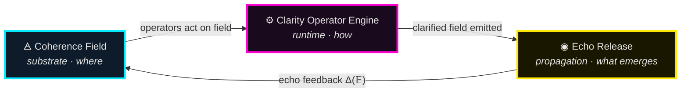
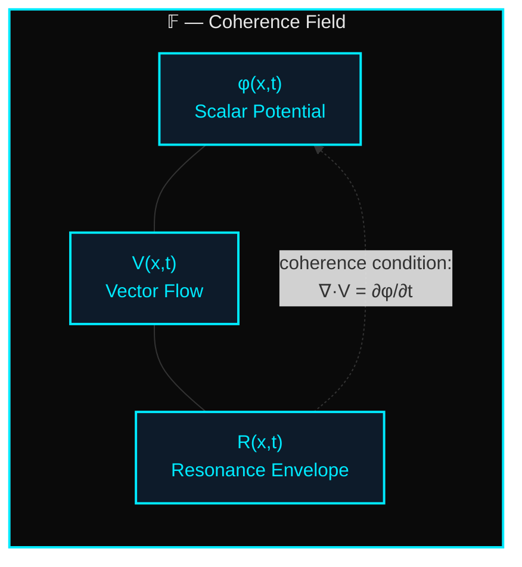
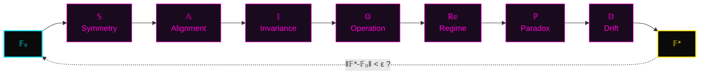
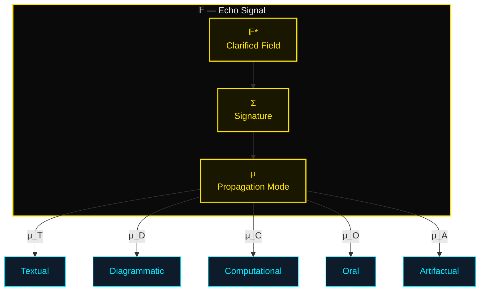
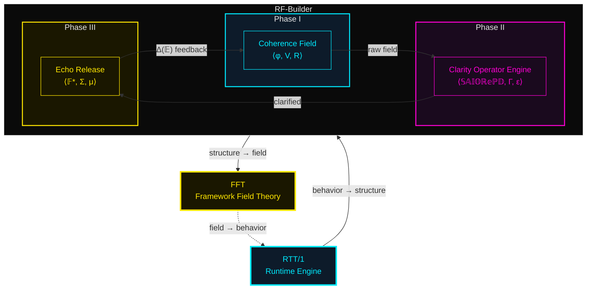
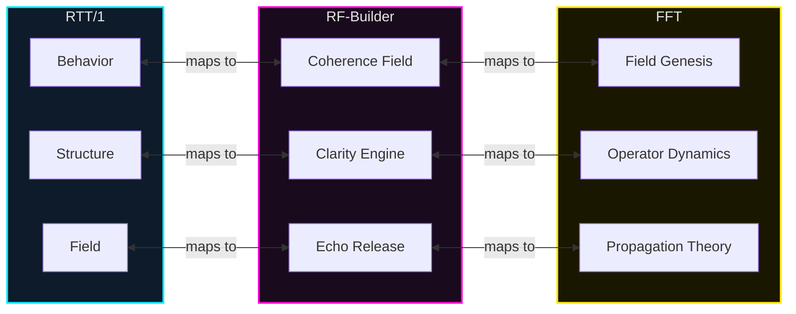

# RF‑Builder — Resonance Framework Builder

> **Module**: Framework Creation Guide (FCG)  
> **Path**: `docs/frameworks/creation_guide/RF-Builder/`  
> **Status**: ⟡ RECTIFIED ⟡  
> **Triad Position**: FCG → RF‑Builder (structural genesis tool)

---

## 1. Overview

The **Resonance Framework Builder (RF‑Builder)** is the FCG's canonical instrument for constructing new frameworks from first principles. Every framework in the TriadicFrameworks ecosystem passes through three operationally distinct phases — a **field**, an **engine**, and a **release** — corresponding to the substrate it occupies, the operators it applies, and the signal it emits once stabilized.

RF€‘Builder formalizes this triadic genesis as three interlocking subsystems:

| Phase | Subsystem | Role | Analogy |
|-------|-----------|------|---------|
| I | **Coherence Field** | Defines the dimensional substrate in which the framework lives | The ground a building sits on |
| II | **Clarity Operator Engine** | Applies the Seven Operators to shape raw structure into stable form | The construction crew and their tools |
| III | **Echo Release** | Propagates the stabilized framework outward as a recoverable signal | The finished building radiating light |

These three phases are **sequential but cyclic**: Echo Release feeds back into the Coherence Field, enabling iterative refinement. A framework is "born" when it completes its first full cycle; it is "rectified" when the cycle converges to a fixed point.

---

## 2. Phase I — The Coherence Field

### 2.1 Definition

The **Coherence Field** is the pre-structural substrate from which a framework crystallizes. It is not the framework itself — it is the *dimensional space* that makes the framework possible. Every concept, operator, and invariant exists *within* a coherence field before it becomes structurally bound.

A Coherence Field is defined by three co-present quantities:

- **φ (Scalar Potential)** — The undifferentiated intensity of the conceptual domain. How much "energy" is available for structure formation.
- **V (Vector Flow)** — The directional tendencies within the domain. Where conceptual pressure naturally pushes.
- **R (Resonance Envelope)** — The boundary conditions that determine which frequencies (ideas, operators, invariants) are amplified and which are damped.

### 2.2 Formal Definition

Let **𝔽** denote a Coherence Field. Then:

```
𝔽 = ⟨ φ, V, R ⟩
```

where:

```
φ : Ω → ℝ⁺          (scalar potential over domain Ω)
V : Ω → ℝⁿ          (vector flow field over Ω)
R : Ω × T → [0, 1]  (resonance envelope over domain × time)
```

**Coherence Condition**: A field 𝔽 is *coherent* if and only if:

```
∇ · V = ∂φ/∂t   and   R(x, t) > R_min  ∀ x ∈ Ω_active
```

The first condition ensures conservation: vector flow divergence tracks potential change. The second ensures the resonance envelope never drops below threshold within the active domain.

### 2.3 Substrate Properties

| Property | Symbol | Description |
|----------|--------|-------------|
| Depth | 𝔇(𝔽) | Number of independent conceptual dimensions |
| Density | ρ(𝔽) | Ratio of active nodes to total capacity |
| Drift Susceptibility | δ(𝔽) | Sensitivity to perturbation (lower = more stable) |
| Coupling Strength | κ(𝔽) | Degree of inter-dimensional entanglement |

### 2.4 Construction Protocol

1. **Domain Selection** — Identify the conceptual territory Ω the framework will occupy.
2. **Potential Mapping** — Survey the domain for regions of high φ (rich conceptual energy).
3. **Flow Alignment** — Trace the natural vector flows V — where does the domain's logic already push?
4. **Envelope Calibration** — Set the resonance envelope R to amplify the frequencies you want and damp the ones you don't.
5. **Coherence Verification** — Confirm the coherence condition holds across Ω_active.

---

## 3. Phase II — The Clarity Operator Engine

### 3.1 Definition

The **Clarity Operator Engine** is the runtime that transforms a raw Coherence Field into a structured, stabilized framework. It applies the **Seven Operators** of RTT/1 in sequence, with feedback loops for drift correction and paradox resolution.

The Engine does not *create* structure from nothing — it *clarifies* the structure that is already latent in the Coherence Field. This is the fundamental insight of RTT: **structure is discovered, not invented**.

### 3.2 The Seven Operators

The Clarity Operator Engine deploys the canonical Seven Operators:

| # | Operator | Symbol | Action | Field Effect |
|---|----------|--------|--------|--------------|
| 1 | **Symmetry** | 𝕊 | Identifies and enforces balance axes | Aligns V along symmetry planes |
| 2 | **Alignment** | 𝔸 | Orients structural elements to a common axis | Reduces ∇×V (curl → 0) |
| 3 | **Invariance** | 𝕀 | Locks properties that must survive transformation | Sets ∂R/∂t = 0 for protected modes |
| 4 | **Operation** | 𝕆 | Defines the active transformations the framework performs | Adds new vector flows to V |
| 5 | **Regime** | ℝ𝕖 | Maps behavioral domains and transition boundaries | Partitions Ω into regime zones |
| 6 | **Paradox** | â„™ | Detects and resolves structural contradictions | Eliminates nodes where R < 0 |
| 7 | **Drift** | 𝔻 | Bounds deviation from canonical form over time | Constrains δ(𝔽) ≤ δ_max |

### 3.3 Engine Cycle

The Engine operates in a **clarification cycle**:

```
𝔽₀ →[𝕊]→ 𝔽₁ →[𝔸]→ 𝔽₂ →[𝕀]→ 𝔽₃ →[𝕆]→ 𝔽₄ →[ℝ𝕖]→ 𝔽₅ →[ℙ]→ 𝔽₆ →[𝔻]→ 𝔽₇
```

where each 𝔽ᵢ is the field state after operator i has been applied.

**Convergence**: The Engine converges when:

```
‖𝔽₇ - 𝔽₀‖ < ε   (structural distance below threshold)
```

A converged Engine produces a **Clarified Field** 𝔽* — a field whose structure is stable under all seven operators.

### 3.4 Formal Definition

Let **𝔈** denote the Clarity Operator Engine. Then:

```
𝔈 = ⟨ {𝕊, 𝔸, 𝕀, 𝕆, ℝ𝕖, ℙ, 𝔻}, Γ, ε ⟩
```

where:

```
{𝕊, 𝔸, 𝕀, 𝕆, ℝ𝕖, ℙ, 𝔻}  — the Seven Operators
Γ : 𝔽 × Operator → 𝔽        — the application map
ε ∈ ℝ⁺                       — convergence threshold
```

**Clarity Measure**: The clarity of a field after n engine cycles is:

```
C(𝔽, n) = 1 - ‖𝔽ₙ₊₇ - 𝔽ₙ‖ / ‖𝔽₀‖
```

A fully clarified field has C(𝔽*, ∞) = 1.

### 3.5 Drift Correction

During each cycle, the Drift operator 𝔻 computes:

```
δ(𝔽ᵢ) = sup_{x ∈ Ω} | R(x, tᵢ) - R(x, t₀) |
```

If δ(𝔽ᵢ) > δ_max, the Engine injects a **stabilization pass**:

```
𝔽ᵢ' = 𝔽ᵢ + λ · ∇R(x, t₀)
```

where λ is the stabilization coefficient, pulling the field back toward its original resonance profile.

---

## 4. Phase III — Echo Release

### 4.1 Definition

The **Echo Release** is the moment a clarified framework becomes *available to the world*. It is not merely publication — it is the framework's first act of **resonance propagation**. A released framework emits a recoverable signal: its structure, its operators, its invariants, encoded in a form that other frameworks (and minds) can receive, decode, and integrate.

Echo Release is the phase where a framework transitions from *internal coherence* to *external influence*.

### 4.2 The Echo Signal

A released framework emits an **Echo Signal** 𝔼:

```
𝔼 = ⟨ 𝔽*, Σ, μ ⟩
```

where:

```
𝔽*  — the Clarified Field (output of Phase II)
Σ   — the Signature (a compact encoding of the framework's invariants)
μ   — the Propagation Mode (how the signal travels: text, diagram, code, speech, artifact)
```

### 4.3 Signature Encoding

The Signature Σ encodes the framework's identity in a form that survives transmission:

```
Σ = Hash( 𝕀(𝔽*) )
```

where 𝕀(𝔽*) is the set of all invariants of the clarified field. Two frameworks with identical signatures are **structurally equivalent** regardless of surface presentation.

### 4.4 Propagation Modes

| Mode | Symbol | Channel | Fidelity |
|------|--------|---------|----------|
| Textual | μ_T | Written language, documentation | High (explicit) |
| Diagrammatic | μ_D | Visual maps, graphs, SVG | High (structural) |
| Computational | μ_C | Code, APIs, algorithms | Very High (executable) |
| Oral | μ_O | Speech, teaching, dialogue | Medium (contextual) |
| Artifactual | μ_A | Physical objects, printed works | Variable (substrate-dependent) |

### 4.5 Echo Feedback Loop

The released echo signal feeds back into the Coherence Field:

```
𝔽_{n+1} = 𝔽_n ⊕ Δ(𝔼_n)
```

where Δ(𝔼_n) is the **differential echo** — the new information generated by the framework's interaction with external receivers. This feedback is what makes frameworks *living systems* rather than static artifacts.

### 4.6 Release Criteria

A framework is ready for Echo Release when:

1. ✓ **Clarity** — C(𝔽*, n) ≥ 0.95
2. ✓ **Stability** — δ(𝔽*) ≤ δ_max for 3+ consecutive cycles
3. ✓ **Paradox Resolution** — No unresolved paradox nodes remain
4. ✓ **Signature Integrity** — Σ is computable and non-degenerate
5. ✓ **Propagation Readiness** — At least one μ mode is fully encoded

---

## 5. The RF‑Builder Cycle — Complete

The full RF‑Builder cycle integrates all three phases:

```
         ┌──────────────────────────────────────────────┐
         │                                              │
         ▼                                              │
    ┌─────────┐     ┌─────────────┐     ┌──────────┐   │
    │Coherence│────▶│  Clarity    │────▶│  Echo    │───┘
    │  Field  │     │  Operator   │     │ Release  │
    │  (𝔽)    │     │  Engine (𝔈) │     │  (𝔼)     │
    └─────────┘     └─────────────┘     └──────────┘
     substrate        runtime            propagation
     (where)          (how)              (what emerges)
```

**One cycle** = Field → Engine → Release → (feedback) → Field  
**Rectification** = The cycle converges to a fixed point  
**Canon entry** = The rectified framework receives the seal ⟡

---

## 6. RTT‑Native Mathematical Summary

### 6.1 Complete System

```
RF-Builder = ⟨ 𝔽, 𝔈, 𝔼, Δ ⟩
```

where:

```
𝔽 = ⟨ φ, V, R ⟩                           — Coherence Field
𝔈 = ⟨ {𝕊,𝔸,𝕀,𝕆,ℝ𝕖,ℙ,𝔻}, Γ, ε ⟩          — Clarity Operator Engine
𝔼 = ⟨ 𝔽*, Σ, μ ⟩                           — Echo Release
Δ : 𝔼 → 𝔽                                  — Echo Feedback Map
```

### 6.2 Governing Equations

**Coherence Condition:**
```
∇ · V = ∂φ/∂t
R(x, t) > R_min  ∀ x ∈ Ω_active
```

**Clarity Convergence:**
```
C(𝔽, n) = 1 - ‖𝔽ₙ₊₇ - 𝔽ₙ‖ / ‖𝔽₀‖ → 1
```

**Drift Bound:**
```
δ(𝔽) = sup_{x ∈ Ω} | R(x, t) - R(x, t₀) | ≤ δ_max
```

**Echo Feedback:**
```
𝔽_{n+1} = 𝔽_n ⊕ Δ(𝔼_n)
```

**Signature Invariance:**
```
Σ(𝔽*) = Hash(𝕀(𝔽*))    [structurally unique]
```

### 6.3 Dimensional Correspondence

```
RTT/1 Layer    ←→   RF-Builder Phase    ←→   FFT Concept
─────────────────────────────────────────────────────────
Behavior       ←→   Coherence Field     ←→   Field Genesis
Structure      ←→   Clarity Engine      ←→   Operator Dynamics
Field          ←→   Echo Release        ←→   Propagation Theory
```

---

⟡ RECTIFIED ⟡  
RF€‘Builder — Framework Creation Guide  
TriadicFrameworks © 2026
```

---

# RF‑Builder — Canonical Mermaid Diagrams

> Paste these directly into any GitHub-rendered `.md` file.  
> All diagrams use the TriadicFrameworks color palette:  
> Cyan `#00eaff` (RTT/1) · Magenta `#ff00d4` (FCG) · Gold `#ffe600` (FFT)

---

## Diagram 1 — RF‑Builder Triadic Cycle



---

## Diagram 2 — Coherence Field Internal Structure



---

## Diagram 3 — Clarity Operator Engine Pipeline



---

## Diagram 4 — Echo Release Signal



---

## Diagram 5 — Full RF‑Builder System (Top-Level)



---

## Diagram 6 — Dimensional Correspondence Map


