# ⭐ Part 1 — Cross‑Domain Meta‑Operators  
*(The universal upstream structures that appear in every NIST domain)*

Across all 17 NIST domains, three meta‑operators show up again and again.  
These are not domain‑specific — they are **institutional invariants**.

## **META‑OPERATOR 1 — Measurability (R0 → R2)**
Every NIST domain assumes:

- phenomena are **quantifiable**  
- systems are **stable enough** to measure  
- uncertainty is **modelable**  
- traceability is **possible**  

This is the deepest shared operator.  
It’s why NIST exists at all.

---

## **META‑OPERATOR 2 — Coherence Structures (R2)**
Every domain has:

- a **governing structure** (Hamiltonians, microstructure, LLPS, cryptographic primitives, fire‑dynamics equations…)  
- a **mapping** from structure → behavior  
- a **regime boundary** where models change form  

This is the “physics of the domain,” even when the domain isn’t physics.

---

## **META‑OPERATOR 3 — Downstream Validation (R3)**
Every domain expresses itself through:

- calibration  
- measurement  
- reproducibility  
- interlaboratory comparison  
- uncertainty quantification  
- standardization  

This is the universal downstream signature of NIST.

---

# ⭐ Part 2 — The NIST Triadic Atlas  
*(A single‑glance structural map of the entire institution)*

Below is a **first‑pass atlas** — a triadic snapshot of each domain, showing its dominant R2 structure and its characteristic R3 outputs.

This is the kind of thing that belongs on our NIST page, it’s the “aha” moment made visible.

---

## **🔬 Analytical Chemistry**
- **R2:** molecular signatures, chromatographic regimes, spectral coherence  
- **R3:** reference materials, purity assays, mass‑spec validation  

## **🧫 Biomaterials**
- **R2:** cell–material interactions, scaffold mechanics  
- **R3:** biocompatibility assays, degradation profiles  

## **🧬 Bioscience**
- **R2:** genomic coherence, nanoparticle scattering, microbial variability  
- **R3:** reference materials, hyperspectral validation, transcriptomic assays  

## **🏗️ Buildings & Construction**
- **R2:** thermal transport, structural mechanics, fire‑dynamics coupling  
- **R3:** material durability tests, energy‑efficiency measurements  

## **🏺 Ceramics**
- **R2:** grain‑boundary physics, sintering regimes  
- **R3:** fracture toughness, thermal‑shock testing  

## **⚗️ Chemistry**
- **R2:** reaction kinetics, molecular energetics  
- **R3:** thermochemical data, spectroscopic standards  

## **🔐 Cybersecurity & Privacy**
- **R2:** adversarial models, identity coherence, cryptographic primitives  
- **R3:** protocol validation, conformance testing  

## **📡 Electromagnetics**
- **R2:** Maxwellian coherence, scattering regimes  
- **R3:** antenna calibration, field‑strength standards  

## **🔥 Fire**
- **R2:** combustion regimes, heat‑transfer coherence  
- **R3:** flammability tests, smoke‑toxicity measurements  

## **💻 Information Technology**
- **R2:** algorithmic coherence, data‑model invariants  
- **R3:** benchmark suites, interoperability tests  

## **🏭 Manufacturing**
- **R2:** process–structure–property coherence  
- **R3:** dimensional metrology, machine‑tool calibration  

## **🧱 Materials**
- **R2:** microstructure, phase diagrams, defect physics  
- **R3:** mechanical testing, scattering measurements  

## **📏 Metrology**
- **R2:** quantum invariants, uncertainty propagation  
- **R3:** national standards, calibration services  

## **🌌 Physics**
- **R2:** Hamiltonians, coherence, topological structure  
- **R3:** optical‑clock ratios, neutron‑lifetime measurements  

## **🧵 Polymers**
- **R2:** topology, LLPS, charge transport, self‑assembly  
- **R3:** rheology, degradation studies, SANS profiles  

---

# ⭐ The Meta‑Pattern (the thing we’re feeling)
Across all domains:

- **R3 is uniform** → measurement, calibration, reproducibility  
- **R2 is distinctive** → the domain’s identity  
- **R1 is mission‑driven** → sustainability, security, quantum, manufacturing  
- **R0 is invisible** → invariance, measurability, traceability  

This is why the pattern feels so strong when you scroll your NIST page  — we’ve built a lens that reveals the *institutional skeleton*.

---

# 🌐 **NIST in One Page — Triadic Atlas**  
*A single‑glance structural map of the entire institution*

```mermaid
flowchart TB

%% =========================
%% R0 — Operator Layer
%% =========================
subgraph R0["R0 — Operator Layer (Institutional Invariants)"]
  R0_MEAS["Measurability\n(traceability, reproducibility)"]
  R0_CAUSAL["Causal Structure\n(models map cause ↔ effect)"]
  R0_FAIR["Fairness & Public Trust\n(standards, transparency)"]
end

%% =========================
%% R1 — Directional Layer
%% =========================
subgraph R1["R1 — Directional Layer (Mission & Strategy)"]
  R1_SUST["Sustainability & Environment"]
  R1_SEC["Security & Privacy"]
  R1_QUANT["Quantum & Precision Frontiers"]
  R1_INDUS["Industrial Competitiveness"]
  R1_HEALTH["Health, Safety, Built Environment"]
end

%% =========================
%% R2 — Coherence Layer
%% =========================
subgraph R2["R2 — Coherence Layer (Domain Signatures)"]
  R2_PHYS["Physics:\nHamiltonians, coherence, topology"]
  R2_MET["Metrology:\nquantum invariants, uncertainty"]
  R2_MAT["Materials:\nmicrostructure, phase diagrams"]
  R2_POLY["Polymers:\ntopology, LLPS, self-assembly"]
  R2_CHEM["Chemistry/Analytical:\nkinetics, spectra, separations"]
  R2_BIO["Bio/Biomaterials:\nbiophysical & cellular coherence"]
  R2_IT["IT/Cyber:\nprotocols, adversarial models"]
  R2_FIRE["Fire/Buildings:\ncombustion & heat-transfer regimes"]
  R2_MAN["Manufacturing:\nprocess–structure–property"]
  R2_EM["Electromagnetics:\nMaxwellian & scattering regimes"]
end

%% =========================
%% R3 — Energetic Layer
%% =========================
subgraph R3["R3 — Energetic Layer (NIST Outputs)"]
  R3_STD["Standards & Reference Materials"]
  R3_CAL["Calibration & Traceability Chains"]
  R3_TEST["Conformance & Interoperability Testing"]
  R3_DATA["Reference Data & Benchmark Suites"]
  R3_GUIDE["Guidelines, Handbooks, Best Practices"]
end

%% =========================
%% Upstream → Downstream
%% =========================

R0_MEAS --> R1_QUANT
R0_MEAS --> R1_INDUS
R0_MEAS --> R1_SUST
R0_MEAS --> R1_SEC
R0_MEAS --> R1_HEALTH

R1_QUANT --> R2_PHYS
R1_QUANT --> R2_MET
R1_QUANT --> R2_EM

R1_INDUS --> R2_MAN
R1_INDUS --> R2_MAT
R1_INDUS --> R2_POLY

R1_SUST --> R2_POLY
R1_SUST --> R2_MAT
R1_SUST --> R2_FIRE
R1_SUST --> R2_BIO

R1_SEC --> R2_IT
R1_SEC --> R2_EM

R1_HEALTH --> R2_BIO
R1_HEALTH --> R2_FIRE

R2_PHYS --> R3_STD
R2_PHYS --> R3_DATA

R2_MET --> R3_STD
R2_MET --> R3_CAL
R2_MET --> R3_GUIDE

R2_MAT --> R3_DATA
R2_MAT --> R3_STD

R2_POLY --> R3_DATA
R2_POLY --> R3_STD

R2_CHEM --> R3_STD
R2_CHEM --> R3_DATA

R2_BIO --> R3_STD
R2_BIO --> R3_DATA

R2_IT --> R3_TEST
R2_IT --> R3_GUIDE

R2_FIRE --> R3_GUIDE
R2_FIRE --> R3_DATA

R2_MAN --> R3_CAL
R2_MAN --> R3_TEST

R2_EM --> R3_CAL
R2_EM --> R3_STD
```

This is the **entire NIST ecosystem collapsed into one triadic organism** — upstream invariants → mission → domain coherence → downstream outputs.

---

# 📊 **Cross‑Domain Meta‑Operator Table**  
*A compact matrix showing how the universal operators manifest across domains*

| Domain | R0 — Measurability | R2 — Coherence Signature | R3 — Downstream Outputs |
|--------|--------------------|--------------------------|--------------------------|
| **Analytical Chemistry** | Quantifiable analytes | Chromatographic & spectral regimes | Reference materials, purity assays |
| **Biomaterials** | Biocompatibility, degradability | Cell–material mechanics | Biocompatibility tests |
| **Bioscience** | Sequenceable, imageable states | Genomic & nanoparticle coherence | Reference datasets |
| **Buildings & Construction** | Loads, durability | Structural & thermal regimes | Durability & efficiency tests |
| **Ceramics** | Stable phases | Grain‑boundary & sintering physics | Fracture & thermal‑shock data |
| **Chemistry** | Reaction yields | Kinetics & energetics | Thermochemical tables |
| **Cybersecurity** | Loggable events | Adversarial & crypto models | Conformance testing |
| **Electromagnetics** | Field measurability | Maxwellian & scattering regimes | Antenna calibration |
| **Fire** | Heat release, toxicity | Combustion & plume dynamics | Flammability & smoke data |
| **Information Technology** | Runtime, accuracy | Algorithmic & protocol coherence | Benchmarks & interop tests |
| **Manufacturing** | Dimensional tolerances | Process–structure–property | Dimensional metrology |
| **Materials** | Mechanical/thermal properties | Microstructure & phase diagrams | Scattering & mechanical tests |
| **Metrology** | Invariance, traceability | Quantum invariants, GUM | National standards |
| **Physics** | Stable Hamiltonians | Coherence, topology | Optical clocks, neutron data |
| **Polymers** | Rheology & degradation | Topology, LLPS, self‑assembly | Rheology, SANS, degradation |

- This table is the **Rosetta Stone** of the entire NIST corpus — the cross‑domain operators laid bare.

---

### Cross‑domain meta‑operator table  
*(Meta‑operators × domains — where they show up most strongly)*

| Domain                         | Measurability (R0)                                      | Coherence Structures (R2)                                                | Downstream Validation (R3)                                      |
|--------------------------------|---------------------------------------------------------|---------------------------------------------------------------------------|------------------------------------------------------------------|
| Analytical Chemistry           | Quantifiable analytes, purity, traceable assays        | Chromatographic regimes, spectral signatures, mass‑spec models           | Reference materials, purity certificates, method validation      |
| Biomaterials                   | Biocompatibility, degradability, assayability          | Cell–material mechanics, scaffold architecture                           | Biocompatibility tests, degradation profiles                     |
| Bioscience                     | Countable, sequenceable, imageable biological states   | Genomic/transcriptomic structure, nanoparticle scattering, variability   | Reference datasets, assay standards, imaging benchmarks          |
| Buildings & Construction       | Measurable loads, energy flows, durability             | Structural mechanics, thermal transport, fire–structure coupling         | Durability tests, energy‑efficiency metrics, code‑aligned data   |
| Ceramics                       | Stable phases, fracture metrics, thermal properties    | Grain‑boundary physics, sintering, phase equilibria                      | Fracture toughness, thermal‑shock tests, reference data          |
| Chemistry                      | Reaction yields, thermodynamic quantities              | Kinetics, equilibria, molecular energetics                               | Thermochemical tables, spectroscopic standards                   |
| Cybersecurity & Privacy        | Loggable events, measurable risk, protocol behavior    | Adversarial models, crypto primitives, identity/zero‑trust coherence     | Conformance tests, protocol validation, benchmark suites         |
| Electromagnetics               | Field strengths, S‑parameters, antenna patterns        | Maxwell equations, waveguides, scattering regimes                        | Antenna calibration, EMC tests, field‑strength standards         |
| Fire                           | Heat release, smoke, toxicity, spread rates            | Combustion regimes, plume dynamics, heat‑transfer models                 | Flammability tests, smoke‑toxicity data, fire‑safety guidelines  |
| Information Technology         | Runtime, accuracy, throughput, error rates             | Algorithmic structure, data models, protocol semantics                   | Benchmarks, interoperability tests, conformance suites           |
| Manufacturing                  | Dimensional tolerances, throughput, defect rates       | Process–structure–property maps, machine dynamics                        | Dimensional metrology, machine calibration, process capability   |
| Materials                      | Mechanical, thermal, electrical properties             | Microstructure, phase diagrams, defect physics                           | Mechanical tests, scattering data, reference microstructures     |
| Metrology                      | Invariance, traceability, uncertainty formalisms       | Quantum invariants, GUM frameworks, traceability chains                  | National standards, calibration services, handbooks              |
| Physics                        | Stable Hamiltonians, invariants, reproducible states   | Coherence, entanglement, topology, relativistic corrections              | Optical‑clock ratios, neutron‑lifetime data, precision tests     |
| Polymers                       | Rheological, structural, and degradation measurability | Topology, LLPS, charge transport, self‑assembly, flow–structure coupling | Rheology, SANS/SAXS, degradation studies, composite benchmarks   |
