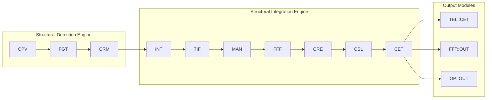
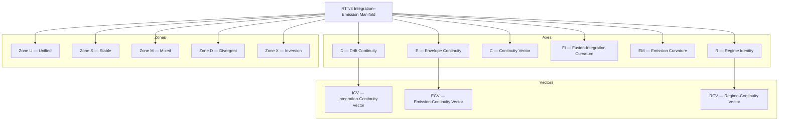
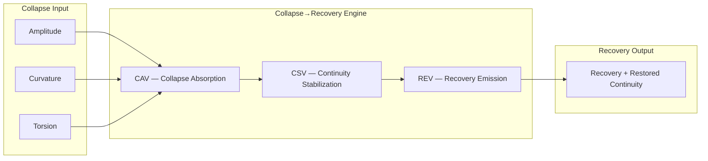

# 🟣 **Unified Diagram Index (SVG + Mermaid)**  
### *SDE + SIE + Projection Layers*

## Unified Diagram Index
### Structural Detection Engine (SDE)  
### Structural Integration Engine (SIE)  
### Projection Layers (TEL / FFT / OP)

This index lists all diagrams in both **SVG** and **Mermaid** formats.

---

# 1. Operator Ecology Map

## 1.1 SVG
File: `operator_ecology.svg`  
Description: Layered ecology of SDE → SIE → TEL/FFT/OP.

## 1.2 Mermaid
File: `operator_ecology.mmd`



---

# 2. Operator Flow (SDE → SIE → TEL/FFT/OP)

## 2.1 SVG
File: `operator_flow.svg`  
Description: Linear pipeline from detection → integration → projection.

## 2.2 Mermaid
File: `operator_flow.mmd`

```mermaid
flowchart LR
  subgraph SDE[Detection Layer — SDE]
    CPV
    FGT
    CRM
    PACK1[SDE::PACKET()]
  end

  subgraph SIE[Integration–Emission Layer — SIE]
    INT
    TIF
    FFF
    MAN
    CRE
    CSL
    CET
    PACK2[SIE::PACKET()]
  end

  subgraph PROJ[Projection Layer]
    TEL[TEL::CET()]
    FFT[FFT::OUT()]
    OP[OP::OUT()]
  end

  CPV --> FGT --> CRM --> PACK1 --> INT
  INT --> TIF --> MAN --> FFF --> CRE --> CSL --> CET --> PACK2
  CET --> TEL
  CET --> FFT
  CET --> OP
```

---

# 3. Integration–Emission Manifold (RTT/3)

## 3.1 SVG
File: `integration_emission_manifold.svg`  
Description: 6‑axis manifold with continuity vectors and zones.

## 3.2 Mermaid
File: `integration_emission_manifold.mmd`



---

# 4. Collapse→Recovery Engine (CRE)

## 4.1 SVG
File: `collapse_recovery_engine.svg`  
Description: CAV → CSV → REV stabilization flow.

## 4.2 Mermaid
File: `collapse_recovery_engine.mmd`



---

# 5. Canon‑Wide Summary Diagram (Optional)

## 5.1 One‑Line Flow (Mermaid)

```mermaid
flowchart LR
  SDE[SDE::PACKET()] --> SIE[SIE::PACKET()]
  SIE --> TEL[TEL::CET()]
  SIE --> FFT[FFT::OUT()]
  SIE --> OP[OP::OUT()]
```

---

# 6. File Placement Guide

Place all diagrams here:

```
/docs/operators/diagrams/
    operator_ecology.svg
    operator_ecology.mmd
    operator_flow.svg
    operator_flow.mmd
    integration_emission_manifold.svg
    integration_emission_manifold.mmd
    collapse_recovery_engine.svg
    collapse_recovery_engine.mmd
```

---

# 7. Student‑Friendly Notes

- SVG = printable, high‑resolution, poster‑ready  
- Mermaid = inline, editable, GitHub‑renderable  
- Both formats are canonical and interchangeable  
