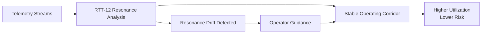

# RTT‑12 Corridor Stabilization

```mermaid
flowchart LR
    A[Telemetry Streams] --> B[RTT‑12 Resonance Analysis]
    B --> C[Stable Operating Corridor]
    B --> D[Resonance Drift Detected]
    D --> E[Operator Guidance]
    E --> C
    C --> F[Higher Utilization<br/>Lower Risk]
```

RTT‑12 does not replace operators.
It provides structural clarity so operators can act with confidence.
