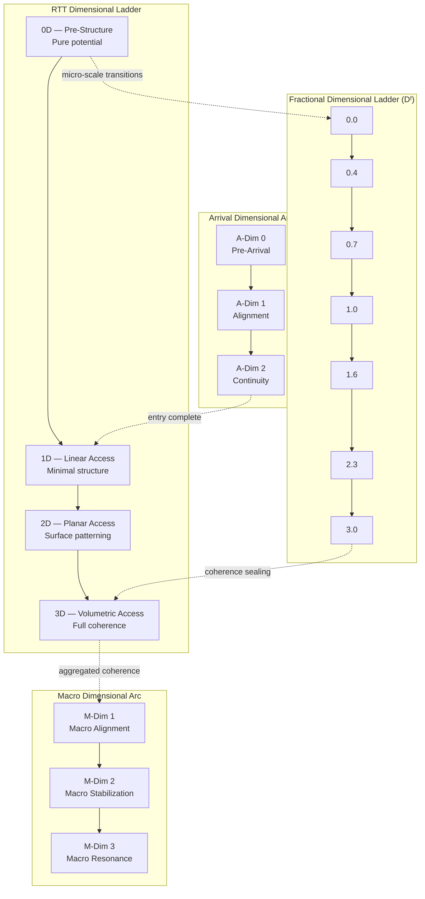

### 🧭 Mermaid version of the dimensional ladder

```mermaid
flowchart TB
    subgraph Core_Dimensions["RTT Dimensional Ladder"]
        D0["0D — Pre-Structure\nPure potential"]
        D1["1D — Linear Access\nMinimal structure"]
        D2["2D — Planar Access\nSurface patterning"]
        D3["3D — Volumetric Access\nFull coherence"]
        
        D0 --> D1
        D1 --> D2
        D2 --> D3
    end

    subgraph Fractional_Ladder["Fractional Dimensional Ladder (Dᶠ)"]
        F0["0.0"]
        F1["0.4"]
        F2["0.7"]
        F3["1.0"]
        F4["1.6"]
        F5["2.3"]
        F6["3.0"]

        F0 --> F1 --> F2 --> F3 --> F4 --> F5 --> F6
    end

    subgraph Arrival_Arc["Arrival Dimensional Arc"]
        AD0["A-Dim 0\nPre-Arrival"]
        AD1["A-Dim 1\nAlignment"]
        AD2["A-Dim 2\nContinuity"]
        AD0 --> AD1 --> AD2
    end

    subgraph Macro_Arc["Macro Dimensional Arc"]
        MD1["M-Dim 1\nMacro Alignment"]
        MD2["M-Dim 2\nMacro Stabilization"]
        MD3["M-Dim 3\nMacro Resonance"]
        MD1 --> MD2 --> MD3
    end

    D0 -.micro-scale transitions.-> F0
    F6 -.coherence sealing.-> D3
    AD2 -.entry complete.-> D1
    D3 -.aggregated coherence.-> MD1
```
