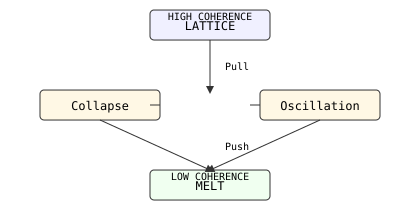
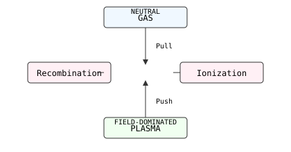
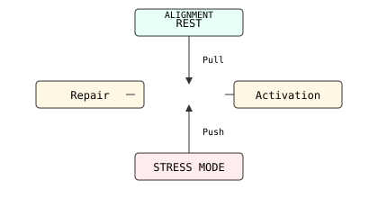
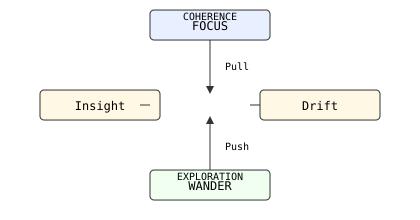

Here are **SVG versions** of the four triadic diagrams — each is self‑contained, ASCII‑safe, and ready to paste into your repo.

---

### 🪙 Metals — Lattice → Oscillation → Melt



```svg
<svg width="420" height="220" viewBox="0 0 420 220" xmlns="http://www.w3.org/2000/svg">
  <rect x="150" y="10" width="120" height="30" rx="4" ry="4" fill="#f0f0ff" stroke="#333"/>
  <text x="210" y="30" text-anchor="middle" font-family="monospace" font-size="12">LATTICE</text>
  <text x="210" y="20" text-anchor="middle" font-family="monospace" font-size="10">HIGH COHERENCE</text>

  <rect x="40" y="90" width="120" height="30" rx="4" ry="4" fill="#fff8e5" stroke="#333"/>
  <text x="100" y="110" text-anchor="middle" font-family="monospace" font-size="12">Collapse</text>

  <rect x="260" y="90" width="120" height="30" rx="4" ry="4" fill="#fff8e5" stroke="#333"/>
  <text x="320" y="110" text-anchor="middle" font-family="monospace" font-size="12">Oscillation</text>

  <rect x="150" y="170" width="120" height="30" rx="4" ry="4" fill="#f0fff0" stroke="#333"/>
  <text x="210" y="190" text-anchor="middle" font-family="monospace" font-size="12">MELT</text>
  <text x="210" y="180" text-anchor="middle" font-family="monospace" font-size="10">LOW COHERENCE</text>

  <line x1="210" y1="40" x2="210" y2="90" stroke="#333" marker-end="url(#arrow)"/>
  <line x1="160" y1="105" x2="150" y2="105" stroke="#333"/>
  <line x1="260" y1="105" x2="250" y2="105" stroke="#333"/>
  <line x1="100" y1="120" x2="210" y2="170" stroke="#333" marker-end="url(#arrow)"/>
  <line x1="320" y1="120" x2="210" y2="170" stroke="#333" marker-end="url(#arrow)"/>

  <text x="225" y="70" font-family="monospace" font-size="10">Pull</text>
  <text x="225" y="150" font-family="monospace" font-size="10">Push</text>

  <defs>
    <marker id="arrow" markerWidth="8" markerHeight="8" refX="4" refY="4" orient="auto">
      <path d="M0,0 L8,4 L0,8 z" fill="#333"/>
    </marker>
  </defs>
</svg>
```

---

### ⚡ Plasma — Gas → Plasma → Recombination



```svg
<svg width="420" height="220" viewBox="0 0 420 220" xmlns="http://www.w3.org/2000/svg">
  <rect x="150" y="10" width="120" height="30" rx="4" ry="4" fill="#f0f8ff" stroke="#333"/>
  <text x="210" y="30" text-anchor="middle" font-family="monospace" font-size="12">GAS</text>
  <text x="210" y="20" text-anchor="middle" font-family="monospace" font-size="10">NEUTRAL</text>

  <rect x="260" y="90" width="120" height="30" rx="4" ry="4" fill="#fff0f5" stroke="#333"/>
  <text x="320" y="110" text-anchor="middle" font-family="monospace" font-size="12">Ionization</text>

  <rect x="40" y="90" width="120" height="30" rx="4" ry="4" fill="#fff0f5" stroke="#333"/>
  <text x="100" y="110" text-anchor="middle" font-family="monospace" font-size="12">Recombination</text>

  <rect x="150" y="170" width="120" height="30" rx="4" ry="4" fill="#f0fff0" stroke="#333"/>
  <text x="210" y="190" text-anchor="middle" font-family="monospace" font-size="12">PLASMA</text>
  <text x="210" y="180" text-anchor="middle" font-family="monospace" font-size="10">FIELD-DOMINATED</text>

  <line x1="210" y1="40" x2="210" y2="90" stroke="#333" marker-end="url(#arrow)"/>
  <line x1="210" y1="170" x2="210" y2="120" stroke="#333" marker-end="url(#arrow)"/>
  <line x1="150" y1="105" x2="140" y2="105" stroke="#333"/>
  <line x1="260" y1="105" x2="250" y2="105" stroke="#333"/>

  <text x="225" y="70" font-family="monospace" font-size="10">Pull</text>
  <text x="225" y="150" font-family="monospace" font-size="10">Push</text>

  <defs>
    <marker id="arrow" markerWidth="8" markerHeight="8" refX="4" refY="4" orient="auto">
      <path d="M0,0 L8,4 L0,8 z" fill="#333"/>
    </marker>
  </defs>
</svg>
```

---

### 🧬 Biological — Rest → Activation → Repair



```svg
<svg width="420" height="220" viewBox="0 0 420 220" xmlns="http://www.w3.org/2000/svg">
  <rect x="150" y="10" width="120" height="30" rx="4" ry="4" fill="#e8fff5" stroke="#333"/>
  <text x="210" y="30" text-anchor="middle" font-family="monospace" font-size="12">REST</text>
  <text x="210" y="20" text-anchor="middle" font-family="monospace" font-size="10">ALIGNMENT</text>

  <rect x="260" y="90" width="120" height="30" rx="4" ry="4" fill="#fff8e5" stroke="#333"/>
  <text x="320" y="110" text-anchor="middle" font-family="monospace" font-size="12">Activation</text>

  <rect x="40" y="90" width="120" height="30" rx="4" ry="4" fill="#fff8e5" stroke="#333"/>
  <text x="100" y="110" text-anchor="middle" font-family="monospace" font-size="12">Repair</text>

  <rect x="150" y="170" width="120" height="30" rx="4" ry="4" fill="#ffecec" stroke="#333"/>
  <text x="210" y="190" text-anchor="middle" font-family="monospace" font-size="12">STRESS MODE</text>

  <line x1="210" y1="40" x2="210" y2="90" stroke="#333" marker-end="url(#arrow)"/>
  <line x1="210" y1="170" x2="210" y2="120" stroke="#333" marker-end="url(#arrow)"/>
  <line x1="150" y1="105" x2="140" y2="105" stroke="#333"/>
  <line x1="260" y1="105" x2="250" y2="105" stroke="#333"/>

  <text x="225" y="70" font-family="monospace" font-size="10">Pull</text>
  <text x="225" y="150" font-family="monospace" font-size="10">Push</text>

  <defs>
    <marker id="arrow" markerWidth="8" markerHeight="8" refX="4" refY="4" orient="auto">
      <path d="M0,0 L8,4 L0,8 z" fill="#333"/>
    </marker>
  </defs>
</svg>
```

---

### 🧠 Cognitive — Focus → Drift → Insight



```svg
<svg width="420" height="220" viewBox="0 0 420 220" xmlns="http://www.w3.org/2000/svg">
  <rect x="150" y="10" width="120" height="30" rx="4" ry="4" fill="#e8f0ff" stroke="#333"/>
  <text x="210" y="30" text-anchor="middle" font-family="monospace" font-size="12">FOCUS</text>
  <text x="210" y="20" text-anchor="middle" font-family="monospace" font-size="10">COHERENCE</text>

  <rect x="260" y="90" width="120" height="30" rx="4" ry="4" fill="#fff8e5" stroke="#333"/>
  <text x="320" y="110" text-anchor="middle" font-family="monospace" font-size="12">Drift</text>

  <rect x="40" y="90" width="120" height="30" rx="4" ry="4" fill="#fff8e5" stroke="#333"/>
  <text x="100" y="110" text-anchor="middle" font-family="monospace" font-size="12">Insight</text>

  <rect x="150" y="170" width="120" height="30" rx="4" ry="4" fill="#f0fff0" stroke="#333"/>
  <text x="210" y="190" text-anchor="middle" font-family="monospace" font-size="12">WANDER</text>
  <text x="210" y="180" text-anchor="middle" font-family="monospace" font-size="10">EXPLORATION</text>

  <line x1="210" y1="40" x2="210" y2="90" stroke="#333" marker-end="url(#arrow)"/>
  <line x1="210" y1="170" x2="210" y2="120" stroke="#333" marker-end="url(#arrow)"/>
  <line x1="150" y1="105" x2="140" y2="105" stroke="#333"/>
  <line x1="260" y1="105" x2="250" y2="105" stroke="#333"/>

  <text x="225" y="70" font-family="monospace" font-size="10">Pull</text>
  <text x="225" y="150" font-family="monospace" font-size="10">Push</text>

  <defs>
    <marker id="arrow" markerWidth="8" markerHeight="8" refX="4" refY="4" orient="auto">
      <path d="M0,0 L8,4 L0,8 z" fill="#333"/>
    </marker>
  </defs>
</svg>
```
