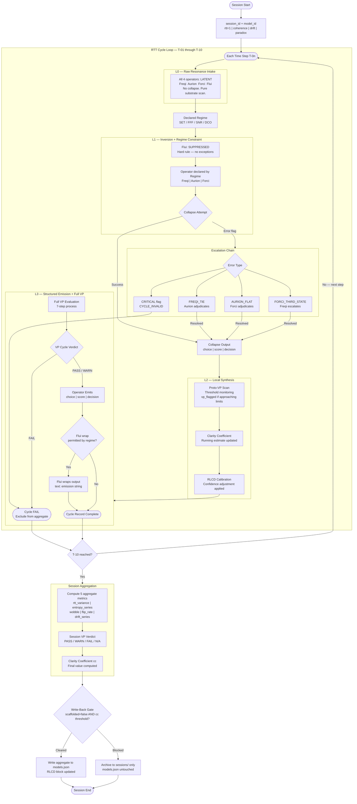
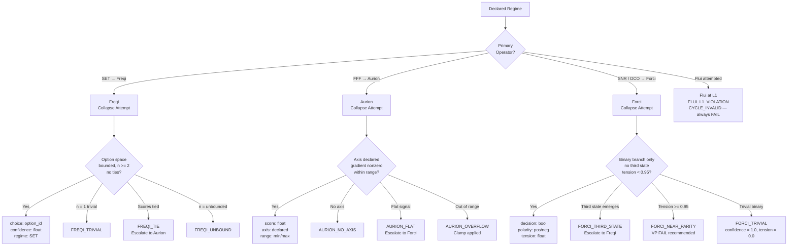
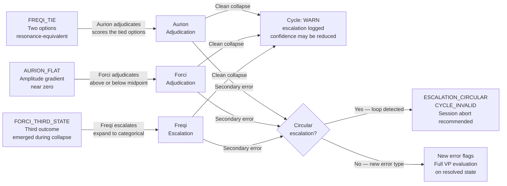
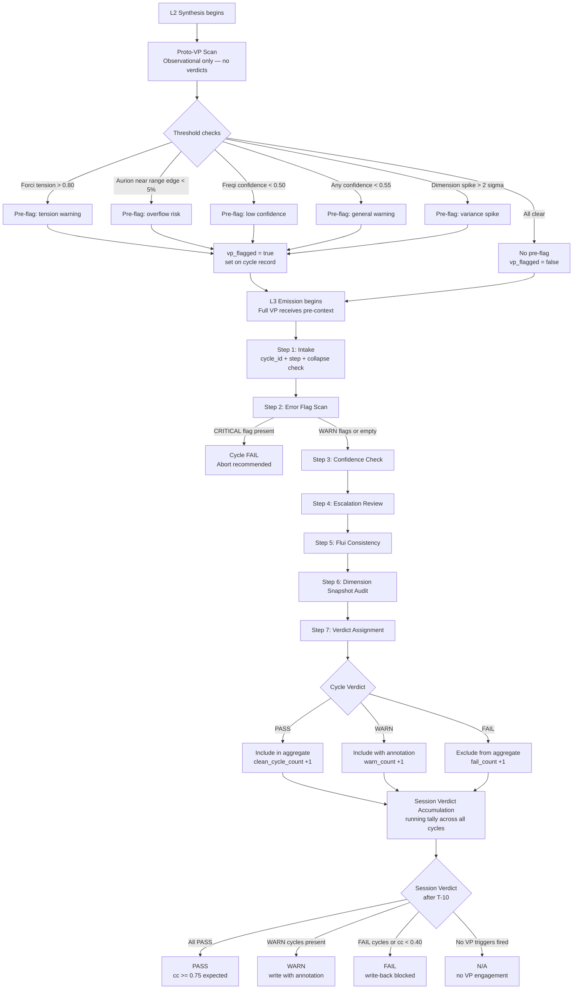
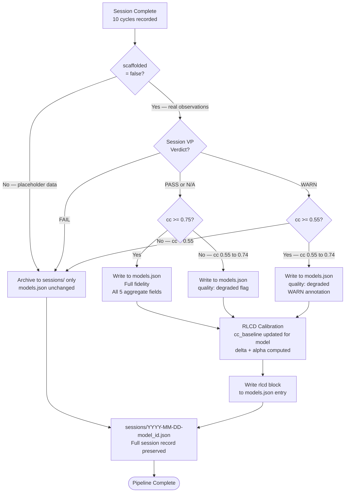

# Theognosis — RTT Pipeline Flow Map

> **Document Class:** P4
> **RTT Layer:** Full Pipeline — L0 through L3 + Session Aggregation
> **Session Context:** `rtt=1 | coherence=declared | drift=bounded | paradox=structural`
> **Status:** Active — Canonical
> **Last Updated:** 2026-09-22
> **Depends On:** `t_OperatorMap.md`, `t_ValidatorPulse.md`, `t_Session_Schema.json`

---

## 1. Purpose

This document is the **visual and structural reference** for the complete Theognosis RTT pipeline. It contains five Mermaid flow diagrams — from session entry to `models.json` write-back — plus a concise narrative breakdown of each stage.

All behavior shown here is governed by:
- Operator rules → `t_OperatorMap.md`
- VP evaluation → `t_ValidatorPulse.md`
- Data structures → `t_Session_Schema.json`

When this document and any of the above conflict, the above win. This document visualizes; those documents define.

---

## 2. Diagram 1 — Main RTT Pipeline (Full Session)

The top-level view of a complete 10-step RTT session from start to `models.json` write-back or archive.

---

## 3. Diagram 2 — Operator Collapse at L1

The internal logic of the L1 collapse attempt for each operator. Flui is shown separately as a blocked path.

---

## 4. Diagram 3 — Escalation Chain

The three valid escalation paths and the circular escalation fault condition.

---

## 5. Diagram 4 — Validator Pulse Checkpoint Flow

Proto-VP at L2 and Full VP at L3 — from pre-flag to cycle verdict to session verdict.

---

## 6. Diagram 5 — Session Write-Back Gate

The two-condition gate that controls whether session aggregate data may be written to `models.json`.

---

## 7. Layer Narrative

### L0 — Raw Resonance Intake
The session opens with all four operators in a latent state. No collapse has occurred. The substrate is scanned for resonance signals across all four dimensions simultaneously — Freqi, Aurion, Forci, and Flui are each present but uncommitted. This is the only layer where Flui is neither suppressed nor active — it simply exists in waiting.

### Regime Declaration
Between L0 and L1, the Declared Regime is applied. The regime (SET, FFF, SNR, or DCO) determines which operator has primary affinity for this cycle, bounds the option/axis/polarity space accordingly, and sets the conditions under which Flui may re-enter at L3.

### L1 — Inversion + Regime Constraint
The hardest layer. Flui is suppressed — no exceptions, no overrides. One operator is declared and collapses. The collapse attempt may succeed cleanly, encounter a resolvable error (triggering the escalation chain), or produce a critical error (invalidating the cycle). At the end of L1, exactly one structured output exists or the cycle is failed.

### L2 — Local Synthesis
L2 is the calibration layer. Proto-VP runs its threshold scan and pre-flags any cycles approaching violation. The running clarity coefficient estimate is updated. RLCD adjustments from the previous session are applied to operator confidence. L2 does not change the operator output — it conditions the evaluation context for L3.

### L3 — Structured Emission + Full VP
Full VP runs its 7-step evaluation on the completed L1 output. If the cycle passes, the operator emits its structured payload. Flui may then wrap that payload in natural language if — and only if — the active Regime permits it. The cycle record is finalized and handed to the session log.

### Session Aggregation
After T-10, the 10 cycle records are reduced to 5 aggregate metrics: `rtt_variance`, `entropy_series`, `wobble`, `flip_rate`, `drift_series`. The session VP verdict and final clarity coefficient are computed. The write-back gate then evaluates two independent conditions before any data reaches `models.json`.

---

## 8. State Quick-Reference

### Operator States Across Layers

| Operator | L0 | L1 | L2 | L3 |
|---|---|---|---|---|
| **Freqi** `ƒ` | Latent | Collapse `choice` | Calibrate | Emit |
| **Aurion** `α` | Latent | Collapse `score` | Calibrate | Emit |
| **Forci** `φ` | Latent | Collapse `decision` | Calibrate | Emit |
| **Flui** `λ` | Latent | **SUPPRESSED** | Latent | Conditional wrap |

### VP States Across Layers

| Layer | VP Component | Verdict Authority |
|---|---|---|
| **L0** | None | — |
| **L1** | None | — |
| **L2** | Proto-VP (pre-flag only) | None — observational |
| **L3** | Full VP (7-step) | Cycle verdict |
| **Session** | Session VP (accumulation) | Session verdict + write-back gate |

### Error Flag Severity

| Class | Flags | Cycle Outcome |
|---|---|---|
| **WARN** | `FREQI_TIE`, `FREQI_TRIVIAL`, `AURION_FLAT`, `AURION_OVERFLOW`, `FORCI_TRIVIAL`, `FORCI_NEAR_PARITY` (< 0.95), `confidence < 0.40` | Include with annotation |
| **FAIL** | `FORCI_NEAR_PARITY` (≥ 0.95), `confidence < 0.40` (confirmed), failed escalation | Exclude from aggregate |
| **CRITICAL** | `FLUI_L1_VIOLATION`, `ESCALATION_CIRCULAR`, `CYCLE_INVALID` | Exclude + session abort recommended |

---

## 9. Cross-References

| Document | Relationship |
|---|---|
| [`t_OperatorMap.md`](./t_OperatorMap.md) | Operator collapse rules governing Diagram 2 and 3 |
| [`t_ValidatorPulse.md`](./t_ValidatorPulse.md) | VP evaluation process governing Diagram 4; RLCD calibration governing Diagram 5 |
| [`t_Session_Schema.json`](./t_Session_Schema.json) | Data structures for cycle records, aggregate metrics, vp_summary |
| [`t_Index.md`](./t_Index.md) | Module master index — this file listed as P4 |
| [`t_Capture.md`](./t_Capture.md) | Original pipeline description — this diagram formalizes it |
| [`models.json`](./models.json) | Write-back target for aggregate metrics (Diagram 5) |
| [`theognosis_dashboard.html`](./theognosis_dashboard.html) | Visual interface — will render operator state and VP status per model |

---

## 10. Build Log

| Date | Action | Author |
|---|---|---|
| 2026-09-22 | Pipeline structure first described in `t_Capture.md` (prose only) | TriadicFrameworks |
| 2026-09-22 | `t_FlowMap.md` created — 5 Mermaid diagrams, layer narrative, state quick-reference tables | TriadicFrameworks |

---

*The flow is fixed. The operators are fixed. The variance is the data.*

