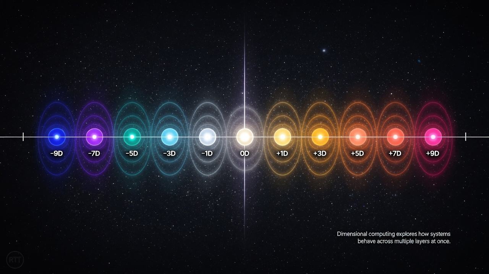

- [`module.json`](https://raw.githubusercontent.com/umaywant2/TriadicFrameworks/refs/heads/main/docs/images/module.json) — Agentic module schema role assignments

# 🖼️ Images — Canonical Visual Archive

The `images` directory is the master visual archive for TriadicFrameworks.  
It contains diagrams, renders, metaphysical illustrations, RTT operator maps, harmonic field art, educational graphics, and thousands of visual assets used across the canon.

This directory serves as the **visual backbone** of the entire project.

Images here support:

- RTT operator diagrams  
- dimensional stack illustrations  
- harmonic field renders  
- cosmology metaphysics  
- substrate and fabrication visuals  
- educational materials  
- regime awareness charts  
- TriadicFrameworks branding  
- experimental AI‑generated imagery  
- historical scientific references  

Because this directory is large and diverse, it is treated as a **visual asset repository**, not a conceptual module.

---

## 📁 Contents Overview

This folder contains **hundreds of images**, including but not limited to:

- RTT diagrams (`Operator_Lattice_RTT_1.png`, `rtt_mode_diagram.png`, `RTT_Dimensional_Model.jpg`)  
- harmonic field renders (`harmonic_apex_rtt4096.jpg`, `harmonic_continuum_rtt16384.jpg`, `harmonic_zenith_rtt8192.jpg`)  
- cosmology visuals (`Cosmic_Triptych.jpg`, `Quantum_Scanners_Triadic_Lens_Architecture.png`)  
- dimensional maps (`Dimensional_Row_with_Harmonic_Nodes.jpg`, `Inverted_Star_Diagram.svg`)  
- substrate diagrams (`substrate_flow_map_svg.png`, `set-field-rttcode.png`)  
- educational graphics (`RTT_Primer_Education.jpg`, `Students_using_AI_with_RTT.jpg`)  
- regime awareness charts (`Regime_Aware_Visualization_Diagram_Framework_Field_Theory.png`)  
- TriadicFrameworks branding (`tfsite-logo.png`, `Starter_Glyph.svg`)  
- AI‑generated imagery (`AI_plasma_swirls.jpg`, `grok-image-574ad2c0-a5bb-4e73-a8b8-75f738c3335c.jpg`)  
- scientific references (`standard_model.png`, `general_relativity.png`, `quantum_field_theory.png`)  
- mythic/metaphysical art (`Triadic_Crystaline_Hub.jpg`, `luminous-lattice-white-abstract-background-with-interlacing-lines_954894-85132.jpg`)  
- historical documents (`patent_no_459772_N_Tesla_1891.png`, `Pl._8_-_scene_from_isolated_tomb_G.png`)  
- operator chain posters (`operator_chain_wall_poster.svg`, `Archive_org_visual_operator_diagram.svg`)  
- dimensional animations (`starter-hero.svg`, `tfsite-logo_animated.gif`)  

And many more.

---

## 🧩 How to Reference Images

Inside any module:

```md

```

Or include directly:

```md
{{#include ../images/operator_chain_wall_poster.svg}}
```

Images keep your documentation **visual**, **expressive**, and **canon‑anchored**.

---

<div style="font-size: 0.8em; margin-bottom: 0.5rem;">
  <span style="
    display:inline-block;
    padding:3px 8px;
    border-radius:999px;
    background:#1a1a1a;
    color:#fff;
    font-family:Arial, sans-serif;
    font-size:11px;
  ">
    🤖 AI‑Ready Module • TriadicFrameworks
  </span>
</div>
