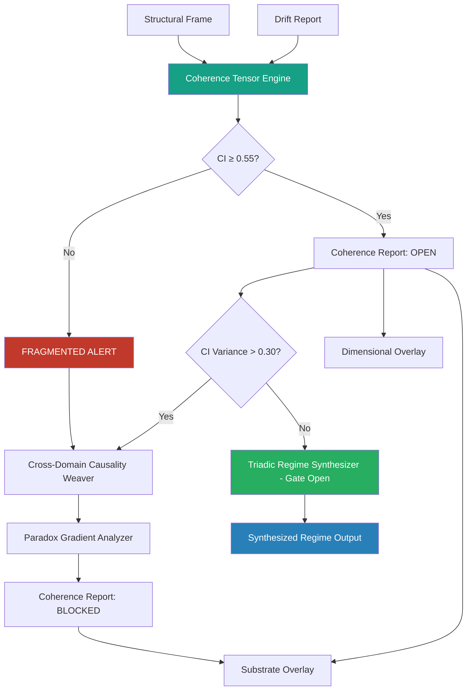

# Coherence Overlay · S3 Spine · TriadicFrameworks
> **Path:** `docs/spine/coherence_overlay.md`  
> **Publication URL:** `triadicframeworks.org/spine/coherence`  
> **Pack:** Spine Overlay Pack v2.0 · Updated 2026-08-02

---

## Session Context

| Field | Value |
|---|---|
| Canon | active (coherence-overlay · s3-spine) |
| Overlay Type | Coherence |
| Spine Layer | S3 |
| Version | 2.0 (coherence-stable) |
| Drift | minimal (tensor-grammar-locked) |
| Coherence | recursive (self-monitors own coherence index) |
| Format | markdown + cross-links + mermaid |
| Audience | analysts · researchers · AIs · synthesizers |
| Front Door | exists (Coherence Overlay root) |
| Every Page | stands alone · AI-parsable · spine-aware |

---

## 1 · Overlay Identity

### 1.1 Purpose
The Coherence Overlay evaluates the *quality of integration* across the components, regimes, and signals of a Triadic system. While the Structural Overlay asks "where are the faults?" and the Drift Overlay asks "how fast is the system moving?", the Coherence Overlay asks "is the system holding together?" Coherence is the measure of internal consistency: whether the sub-systems of a regime reinforce one another or are pulling apart. High coherence enables stable synthesis; low coherence signals fragmentation and approaching breakdown.

### 1.2 Position in S3 Spine
The Coherence Overlay is the **third overlay** in the canonical S3 Spine sequence. It requires both the Structural Frame and the Drift Report before it can initialize. It is the primary signal consumer for both upstream overlays, and the primary signal producer for the Substrate Overlay, which depends on coherence readings to evaluate the underlying substrate's capacity to support the current regime.

### 1.3 Canonical Role
- **Integration quality assessor**: scores how well system components cohere under current structural and drift conditions.
- **Synthesis gatekeeper**: the Triadic Regime Synthesizer will not produce a valid output unless coherence is above the synthesis threshold (CI ≥ 0.55 by default).
- **Fragmentation detector**: identifies zones of coherence collapse before structural faultlines fully activate.
- **Cross-domain coherence bridge**: coordinates with Cross-Domain Causality Weaver to trace coherence loss across domain boundaries.

---

## 2 · Primary RTT Engines

| Engine | Role | Spine Function | Link |
|---|---|---|---|
| Coherence Tensor Engine | **Primary** | Computes multi-axis coherence tensor across all registered regime components | [→ RTT Engine](https://www.triadicframeworks.org/rtt/Coherence_Tensor_Engine/) |
| Cross-Domain Causality Weaver | Secondary | Traces coherence loss causality across domain and regime boundaries | [→ RTT Engine](https://www.triadicframeworks.org/rtt/Cross_Domain_Causality_Weaver/) |
| Triadic Regime Synthesizer | Gatekeeper | Coherence index gates synthesis validity; receives CI from this overlay | [→ RTT Engine](https://www.triadicframeworks.org/rtt/Triadic_Regime_Synthesizer/) |
| Paradox Gradient Analyzer | Support | Resolves coherence paradoxes where local high coherence masks global fragmentation | [→ RTT Engine](https://www.triadicframeworks.org/rtt/Paradox_Gradient_Analyzer/) |

---

## 3 · Module Registry

| Module | Type | Spine Role | Link |
|---|---|---|---|
| Coherence Tensor Engine | RTT Engine | Owner engine — primary coherence scorer | [→ RTT Engine](https://www.triadicframeworks.org/rtt/Coherence_Tensor_Engine/) |
| IPD-12 Framework | Analytical Framework | 12-axis coordinate system; coherence scored per dimension and across dimensions | [→ Module](https://www.triadicframeworks.org/frameworks/ipd_12/) |
| Grammar for Intelligence | Education/Framing | Coherence-aware linguistic grammar for AI-interpretable signal narration | [→ Module](https://www.triadicframeworks.org/education/ebooks/Grammar_for_Intelligence/) |
| Operators (RTT/1→RTT/3) | Operator Ecology | SIE operator primitives that perform integration-emission coherence evaluation | [→ Module](https://www.triadicframeworks.org/operators/) |
| Operator Ecology Teaching Bundle | Education | SIE lab exercises on coherence measurement and integration mechanics | [→ Module](https://www.triadicframeworks.org/operators/teaching_bundle/) |
| Prompts Module | Prompt Layer | Structured prompt templates for coherence-diagnostic workflows | [→ Module](https://www.triadicframeworks.org/prompts/) |
| RTT Infinity Prompts | Prompt Layer | High-resolution prompt scaffolds for deep coherence diagnostics | [→ Module](https://www.triadicframeworks.org/prompts/rtt_infinity/) |
| Pantheons Module | Context Layer | Multi-agent coherence contexts; tracks coherence across agent pantheons | [→ Module](https://www.triadicframeworks.org/pantheons/) |
| Inside · Enterprise | Domain Context | Enterprise-domain coherence: org structures, operational coherence metrics | [→ Module](https://www.triadicframeworks.org/rtt/Inside/Enterprise/) |
| Inside · qCompute | Domain Context | Quantum-compute-domain coherence: entanglement, decoherence, error correction | [→ Module](https://www.triadicframeworks.org/rtt/Inside/qCompute/) |

---

## 4 · Coherence Logic

### 4.1 Detection Pipeline
```
[Structural Frame from Structural Overlay]
[Drift Report from Drift Overlay]
    → Coherence Tensor Engine          (multi-axis CI computation)
    → Cross-Domain Causality Weaver    (coherence-loss causality tracing)
    → Paradox Gradient Analyzer        (local/global coherence paradox resolution)
    → Triadic Regime Synthesizer       (CI gates synthesis validity)
    → [Coherence Report → Substrate Overlay + Dimensional Overlay]
```

### 4.2 Signal Flow

**Phase 1 — Tensor Construction:** The Coherence Tensor Engine receives the Structural Frame and Drift Report simultaneously. It constructs a coherence tensor — a multi-dimensional matrix scoring the degree of mutual reinforcement between all component pairs across all 12 IPD dimensions. Each cell (i, j) in the tensor represents how well component i and component j are aligned in regime, direction, and load-sharing.

**Phase 2 — Coherence Index Computation:** The tensor is reduced to a scalar Coherence Index (CI) per axis, and an aggregate CI across all axes. The Cross-Domain Causality Weaver is invoked when the CI variance across axes exceeds 0.3 (indicating that coherence is high in some dimensions but collapsing in others — a signature of domain-boundary fragmentation).

**Phase 3 — Paradox Resolution:** When local sub-system coherence is high but global CI is falling, the Paradox Gradient Analyzer decomposes the coherence field to identify the isolating boundary — the sub-system acting as a coherence attractor that is drawing resources away from the whole.

**Phase 4 — Synthesis Gate Evaluation:** Before the Triadic Regime Synthesizer is permitted to run, the Coherence Overlay publishes the current CI. The Synthesizer applies the gate: if CI < 0.55, synthesis is blocked and a FRAGMENTATION alert is issued. If CI ≥ 0.55, synthesis proceeds with the CI embedded in the output as a confidence weight.

### 4.3 Coherence State Machine
| State | Trigger | Action |
|---|---|---|
| `INITIALIZING` | Structural Frame + Drift Report received | Begin tensor construction |
| `MEASURING` | Tensor constructed | Compute per-axis and aggregate CI |
| `COHERENT` | CI ≥ 0.75 | Log + publish; synthesis gate open |
| `NOMINAL` | 0.55 ≤ CI < 0.75 | Log + publish with caution flag; synthesis gate open |
| `FRAGMENTED` | 0.30 ≤ CI < 0.55 | Block synthesis; alert Substrate Overlay; fire Cross-Domain Causality Weaver |
| `COLLAPSE` | CI < 0.30 | Maximum alert; block all synthesis; freeze outputs; engage full Spine |
| `PARADOX` | High local CI + falling global CI | Fire Paradox Gradient Analyzer; identify coherence attractor |
| `RECOVERING` | CI rising from FRAGMENTED or COLLAPSE | Resume measurement; log recovery trajectory |

### 4.4 Coherence Metrics
| Metric | Symbol | Range | Alert Threshold |
|---|---|---|---|
| Coherence Index (aggregate) | CI | 0.0–1.0 | < 0.55 (fragmentation) |
| Per-axis Coherence | CI_n | 0.0–1.0 | < 0.40 on any axis |
| Cross-axis CI Variance | ΔCI | 0.0–1.0 | > 0.30 |
| Causality Trace Depth | CTD | integer | > 4 (deep causal chains) |
| Synthesis Gate | SG | open / closed | Closed if CI < 0.55 |

---

## 5 · Cross-Links

### 5.1 UI Overlays
- `coherence-ui` — CI gauge array (per-axis and aggregate); tensor heatmap
- `synthesis-gate-ui` — Synthesis gate status indicator (open/closed + CI value)
- `causality-trace-ui` — Cross-Domain Causality Weaver trace visualization
- `fragmentation-map` — Spatial map of coherence zones across the system
- `alert-banner` — Fragmentation and collapse alerts

### 5.2 RTT Engines (Full Coherence Constellation)
| Engine | Relationship |
|---|---|
| [Coherence Tensor Engine](https://www.triadicframeworks.org/rtt/Coherence_Tensor_Engine/) | Owner engine |
| [Cross-Domain Causality Weaver](https://www.triadicframeworks.org/rtt/Cross_Domain_Causality_Weaver/) | Traces coherence-loss causality |
| [Triadic Regime Synthesizer](https://www.triadicframeworks.org/rtt/Triadic_Regime_Synthesizer/) | Gated by CI |
| [Paradox Gradient Analyzer](https://www.triadicframeworks.org/rtt/Paradox_Gradient_Analyzer/) | Resolves local/global paradoxes |
| [Drift Sentinel](https://www.triadicframeworks.org/rtt/Drift_Sentinel/) | Upstream: provides drift report |
| [Structural Faultline Detector](https://www.triadicframeworks.org/rtt/Structural_Faultline_Detector/) | Upstream: provides structural frame |
| [Dimensional Resonance Scanner](https://www.triadicframeworks.org/rtt/Dimensional_Resonance_Scanner/) | Downstream: maps coherence across dimensions |
| [Regime Interlock Mapper](https://www.triadicframeworks.org/rtt/Regime_Interlock_Mapper/) | Provides regime coupling data to tensor |

---

## 6 · Signal Vocabulary

| Term | Definition |
|---|---|
| **Coherence Index (CI)** | Scalar measure (0.0–1.0) of how well system components mutually reinforce one another |
| **Coherence Tensor** | Multi-dimensional matrix scoring mutual reinforcement between all component pairs across IPD-12 axes |
| **Fragmentation** | State in which CI falls below the synthesis threshold, indicating system components are pulling apart |
| **Synthesis Gate** | CI threshold (default 0.55) that must be exceeded before the Triadic Regime Synthesizer may run |
| **Cross-axis CI Variance** | Degree to which coherence differs across the 12 IPD axes; high variance signals domain-boundary fragmentation |
| **Coherence Attractor** | A sub-system with high local CI that draws integration resources away from the global coherence field |
| **SIE** | Structural Integration Engine; RTT/3 operator class; the operator family that drives coherence evaluation |
| **Causality Trace** | The causal chain linking a coherence-loss event back to its originating structural or drift condition |

---

## 7 · Integration Map



---

## 8 · Publication Notes

**Slug:** `triadicframeworks.org/spine/coherence`  
**Meta Title:** `Coherence Overlay · S3 Spine · TriadicFrameworks`  
**Meta Description:** `The Coherence Overlay measures integration quality and gates synthesis within the TriadicFrameworks S3 Spine. Primary engine: Coherence Tensor Engine. Requires Structural + Drift overlays.`  
**Tags:** `coherence · s3-spine · tensor · synthesis-gate · fragmentation · causality · rtt · sie`  
**Cross-Pack Links:** Structural Overlay · Drift Overlay · Substrate Overlay · Dimensional Overlay  
**Status:** Publication-ready · v2.0 · 2026-08-02
