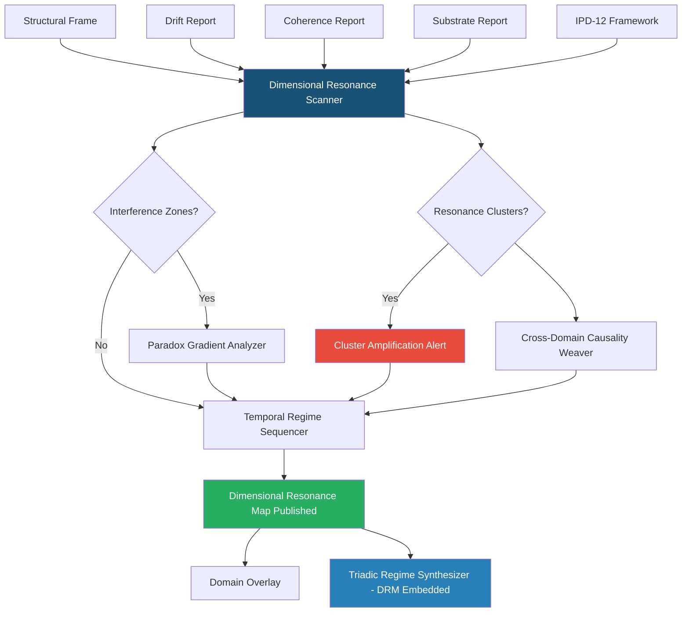

# Dimensional Overlay · S3 Spine · TriadicFrameworks
> **Path:** `docs/spine/dimensional_overlay.md`  
> **Publication URL:** `triadicframeworks.org/spine/dimensional`  
> **Pack:** Spine Overlay Pack v2.0 · Updated 2026-08-02

---

## Session Context

| Field | Value |
|---|---|
| Canon | active (dimensional-overlay · s3-spine) |
| Overlay Type | Dimensional |
| Spine Layer | S3 |
| Version | 2.0 (dimensional-stable) |
| Drift | minimal (resonance-grammar-locked) |
| Coherence | stable (cross-axis grammar) |
| Format | markdown + cross-links + mermaid |
| Audience | analysts · researchers · AIs · multi-domain architects |
| Front Door | exists (Dimensional Overlay root) |
| Every Page | stands alone · AI-parsable · spine-aware |

---

## 1 · Overlay Identity

### 1.1 Purpose
The Dimensional Overlay maps all prior overlay signals — structural, drift, coherence, and substrate — across the cross-cutting dimensional axes of a system. Where earlier overlays ask *what is breaking*, *how fast is it moving*, *does it hold together*, and *can the ground support it*, the Dimensional Overlay asks: **across which dimensions do these conditions resonate, interfere, or amplify one another?** It is the multi-axis projection layer: it takes the full four-overlay signal stack and renders it as a dimensional resonance field, revealing which axes are in harmonic alignment and which are in destructive interference.

### 1.2 Position in S3 Spine
The Dimensional Overlay is the **fifth overlay** in the canonical S3 Spine sequence. It requires all four preceding overlays (Structural, Drift, Coherence, Substrate) to be complete before it initializes. It produces a **Dimensional Resonance Map (DRM)** — the cross-axis projection of the full overlay stack — which is the primary input to the final Domain Overlay.

### 1.3 Canonical Role
- **Resonance detector**: identifies dimensional axes where multiple overlay signals reinforce one another (resonance zones) or cancel each other (interference zones).
- **Cross-axis signal projector**: maps 1D signals from individual overlays onto the full IPD-12 dimensional space.
- **Amplification tracer**: flags dimensions where weak signals from one overlay become amplified by coupling with signals from another.
- **Gateway to Domain Overlay**: the DRM is the primary input that enables the Domain Overlay to apply spine diagnostics to any specific domain.

---

## 2 · Primary RTT Engines

| Engine | Role | Spine Function | Link |
|---|---|---|---|
| Dimensional Resonance Scanner | **Primary** | Scans all 12 IPD dimensions for resonance between overlay signals | [→ RTT Engine](https://www.triadicframeworks.org/rtt/Dimensional_Resonance_Scanner/) |
| Cross-Domain Causality Weaver | Secondary | Traces causal chains that cross dimensional boundaries | [→ RTT Engine](https://www.triadicframeworks.org/rtt/Cross_Domain_Causality_Weaver/) |
| Paradox Gradient Analyzer | Tertiary | Resolves dimensional interference paradoxes (opposing signals on the same axis) | [→ RTT Engine](https://www.triadicframeworks.org/rtt/Paradox_Gradient_Analyzer/) |
| Triadic Regime Synthesizer | Synthesizer | Integrates the DRM into the final synthesized regime output | [→ RTT Engine](https://www.triadicframeworks.org/rtt/Triadic_Regime_Synthesizer/) |
| Temporal Regime Sequencer | Support | Time-stamps resonance events; sequences dimensional phase transitions | [→ RTT Engine](https://www.triadicframeworks.org/rtt/Temporal_Regime_Sequencer/) |

---

## 3 · Module Registry

| Module | Type | Spine Role | Link |
|---|---|---|---|
| Dimensional Resonance Scanner | RTT Engine | Owner engine — dimensional resonance mapping | [→ RTT Engine](https://www.triadicframeworks.org/rtt/Dimensional_Resonance_Scanner/) |
| IPD-12 Framework | Analytical Framework | 12-axis coordinate system; the dimensional grid for all resonance mapping | [→ Module](https://www.triadicframeworks.org/frameworks/ipd_12/) |
| Triadic Detection | Detection Suite | Pattern-recognition that feeds cross-dimensional signal extraction | [→ Module](https://www.triadicframeworks.org/triadic_detection/) |
| Operators (RTT/1→RTT/3) | Operator Ecology | SDE/SIE operators that compute inter-dimensional coupling coefficients | [→ Module](https://www.triadicframeworks.org/operators/) |
| Operator Ecology Teaching Bundle | Education | Labs on SDE/SIE dimensional coupling and resonance measurement | [→ Module](https://www.triadicframeworks.org/operators/teaching_bundle/) |
| RTT Infinity Prompts | Prompt Layer | High-resolution dimensional diagnostic prompt scaffolds | [→ Module](https://www.triadicframeworks.org/prompts/rtt_infinity/) |
| Grammar for Intelligence | Education/Framing | Dimensional grammar for structured AI-interpretable resonance narration | [→ Module](https://www.triadicframeworks.org/education/ebooks/Grammar_for_Intelligence/) |
| Pantheons Module | Context Layer | Multi-agent cross-dimensional contexts; agent role assignment per dimensional axis | [→ Module](https://www.triadicframeworks.org/pantheons/) |
| TFT OpenGPU Stack Module | Compute Layer | Parallel dimensional tensor computation across all 12 IPD axes | [→ Module](https://www.triadicframeworks.org/TFT.OpenGPU.Stack.Module/) |
| Atmosphere Module | Environmental Layer | Environmental dimensional pressures (cross-cutting atmospheric signals) | [→ Module](https://www.triadicframeworks.org/atmosphere/) |

---

## 4 · Dimensional Logic

### 4.1 Detection Pipeline
```
[Structural Frame + Drift Report + Coherence Report + Substrate Report]
    → Dimensional Resonance Scanner    (12-axis resonance field computation)
    → Cross-Domain Causality Weaver    (cross-dimensional causality tracing)
    → Paradox Gradient Analyzer        (interference zone resolution)
    → Temporal Regime Sequencer        (phase-transition time-stamping)
    → Triadic Regime Synthesizer       (DRM embedded in synthesized output)
    → [Dimensional Resonance Map → Domain Overlay]
```

### 4.2 Signal Flow

**Phase 1 — Stack Projection:** The Dimensional Resonance Scanner ingests all four prior overlay reports and projects each signal onto the IPD-12 dimensional grid. For each of the 12 axes, it computes a **dimensional signal vector** — the composite of structural criticality, drift magnitude, coherence index, and substrate saturation on that axis.

**Phase 2 — Resonance Field Computation:** The scanner computes pairwise resonance coefficients between all axis pairs (12 × 11 / 2 = 66 pairs). A positive resonance coefficient indicates that the two axes are reinforcing one another's signals (amplification). A negative coefficient indicates destructive interference (one axis's signals partially cancel the other's). Axes with resonance coefficients above +0.70 form **resonance clusters** — zones where problems (or recoveries) self-amplify. Axes with coefficients below −0.40 form **interference zones** — zones where competing signals may mask genuine system states.

**Phase 3 — Causality Tracing:** The Cross-Domain Causality Weaver traces causal chains across dimensional boundaries — identifying where a signal on axis *i* is the cause of a signal on axis *j*, rather than an independent reading. This de-correlates the resonance field and provides a directed causality graph over the 12-axis space.

**Phase 4 — Interference Resolution:** The Paradox Gradient Analyzer is applied to interference zones. It identifies the dominant gradient direction on each contested axis, resolving which overlay signal should be treated as primary for that dimension.

**Phase 5 — DRM Publication:** The final Dimensional Resonance Map is a 12×12 signed matrix annotated with resonance clusters, interference zones, causality directions, and a per-axis composite score. It is published to the Spine bus and passed as the primary input to the Domain Overlay.

### 4.3 Dimensional State Machine
| State | Trigger | Action |
|---|---|---|
| `PROJECTING` | All four overlay reports received | Begin 12-axis signal projection |
| `SCANNING` | Projection complete | Compute 66 pairwise resonance coefficients |
| `RESONANT` | Any cluster with coefficient > 0.70 | Flag resonance cluster; alert Domain Overlay |
| `INTERFERING` | Any pair with coefficient < −0.40 | Fire Paradox Gradient Analyzer |
| `TRACING` | Causality chain detected | Fire Cross-Domain Causality Weaver |
| `AMPLIFIED` | Resonance cluster + collapse-precursor signal | Critical: self-amplifying collapse risk |
| `DRM_PUBLISHED` | Map complete | Pass DRM to Domain Overlay + Triadic Regime Synthesizer |

### 4.4 Dimensional Metrics
| Metric | Symbol | Range | Alert Threshold |
|---|---|---|---|
| Resonance Coefficient (pairwise) | RC_ij | −1.0 to +1.0 | > +0.70 or < −0.40 |
| Cluster Amplification Factor | CAF | 1.0–∞ | > 3.0 |
| Interference Masking Depth | IMD | 0.0–1.0 | > 0.50 |
| Causality Chain Length | CCL | integer | > 5 hops |
| Per-axis Composite Score | ACS_n | 0.0–1.0 | varies by axis |
| DRM Confidence | DRC | 0.0–1.0 | < 0.60 (low confidence) |

---

## 5 · Cross-Links

### 5.1 UI Overlays
- `dimensional-ui` — 12×12 resonance matrix heatmap; cluster highlights; interference zone markers
- `resonance-cluster-panel` — Active resonance cluster list with amplification factors
- `causality-graph-ui` — Directed causality graph visualization over 12-axis space
- `axis-composite-panel` — Per-axis composite scores with overlay signal breakdown
- `drm-export` — Dimensional Resonance Map export (JSON + visual)

### 5.2 RTT Engines (Full Dimensional Constellation)
| Engine | Relationship |
|---|---|
| [Dimensional Resonance Scanner](https://www.triadicframeworks.org/rtt/Dimensional_Resonance_Scanner/) | Owner engine |
| [Cross-Domain Causality Weaver](https://www.triadicframeworks.org/rtt/Cross_Domain_Causality_Weaver/) | Causality tracing across axes |
| [Paradox Gradient Analyzer](https://www.triadicframeworks.org/rtt/Paradox_Gradient_Analyzer/) | Interference zone resolution |
| [Triadic Regime Synthesizer](https://www.triadicframeworks.org/rtt/Triadic_Regime_Synthesizer/) | Embeds DRM in synthesized output |
| [Temporal Regime Sequencer](https://www.triadicframeworks.org/rtt/Temporal_Regime_Sequencer/) | Phase-transition time-stamping |
| [Stability Basin Cartographer](https://www.triadicframeworks.org/rtt/Stability_Basin_Cartographer/) | Upstream: provides substrate basin data |
| [Coherence Tensor Engine](https://www.triadicframeworks.org/rtt/Coherence_Tensor_Engine/) | Upstream: provides coherence tensor per axis |
| [Drift Sentinel](https://www.triadicframeworks.org/rtt/Drift_Sentinel/) | Upstream: provides per-axis drift vectors |
| [Structural Faultline Detector](https://www.triadicframeworks.org/rtt/Structural_Faultline_Detector/) | Upstream: provides per-axis faultline scores |

### 5.3 Module Structures
- [Substrate Overlay](./substrate_overlay.md) — Upstream: provides substrate report
- [Coherence Overlay](./coherence_overlay.md) — Upstream: provides coherence report
- [Drift Overlay](./drift_overlay.md) — Upstream: provides drift report
- [Structural Overlay](./structural_overlay.md) — Upstream: provides structural frame
- [Domain Overlay](./domain_overlay.md) — Downstream: receives DRM as primary input
- [IPD-12 Framework](https://www.triadicframeworks.org/frameworks/ipd_12/) — Dimensional coordinate system
- [Triadic Detection](https://www.triadicframeworks.org/triadic_detection/) — Signal extraction across dimensions
- [Pantheons Module](https://www.triadicframeworks.org/pantheons/) — Multi-agent per-dimension role assignment

---

## 6 · Signal Vocabulary

| Term | Definition |
|---|---|
| **Dimensional Resonance Map (DRM)** | The 12×12 signed matrix of resonance coefficients and composite scores across all IPD axes |
| **Resonance Coefficient (RC_ij)** | Pairwise measure (−1.0 to +1.0) of signal reinforcement or cancellation between axes i and j |
| **Resonance Cluster** | A group of axes with mutually high positive RC; signals self-amplify within the cluster |
| **Interference Zone** | A pair of axes with strongly negative RC; opposing signals partially cancel, masking true system state |
| **Amplification Factor** | The multiplier by which a resonance cluster amplifies an incoming signal |
| **Causality Chain** | A directed sequence of dimensional dependencies: axis i causes axis j causes axis k... |
| **Cross-Dimensional Causality** | Causal influence that operates across dimensional boundaries; traced by Cross-Domain Causality Weaver |
| **Dimensional Signal Vector** | The composite of structural, drift, coherence, and substrate signals on a single IPD axis |
| **DRM Confidence** | Measure of how reliably the DRM reflects actual system state; reduced by high interference |
| **Phase Transition** | A dimensional event in which a cluster shifts from one resonance regime to another |

---

## 7 · Integration Map



---

## 8 · Publication Notes

**Slug:** `triadicframeworks.org/spine/dimensional`  
**Meta Title:** `Dimensional Overlay · S3 Spine · TriadicFrameworks`  
**Meta Description:** `The Dimensional Overlay maps all prior overlay signals across 12 IPD axes, producing the Dimensional Resonance Map. Primary engine: Dimensional Resonance Scanner. Requires all four prior overlays.`  
**Tags:** `dimensional · s3-spine · resonance · ipd-12 · cross-axis · drm · causality · rtt`  
**Cross-Pack Links:** Substrate Overlay · Domain Overlay · Structural Overlay · Drift Overlay · Coherence Overlay  
**Status:** Publication-ready · v2.0 · 2026-08-02
