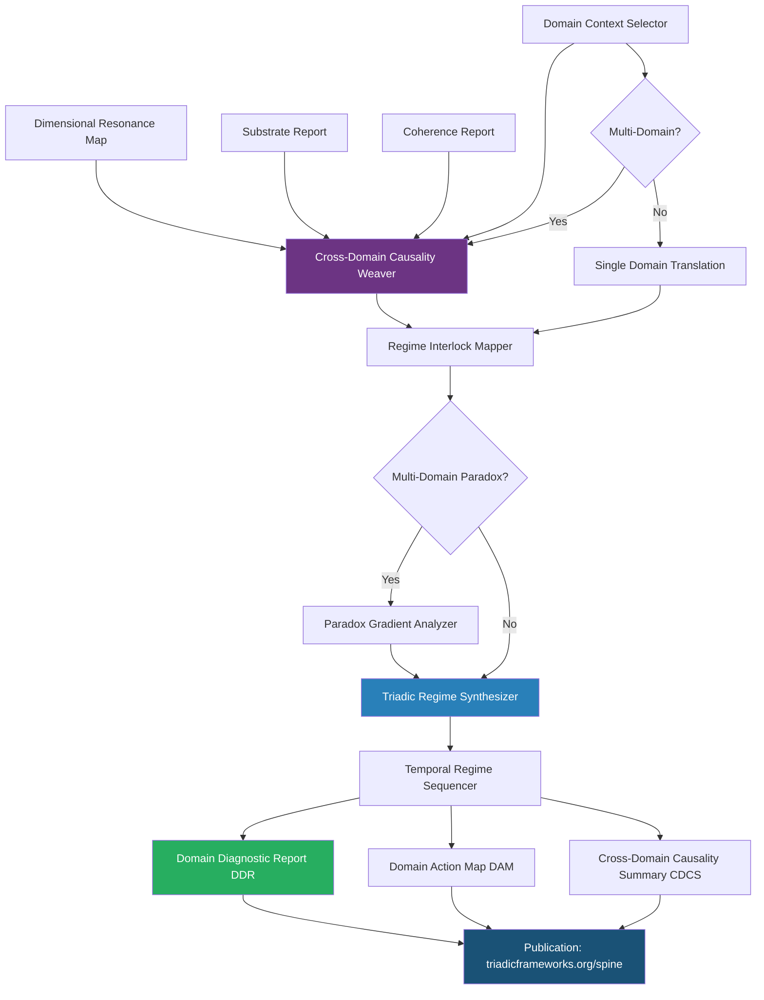

# Domain Overlay · S3 Spine · TriadicFrameworks
> **Path:** `docs/spine/domain_overlay.md`  
> **Publication URL:** `triadicframeworks.org/spine/domain`  
> **Pack:** Spine Overlay Pack v2.0 · Updated 2026-08-02

---

## Session Context

| Field | Value |
|---|---|
| Canon | active (domain-overlay · s3-spine) |
| Overlay Type | Domain |
| Spine Layer | S3 |
| Version | 2.0 (domain-stable) |
| Drift | minimal (domain-grammar-locked) |
| Coherence | stable (cross-domain-first grammar) |
| Format | markdown + cross-links + mermaid |
| Audience | practitioners · domain experts · researchers · AIs |
| Front Door | exists (Domain Overlay root) |
| Every Page | stands alone · AI-parsable · spine-aware |

---

## 1 · Overlay Identity

### 1.1 Purpose
The Domain Overlay is the **terminal overlay** of the S3 Spine sequence. It takes the complete Dimensional Resonance Map produced by all five prior overlays and applies it to the concrete reality of a specific domain — Enterprise, Quantum Compute, Radiology, Fiscal/Tax, Education, Atmosphere, and others. Where all preceding overlays operate in the abstract Triadic coordinate space, the Domain Overlay translates spine diagnostics into domain-specific insight, actionable intelligence, and practitioner-facing outputs. It is the overlay that answers: "given everything the Spine has detected, what does it mean *here*, in *this* domain, *right now*?"

### 1.2 Position in S3 Spine
The Domain Overlay is the **sixth and final overlay** in the canonical S3 Spine sequence. It requires all five preceding overlays (Structural, Drift, Coherence, Substrate, Dimensional) to be complete. It is the only overlay that produces practitioner-facing outputs — all other overlays produce signal reports consumed by the next overlay in the chain. The Domain Overlay produces:
- **Domain Diagnostic Report (DDR)**: a human-readable and AI-parsable summary of spine findings translated into domain language.
- **Domain Action Map (DAM)**: ranked actionable interventions ordered by feasibility, urgency, and expected impact.
- **Cross-Domain Causality Summary (CDCS)**: a distilled account of causal chains that cross domain boundaries.

### 1.3 Canonical Role
- **Translation layer**: converts abstract Triadic spine signals into domain-specific terminology, metrics, and recommendations.
- **Action synthesizer**: produces ranked intervention maps for domain practitioners.
- **Cross-domain bridge**: identifies when causes originate in a different domain from where effects are observed.
- **Publication endpoint**: the DDR is the primary publishable output of a complete S3 Spine diagnostic run.

---

## 2 · Primary RTT Engines

| Engine | Role | Spine Function | Link |
|---|---|---|---|
| Cross-Domain Causality Weaver | **Primary** | Weaves causal chains across domain boundaries; identifies multi-domain causal structures | [→ RTT Engine](https://www.triadicframeworks.org/rtt/Cross_Domain_Causality_Weaver/) |
| Triadic Regime Synthesizer | **Co-Primary** | Produces the final synthesized regime description in domain-native language | [→ RTT Engine](https://www.triadicframeworks.org/rtt/Triadic_Regime_Synthesizer/) |
| Regime Interlock Mapper | Secondary | Maps regime couplings within and across domains; identifies domain-locked regimes | [→ RTT Engine](https://www.triadicframeworks.org/rtt/Regime_Interlock_Mapper/) |
| Temporal Regime Sequencer | Secondary | Sequences domain events along the regime timeline; generates domain chronology | [→ RTT Engine](https://www.triadicframeworks.org/rtt/Temporal_Regime_Sequencer/) |
| Paradox Gradient Analyzer | Support | Resolves domain-level paradoxes (e.g., simultaneous growth and contraction signals) | [→ RTT Engine](https://www.triadicframeworks.org/rtt/Paradox_Gradient_Analyzer/) |
| Stability Basin Cartographer | Support | Translates basin metaphors into domain-specific stability thresholds | [→ RTT Engine](https://www.triadicframeworks.org/rtt/Stability_Basin_Cartographer/) |

---

## 3 · Module Registry

### 3.1 Domain Contexts
| Module | Domain | Spine Role | Link |
|---|---|---|---|
| Inside · Enterprise | Enterprise | Org-structure, operational, financial regime diagnostics | [→ Module](https://www.triadicframeworks.org/rtt/Inside/Enterprise/) |
| Inside · qCompute | Quantum Compute | Qubit coherence, error budgets, entanglement regime diagnostics | [→ Module](https://www.triadicframeworks.org/rtt/Inside/qCompute/) |
| Radiology Module | Medical Imaging | Tissue, signal, imaging-capacity regime diagnostics | [→ Module](https://www.triadicframeworks.org/Radiology/) |
| Taxes Module | Fiscal/Tax | Tax-base, sovereign debt, revenue-regime diagnostics | [→ Module](https://www.triadicframeworks.org/taxes/) |
| Atmosphere Module | Environmental | Atmospheric, ecological, environmental-pressure diagnostics | [→ Module](https://www.triadicframeworks.org/atmosphere/) |
| Pantheons Module | Multi-Agent | Agent-role and multi-pantheon cross-domain orchestration | [→ Module](https://www.triadicframeworks.org/pantheons/) |

### 3.2 Education & Framing
| Module | Type | Spine Role | Link |
|---|---|---|---|
| Grammar for Intelligence | Education/Framing | Domain-native linguistic grammar for AI-parsable DDR narration | [→ Module](https://www.triadicframeworks.org/education/ebooks/Grammar_for_Intelligence/) |
| Expectations Module | Analytical Module | Domain-specific expectation envelopes for DDR contextualization | [→ Module](https://www.triadicframeworks.org/Expectations/) |
| Operators (RTT/1→RTT/3) | Operator Ecology | Full SDE/SIE operator pipeline applied within each domain | [→ Module](https://www.triadicframeworks.org/operators/) |
| Operator Ecology Teaching Bundle | Education | Domain-applied operator labs and instructor materials | [→ Module](https://www.triadicframeworks.org/operators/teaching_bundle/) |
| Prompts Module | Prompt Layer | Domain-specific structured prompt templates | [→ Module](https://www.triadicframeworks.org/prompts/) |
| RTT Infinity Prompts | Prompt Layer | Infinite-resolution domain diagnostic prompt scaffolds | [→ Module](https://www.triadicframeworks.org/prompts/rtt_infinity/) |

### 3.3 Compute & Detection
| Module | Type | Spine Role | Link |
|---|---|---|---|
| Triadic Detection | Detection Suite | Domain-context pattern recognition feeding DDR generation | [→ Module](https://www.triadicframeworks.org/triadic_detection/) |
| TFT OpenGPU Stack Module | Compute Layer | GPU-accelerated DDR and DAM generation at scale | [→ Module](https://www.triadicframeworks.org/TFT.OpenGPU.Stack.Module/) |
| IPD-12 Framework | Analytical Framework | Domain mapping within 12-axis coordinate space | [→ Module](https://www.triadicframeworks.org/frameworks/ipd_12/) |
| Crystal Mycelial Engine | Network Engine | Cross-domain resource-flow network in DDR resource sections | [→ Module](https://www.triadicframeworks.org/rtt/Crystal_Mycelial_Engine/) |

---

## 4 · Domain Logic

### 4.1 Detection Pipeline
```
[Dimensional Resonance Map (DRM) from Dimensional Overlay]
[Substrate Report from Substrate Overlay]
[Coherence Report from Coherence Overlay]
    → Domain Context Selector          (active domain(s) identified)
    → Cross-Domain Causality Weaver    (cross-domain causal chain weaving)
    → Regime Interlock Mapper          (domain-level regime coupling)
    → Triadic Regime Synthesizer       (domain-native regime synthesis)
    → Temporal Regime Sequencer        (domain chronology generation)
    → [Domain Diagnostic Report + Domain Action Map + CDCS → Publication]
```

### 4.2 Signal Flow

**Phase 1 — Domain Context Selection:** The Domain Overlay first identifies which domain contexts are active for the current Spine run. Multi-domain runs (e.g., Enterprise + Fiscal + Atmosphere simultaneously) engage the Cross-Domain Causality Weaver immediately for inter-domain causal weaving. Single-domain runs proceed directly to domain translation.

**Phase 2 — Domain Translation:** For each active domain, the DRM's per-axis composite scores are translated into domain-native metrics. Example translations:
- **Enterprise domain:** Axis 3 (Structural Load) → Organizational stress index; Axis 7 (Coherence Gradient) → Team alignment score
- **qCompute domain:** Axis 1 (Substrate Saturation) → Qubit error rate; Axis 9 (Drift Velocity) → Decoherence rate
- **Radiology domain:** Axis 4 (Signal Integrity) → SNR (signal-to-noise ratio); Axis 2 (Basin Depth) → Tissue margin stability
- **Fiscal domain:** Axis 6 (Regime Interlock) → Tax-regime coupling coefficient; Axis 11 (Drift Direction) → Revenue trajectory
- **Atmospheric domain:** Axis 5 (Flow Capacity) → Atmospheric circulation efficiency; Axis 10 (Resonance) → Climate feedback strength

**Phase 3 — Cross-Domain Causality Weaving:** The Cross-Domain Causality Weaver constructs a cross-domain causality graph: directed edges from causal domain to effect domain. This reveals, for example, that an atmospheric shift (Domain: Atmosphere) is causing a substrate pressure in fiscal policy (Domain: Fiscal) mediated by an agricultural output disruption — a three-domain causal chain invisible to single-domain analysis.

**Phase 4 — Synthesis:** The Triadic Regime Synthesizer produces the Domain Diagnostic Report in domain-native language, embedding:
- Regime name and description (domain-specific)
- Current phase in the Temporal Regime Sequencer's domain chronology
- Key faultlines translated into domain terminology
- Substrate runway in domain-specific time units
- Coherence state in domain-native quality language
- Ranked action items (the Domain Action Map)

**Phase 5 — Publication:** The DDR, DAM, and CDCS are published to the Spine bus and marked as publication-ready for `triadicframeworks.org/spine`.

### 4.3 Domain State Machine
| State | Trigger | Action |
|---|---|---|
| `CONTEXT_SELECTION` | DRM received | Identify active domain(s) |
| `TRANSLATING` | Domain(s) confirmed | Apply domain translation to DRM signals |
| `WEAVING` | Multi-domain run | Fire Cross-Domain Causality Weaver |
| `COUPLING` | Domain regimes identified | Fire Regime Interlock Mapper |
| `SYNTHESIZING` | Translation + causality complete | Fire Triadic Regime Synthesizer |
| `SEQUENCING` | Synthesis complete | Fire Temporal Regime Sequencer for chronology |
| `DDR_PUBLISHED` | DDR + DAM + CDCS complete | Mark as publication-ready; output to Spine bus |
| `MULTI_DOMAIN_PARADOX` | Contradictory cross-domain signals | Fire Paradox Gradient Analyzer; resolve before synthesis |

### 4.4 Domain Action Map (DAM) Ranking
| Priority Tier | Criteria | Example Intervention |
|---|---|---|
| **Tier 1 — Urgent** | Collapse-precursor detected; SI ≥ 0.80; CI < 0.30 | Emergency substrate relief; coherence recovery protocol |
| **Tier 2 — High** | Faultline SCS > 0.70; basin proximity < 0.25 | Structural reinforcement; regime transition management |
| **Tier 3 — Medium** | Drift deviation > 45°; CI < 0.55 | Drift correction; coherence enhancement |
| **Tier 4 — Monitor** | Nominal drift; CI ≥ 0.75; SI < 0.60 | Scheduled monitoring; expectation-envelope review |

---

## 5 · Cross-Links

### 5.1 UI Overlays
- `domain-ui` — DDR reader; domain toggle (Enterprise / qCompute / Radiology / Fiscal / Atmosphere / Multi)
- `action-map-ui` — Domain Action Map tier display; ranked intervention cards
- `causality-web-ui` — Cross-domain causality web visualization
- `domain-translation-panel` — DRM axis → domain metric translation table
- `chronology-rail` — Temporal Regime Sequencer domain event timeline
- `ddr-export` — DDR/DAM/CDCS export (PDF + JSON + Markdown)

### 5.2 RTT Engines (Full Domain Constellation)
| Engine | Relationship |
|---|---|
| [Cross-Domain Causality Weaver](https://www.triadicframeworks.org/rtt/Cross_Domain_Causality_Weaver/) | Owner co-engine |
| [Triadic Regime Synthesizer](https://www.triadicframeworks.org/rtt/Triadic_Regime_Synthesizer/) | Owner co-engine |
| [Regime Interlock Mapper](https://www.triadicframeworks.org/rtt/Regime_Interlock_Mapper/) | Domain coupling |
| [Temporal Regime Sequencer](https://www.triadicframeworks.org/rtt/Temporal_Regime_Sequencer/) | Domain chronology |
| [Paradox Gradient Analyzer](https://www.triadicframeworks.org/rtt/Paradox_Gradient_Analyzer/) | Multi-domain paradox resolution |
| [Stability Basin Cartographer](https://www.triadicframeworks.org/rtt/Stability_Basin_Cartographer/) | Domain threshold translation |
| [Crystal Mycelial Engine](https://www.triadicframeworks.org/rtt/Crystal_Mycelial_Engine/) | Cross-domain resource flow |
| [Dimensional Resonance Scanner](https://www.triadicframeworks.org/rtt/Dimensional_Resonance_Scanner/) | Upstream: provides DRM |
| [Coherence Tensor Engine](https://www.triadicframeworks.org/rtt/Coherence_Tensor_Engine/) | Upstream: provides coherence report |

### 5.3 Module Structures
- [Dimensional Overlay](./dimensional_overlay.md) — Upstream: provides DRM
- [Substrate Overlay](./substrate_overlay.md) — Upstream: provides substrate runway
- [Coherence Overlay](./coherence_overlay.md) — Upstream: provides CI
- [Drift Overlay](./drift_overlay.md) — Upstream: provides drift trajectory
- [Structural Overlay](./structural_overlay.md) — Upstream: provides structural frame
- [Inside · Enterprise](https://www.triadicframeworks.org/rtt/Inside/Enterprise/) — Enterprise domain context
- [Inside · qCompute](https://www.triadicframeworks.org/rtt/Inside/qCompute/) — Quantum compute domain context
- [Radiology Module](https://www.triadicframeworks.org/Radiology/) — Medical imaging domain context
- [Taxes Module](https://www.triadicframeworks.org/taxes/) — Fiscal domain context
- [Atmosphere Module](https://www.triadicframeworks.org/atmosphere/) — Environmental domain context
- [Pantheons Module](https://www.triadicframeworks.org/pantheons/) — Multi-agent domain orchestration

---

## 6 · Signal Vocabulary

| Term | Definition |
|---|---|
| **Domain Diagnostic Report (DDR)** | The human-readable and AI-parsable output of a complete S3 Spine run, translated into domain-native language |
| **Domain Action Map (DAM)** | Ranked set of actionable interventions organized by urgency, feasibility, and expected impact |
| **Cross-Domain Causality Summary (CDCS)** | Distilled account of causal chains that cross domain boundaries, produced by the Cross-Domain Causality Weaver |
| **Domain Translation** | The mapping from abstract DRM axis scores to domain-native metrics (e.g., Axis 1 SI → qubit error rate in qCompute) |
| **Domain Context** | The active real-world domain(s) to which the Spine diagnostic is being applied |
| **Multi-Domain Run** | A Spine diagnostic that simultaneously applies to two or more domain contexts |
| **Cross-Domain Causal Chain** | A causal sequence in which cause and effect occur in different domains |
| **Domain Chronology** | The domain-native event timeline produced by the Temporal Regime Sequencer for practitioner consumption |
| **Regime Name** | The domain-specific label assigned to the current triadic regime by the Triadic Regime Synthesizer |
| **DAM Tier** | The urgency/priority classification of a domain intervention (Tier 1=Urgent → Tier 4=Monitor) |

---

## 7 · Domain Translation Reference

### 7.1 Enterprise Domain
| IPD-12 Axis | Domain Metric | Threshold |
|---|---|---|
| Axis 1: Substrate Saturation | Capital Utilization Rate | Alert > 80% |
| Axis 2: Basin Depth | Organizational Resilience Score | Alert < 0.30 |
| Axis 3: Structural Load | Operational Stress Index | Alert > 0.70 |
| Axis 7: Coherence Gradient | Team Alignment Score | Alert < 0.55 |
| Axis 9: Drift Velocity | Strategic Drift Rate | Alert > 0.60 |
| Axis 11: Drift Direction | Revenue Trajectory Deviation | Alert > 30° |

### 7.2 Quantum Compute (qCompute) Domain
| IPD-12 Axis | Domain Metric | Threshold |
|---|---|---|
| Axis 1: Substrate Saturation | Qubit Error Rate | Alert > 5% |
| Axis 4: Signal Integrity | Gate Fidelity | Alert < 0.99 |
| Axis 5: Flow Capacity | Entanglement Bandwidth | Alert < 0.60 |
| Axis 9: Drift Velocity | Decoherence Rate | Alert > 0.40 |
| Axis 12: Resonance | Quantum Error Correction Overhead | Alert > 0.50 |

### 7.3 Radiology Domain
| IPD-12 Axis | Domain Metric | Threshold |
|---|---|---|
| Axis 2: Basin Depth | Tissue Margin Stability | Alert < 0.40 |
| Axis 4: Signal Integrity | SNR (Signal-to-Noise Ratio) | Alert < 20 dB |
| Axis 6: Regime Interlock | Imaging Protocol Coupling | Alert > 0.70 |
| Axis 8: Coherence Depth | Contrast Resolution | Alert < 0.55 |

### 7.4 Fiscal/Tax Domain
| IPD-12 Axis | Domain Metric | Threshold |
|---|---|---|
| Axis 1: Substrate Saturation | Tax-Base Utilization | Alert > 85% |
| Axis 3: Structural Load | Sovereign Debt Stress | Alert > 0.70 |
| Axis 6: Regime Interlock | Tax-Regime Coupling Coefficient | Alert > 0.75 |
| Axis 11: Drift Direction | Revenue Trajectory | Alert > 25° deviation |

---

## 8 · Integration Map



---

## 9 · Publication Notes

**Slug:** `triadicframeworks.org/spine/domain`  
**Meta Title:** `Domain Overlay · S3 Spine · TriadicFrameworks`  
**Meta Description:** `The Domain Overlay translates S3 Spine diagnostics into practitioner-facing outputs across Enterprise, qCompute, Radiology, Fiscal, Atmospheric, and multi-domain contexts. Terminal overlay in the S3 Spine sequence.`  
**Tags:** `domain · s3-spine · ddr · dam · causality · enterprise · qcompute · radiology · fiscal · atmosphere · rtt`  
**Cross-Pack Links:** All five upstream overlays · Inside Enterprise · Inside qCompute · Radiology · Taxes · Atmosphere  
**Status:** Publication-ready · v2.0 · 2026-08-02
