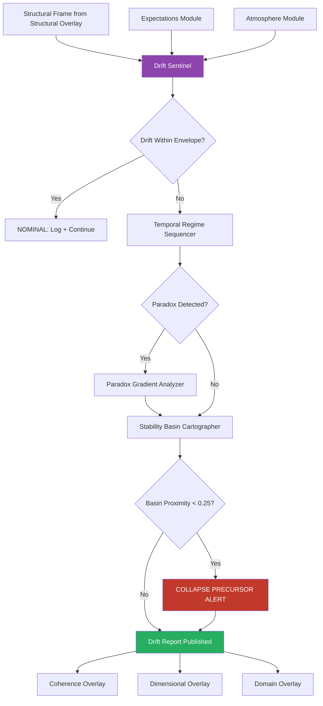

# Drift Overlay · S3 Spine · TriadicFrameworks
> **Path:** `docs/spine/drift_overlay.md`  
> **Publication URL:** `triadicframeworks.org/spine/drift`  
> **Pack:** Spine Overlay Pack v2.0 · Updated 2026-08-02

---

## Session Context

| Field | Value |
|---|---|
| Canon | active (drift-overlay · s3-spine) |
| Overlay Type | Drift |
| Spine Layer | S3 |
| Version | 2.0 (drift-stable) |
| Drift | self-referential (monitors own signal for meta-drift) |
| Coherence | stable (sentinel-grammar) |
| Format | markdown + cross-links + mermaid |
| Audience | analysts · researchers · AIs · operators |
| Front Door | exists (Drift Overlay root) |
| Every Page | stands alone · AI-parsable · spine-aware |

---

## 1 · Overlay Identity

### 1.1 Purpose
The Drift Overlay monitors the rate and direction of change across any Triadic system registered to the S3 Spine. Where the Structural Overlay identifies *what* is load-bearing, the Drift Overlay identifies *how fast* the load distribution is shifting. Drift is not error — it is regime migration: the measurable movement of a system's operating center through its stability landscape over time. Unchecked drift precedes collapse; detected and managed drift enables controlled regime transitions.

### 1.2 Position in S3 Spine
The Drift Overlay is the **second overlay** in the canonical S3 Spine sequence. It requires a registered Structural Frame (from the Structural Overlay) before it can initialize. It feeds its drift readings to the Coherence Overlay, which determines whether drift is integrative or disintegrative, and to the Dimensional Overlay, which maps drift across cross-cutting axes.

### 1.3 Canonical Role
- **Primary monitor** of regime migration velocity and trajectory.
- **Early-warning system** for collapse-precursor drift signatures.
- **Time-annotator**: all drift readings carry a temporal stamp passed to the Temporal Regime Sequencer.
- **Bridge** between structural geometry (Structural Overlay) and signal quality (Coherence Overlay).

---

## 2 · Primary RTT Engines

| Engine | Role | Spine Function | Link |
|---|---|---|---|
| Drift Sentinel | **Primary** | Continuously monitors drift vectors across registered structural frame | [→ RTT Engine](https://www.triadicframeworks.org/rtt/Drift_Sentinel/) |
| Temporal Regime Sequencer | Secondary | Time-stamps and sequences regime transitions revealed by drift | [→ RTT Engine](https://www.triadicframeworks.org/rtt/Temporal_Regime_Sequencer/) |
| Paradox Gradient Analyzer | Tertiary | Resolves contradictory drift signals where regimes pull in opposing directions | [→ RTT Engine](https://www.triadicframeworks.org/rtt/Paradox_Gradient_Analyzer/) |
| Stability Basin Cartographer | Validator | Re-scores basin depth as drift shifts the structural frame | [→ RTT Engine](https://www.triadicframeworks.org/rtt/Stability_Basin_Cartographer/) |

---

## 3 · Module Registry

| Module | Type | Spine Role | Link |
|---|---|---|---|
| Drift Sentinel | RTT Engine | Owner engine — primary drift detector | [→ RTT Engine](https://www.triadicframeworks.org/rtt/Drift_Sentinel/) |
| Expectations Module | Analytical Module | Expectation-state modeling; drift measured against expected trajectories | [→ Module](https://www.triadicframeworks.org/Expectations/) |
| RTT Infinity Prompts | Prompt Layer | Infinite-resolution prompt scaffolds for drift diagnostics | [→ Module](https://www.triadicframeworks.org/prompts/rtt_infinity/) |
| Operators (RTT/1→RTT/3) | Operator Ecology | SDE primitives underpin drift-vector computation | [→ Module](https://www.triadicframeworks.org/operators/) |
| Triadic Detection | Detection Suite | Signal extraction layer feeding raw readings to Drift Sentinel | [→ Module](https://www.triadicframeworks.org/triadic_detection/) |
| Atmosphere Module | Environmental Layer | Ambient environmental signals that generate systemic drift pressure | [→ Module](https://www.triadicframeworks.org/atmosphere/) |
| Grammar for Intelligence | Education/Framing | Linguistic framing of drift signals; supports AI-parsable drift narration | [→ Module](https://www.triadicframeworks.org/education/ebooks/Grammar_for_Intelligence/) |

---

## 4 · Drift Logic

### 4.1 Detection Pipeline
```
[Structural Frame from Structural Overlay]
    → Drift Sentinel                   (continuous vector monitoring)
    → Temporal Regime Sequencer        (drift time-stamping + sequencing)
    → Paradox Gradient Analyzer        (contradiction resolution)
    → Stability Basin Cartographer     (basin re-scoring under drift)
    → [Drift Report → Coherence Overlay + Dimensional Overlay]
```

### 4.2 Signal Flow

**Phase 1 — Baseline Acquisition:** Drift Sentinel ingests the registered Structural Frame and establishes a drift baseline: the system's current position within its stability landscape. The Expectations Module provides expected-trajectory envelopes — the region within which drift is considered nominal.

**Phase 2 — Vector Monitoring:** Drift Sentinel tracks three drift dimensions simultaneously:
- **Magnitude Drift (ΔM):** Rate of change in structural load distribution
- **Directional Drift (ΔD):** Angular deviation of the system's regime trajectory from its expected path
- **Volatility Drift (ΔV):** Second-derivative of drift; acceleration of change

When any drift dimension exceeds its envelope, the Temporal Regime Sequencer stamps the exceedance event and begins sequencing a potential regime transition.

**Phase 3 — Paradox Resolution:** Systems under competing pressures (e.g., expansion and contraction forces simultaneously active) produce paradoxical drift signals. The Paradox Gradient Analyzer resolves these by decomposing the signal into its constituent gradient vectors and identifying the dominant forcing regime.

**Phase 4 — Basin Re-scoring:** As drift accumulates, the Stability Basin Cartographer re-scores basin depth. A system drifting toward a basin boundary receives a shrinking basin depth score; this score is published to the S3 Spine bus alongside the drift report.

### 4.3 Drift State Machine
| State | Trigger | Action |
|---|---|---|
| `BASELINE` | Structural Frame received | Establish drift envelopes from Expectations Module |
| `NOMINAL` | All ΔM, ΔD, ΔV within envelope | Log + continue monitoring |
| `DEVIATION` | Any dimension exceeds envelope | Timestamp via Temporal Regime Sequencer; alert Coherence Overlay |
| `PARADOX` | Contradictory drift vectors detected | Fire Paradox Gradient Analyzer |
| `TRANSITION` | Basin boundary proximity confirmed | Escalate to full Spine alert; engage Domain Overlay |
| `COLLAPSE_PRECURSOR` | ΔV accelerating + basin depth < 0.2 | Maximum alert; freeze synthesis; engage all overlays |
| `RECOVERY` | Drift vectors reversing toward baseline | Resume nominal monitoring; log recovery signature |

### 4.4 Drift Metrics
| Metric | Symbol | Range | Alert Threshold |
|---|---|---|---|
| Magnitude Drift | ΔM | 0.0–1.0 | > 0.6 |
| Directional Drift | ΔD | 0°–360° | > 45° deviation |
| Volatility Drift | ΔV | 0.0–1.0 | > 0.5 |
| Basin Proximity | BP | 0.0–1.0 | < 0.25 |
| Paradox Index | PX | 0.0–1.0 | > 0.4 |

---

## 5 · Cross-Links

### 5.1 UI Overlays
- `drift-ui` — Real-time drift vector display; ΔM/ΔD/ΔV gauges; trajectory arc
- `timeline-rail` — Temporal Regime Sequencer event timeline
- `paradox-panel` — Paradox Gradient Analyzer gradient decomposition view
- `basin-map` — Stability Basin Cartographer depth map (drift-adjusted)
- `alert-banner` — Collapse-precursor and transition alerts

### 5.2 RTT Engines (Full Drift Constellation)
| Engine | Relationship |
|---|---|
| [Drift Sentinel](https://www.triadicframeworks.org/rtt/Drift_Sentinel/) | Owner engine |
| [Temporal Regime Sequencer](https://www.triadicframeworks.org/rtt/Temporal_Regime_Sequencer/) | Time-stamps drift events |
| [Paradox Gradient Analyzer](https://www.triadicframeworks.org/rtt/Paradox_Gradient_Analyzer/) | Resolves contradictory signals |
| [Stability Basin Cartographer](https://www.triadicframeworks.org/rtt/Stability_Basin_Cartographer/) | Re-scores basin depth under drift |
| [Structural Faultline Detector](https://www.triadicframeworks.org/rtt/Structural_Faultline_Detector/) | Upstream provider (structural frame) |
| [Coherence Tensor Engine](https://www.triadicframeworks.org/rtt/Coherence_Tensor_Engine/) | Downstream consumer of drift report |
| [Dimensional Resonance Scanner](https://www.triadicframeworks.org/rtt/Dimensional_Resonance_Scanner/) | Receives drift trajectory for dimensional mapping |
| [Cross-Domain Causality Weaver](https://www.triadicframeworks.org/rtt/Cross_Domain_Causality_Weaver/) | Traces drift causes across domain boundaries |

### 5.3 Module Structures
- [Structural Overlay](./structural_overlay.md) — Upstream: provides registered structural frame
- [Coherence Overlay](./coherence_overlay.md) — Downstream: receives drift report
- [Dimensional Overlay](./dimensional_overlay.md) — Downstream: maps drift across axes
- [Expectations Module](https://www.triadicframeworks.org/Expectations/) — Nominal trajectory envelopes
- [Atmosphere Module](https://www.triadicframeworks.org/atmosphere/) — Environmental drift pressure
- [Operators / RTT/1→RTT/3](https://www.triadicframeworks.org/operators/) — SDE operator primitives

---

## 6 · Signal Vocabulary

| Term | Definition |
|---|---|
| **Drift** | The measurable movement of a system's operating center through its stability landscape over time |
| **Drift Vector** | A directional quantity expressing both the magnitude and heading of regime migration |
| **ΔM** | Magnitude Drift; rate of change in structural load distribution |
| **ΔD** | Directional Drift; angular deviation from expected trajectory |
| **ΔV** | Volatility Drift; acceleration of drift (second derivative) |
| **Drift Envelope** | The nominal corridor within which drift is expected and acceptable |
| **Paradox Gradient** | A drift field where opposing regime forces produce contradictory motion vectors |
| **Collapse Precursor** | A signature of accelerating volatility drift combined with shrinking basin depth |
| **Regime Transition** | A controlled drift event in which the system moves from one stability regime to another |
| **Basin Proximity** | Distance (0.0–1.0) from basin boundary; lower values indicate higher collapse risk |

---

## 7 · Integration Map



---

## 8 · Publication Notes

**Slug:** `triadicframeworks.org/spine/drift`  
**Meta Title:** `Drift Overlay · S3 Spine · TriadicFrameworks`  
**Meta Description:** `The Drift Overlay monitors regime migration velocity and trajectory within the TriadicFrameworks S3 Spine. Primary engine: Drift Sentinel. Requires Structural Overlay registration.`  
**Tags:** `drift · s3-spine · sentinel · temporal-regime · paradox-gradient · basin · rtt`  
**Cross-Pack Links:** Structural Overlay · Coherence Overlay · Dimensional Overlay · Domain Overlay  
**Status:** Publication-ready · v2.0 · 2026-08-02
