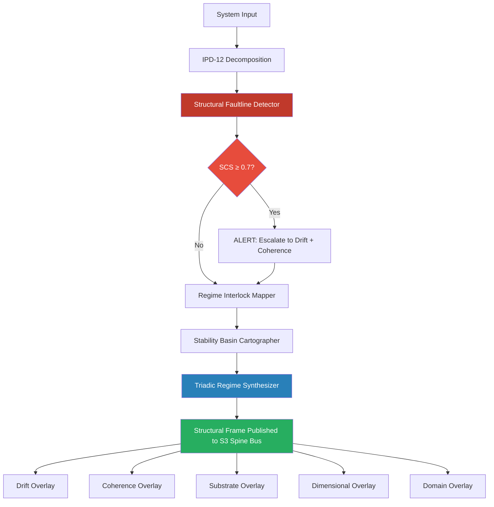

# Structural Overlay · S3 Spine · TriadicFrameworks
> **Path:** `docs/spine/structural_overlay.md`  
> **Publication URL:** `triadicframeworks.org/spine/structural`  
> **Pack:** Spine Overlay Pack v2.0 · Updated 2026-08-02

---

## Session Context

| Field | Value |
|---|---|
| Canon | active (structural-overlay · s3-spine) |
| Overlay Type | Structural |
| Spine Layer | S3 |
| Version | 2.0 (structural-stable) |
| Drift | minimal (architecture-locked) |
| Coherence | stable (faultline-grammar) |
| Format | markdown + cross-links + mermaid |
| Audience | developers · researchers · AIs · architects |
| Front Door | exists (Structural Overlay root) |
| Every Page | stands alone · AI-parsable · spine-aware |

---

## 1 · Overlay Identity

### 1.1 Purpose
The Structural Overlay maps the load-bearing architecture of any system under Triadic analysis. It identifies faultlines — the latent fracture planes along which a system collapses or reorganizes — and exposes the interlock geometry between regimes. The Structural Overlay is the first overlay consulted in any S3 Spine diagnostic sequence because all other overlays inherit their coordinate space from structural registration.

### 1.2 Position in S3 Spine
Within the S3 Spine, the Structural Overlay occupies the **registration layer**: it must be applied before Drift, Coherence, Substrate, Dimensional, or Domain overlays are meaningful. It provides the foundational grid — the triadic skeleton — onto which all signal readings are projected. No Spine diagnostic is considered complete unless the Structural Overlay has been validated.

### 1.3 Canonical Role
- **Primary detector** of hidden load-bearing elements and their failure modes.
- **Anchor** for regime interlock geometry (which regimes are coupled, which are independent).
- **Source of truth** for boundary conditions passed to Drift and Coherence overlays.
- **Gate** for Triadic Regime Synthesizer output — synthesis is only valid against a registered structural frame.

---

## 2 · Primary RTT Engines

| Engine | Role | Spine Function | Link |
|---|---|---|---|
| Structural Faultline Detector | **Primary** | Locates and scores latent fracture planes across system architecture | [→ RTT Engine](https://www.triadicframeworks.org/rtt/Structural_Faultline_Detector/) |
| Regime Interlock Mapper | Secondary | Maps coupling geometry between co-active regimes | [→ RTT Engine](https://www.triadicframeworks.org/rtt/Regime_Interlock_Mapper/) |
| Triadic Regime Synthesizer | Synthesizer | Produces the unified structural frame from multi-regime inputs | [→ RTT Engine](https://www.triadicframeworks.org/rtt/Triadic_Regime_Synthesizer/) |
| Stability Basin Cartographer | Validator | Confirms structural stability thresholds post-synthesis | [→ RTT Engine](https://www.triadicframeworks.org/rtt/Stability_Basin_Cartographer/) |

---

## 3 · Module Registry

| Module | Type | Spine Role | Link |
|---|---|---|---|
| IPD-12 Framework | Analytical Framework | 12-dimensional structural decomposition grid | [→ Module](https://www.triadicframeworks.org/frameworks/ipd_12/) |
| TFT OpenGPU Stack Module | Compute Layer | GPU-accelerated structural tensor computation | [→ Module](https://www.triadicframeworks.org/TFT.OpenGPU.Stack.Module/) |
| Operators (RTT/1→RTT/3) | Operator Ecology | SDE/SIE operator primitives that drive structural detection | [→ Module](https://www.triadicframeworks.org/operators/) |
| Operator Ecology Teaching Bundle | Education | Structured labs for SDE/SIE structural pipeline mastery | [→ Module](https://www.triadicframeworks.org/operators/teaching_bundle/) |
| Triadic Detection | Detection Suite | Pattern-recognition layer for structural signal extraction | [→ Module](https://www.triadicframeworks.org/triadic_detection/) |
| RTT Infinity Prompts | Prompt Layer | Infinite-resolution prompt scaffolds for structural queries | [→ Module](https://www.triadicframeworks.org/prompts/rtt_infinity/) |

---

## 4 · Structural Logic

### 4.1 Detection Pipeline
```
[System Input]
    → IPD-12 Decomposition          (12-axis structural grid)
    → Structural Faultline Detector (faultline scoring per axis)
    → Regime Interlock Mapper       (coupling geometry extraction)
    → Stability Basin Cartographer  (basin depth validation)
    → Triadic Regime Synthesizer    (unified structural frame output)
    → [Structural Frame → downstream overlays]
```

### 4.2 Signal Flow
The Structural Overlay operates in three signal phases:

**Phase 1 — Registration:** The IPD-12 Framework decomposes the input system into 12 structural dimensions. Each dimension is scored for load-bearing weight and fracture vulnerability. The TFT OpenGPU Stack Module accelerates this decomposition for large-scale systems.

**Phase 2 — Faultline Scoring:** The Structural Faultline Detector applies SDE operators (RTT/2 collapse detection) across all 12 dimensions. It returns a ranked faultline map: each faultline carries a structural criticality score (SCS) from 0.0–1.0. Any faultline above SCS 0.7 triggers an interlock check.

**Phase 3 — Synthesis:** The Regime Interlock Mapper resolves which regimes share faultline boundaries. Coupled regimes are flagged as co-dependent; their failure modes are linked. The Triadic Regime Synthesizer produces the final structural frame — a registered, scored, coupled representation of the system's architecture — which is published to the S3 Spine bus for all downstream overlays.

### 4.3 State Machine
| State | Trigger | Action |
|---|---|---|
| `UNREGISTERED` | New system input | Begin IPD-12 decomposition |
| `DECOMPOSED` | 12-axis grid complete | Fire Structural Faultline Detector |
| `FAULTLINES_MAPPED` | SCS scores returned | Fire Regime Interlock Mapper |
| `INTERLOCKED` | Coupling geometry resolved | Fire Stability Basin Cartographer |
| `FRAME_VALIDATED` | Basin depth confirmed | Fire Triadic Regime Synthesizer |
| `REGISTERED` | Structural frame published | Release to downstream overlays |
| `ALERT` | SCS ≥ 0.7 detected | Escalate to Drift + Coherence overlays simultaneously |

---

## 5 · Cross-Links

### 5.1 UI Overlays
- `structural-ui` — Faultline heatmap panel; SCS gauge; regime coupling graph
- `spine-nav` — S3 Spine navigation rail (Structural is entry node)
- `ipd12-grid` — 12-axis decomposition visual grid
- `alert-banner` — SCS ≥ 0.7 structural alert banner

### 5.2 RTT Engines (Full Structural Constellation)
| Engine | Relationship |
|---|---|
| [Structural Faultline Detector](https://www.triadicframeworks.org/rtt/Structural_Faultline_Detector/) | Owner engine |
| [Regime Interlock Mapper](https://www.triadicframeworks.org/rtt/Regime_Interlock_Mapper/) | Coupling resolver |
| [Triadic Regime Synthesizer](https://www.triadicframeworks.org/rtt/Triadic_Regime_Synthesizer/) | Frame publisher |
| [Stability Basin Cartographer](https://www.triadicframeworks.org/rtt/Stability_Basin_Cartographer/) | Threshold validator |
| [Drift Sentinel](https://www.triadicframeworks.org/rtt/Drift_Sentinel/) | Downstream consumer of structural frame |
| [Coherence Tensor Engine](https://www.triadicframeworks.org/rtt/Coherence_Tensor_Engine/) | Downstream consumer of structural frame |
| [Temporal Regime Sequencer](https://www.triadicframeworks.org/rtt/Temporal_Regime_Sequencer/) | Time-stamps faultline evolution |

### 5.3 Module Structures
- [Operators / RTT/1→RTT/3](https://www.triadicframeworks.org/operators/) — SDE operator primitives
- [IPD-12 Framework](https://www.triadicframeworks.org/frameworks/ipd_12/) — 12-dimensional decomposition
- [TFT OpenGPU Stack Module](https://www.triadicframeworks.org/TFT.OpenGPU.Stack.Module/) — Compute acceleration
- [Triadic Detection](https://www.triadicframeworks.org/triadic_detection/) — Signal extraction
- [Drift Overlay](./drift_overlay.md) — Receives structural frame; monitors change rates
- [Coherence Overlay](./coherence_overlay.md) — Receives structural frame; monitors integration quality
- [Domain Overlay](./domain_overlay.md) — Applies structural frame to domain-specific contexts

---

## 6 · Signal Vocabulary

| Term | Definition |
|---|---|
| **Faultline** | A latent fracture plane within system architecture; the location where structural collapse initiates |
| **SCS** | Structural Criticality Score; 0.0–1.0 measure of faultline severity |
| **Regime Coupling** | The interlocked dependency between two or more co-active regimes sharing a structural boundary |
| **IPD-12** | 12-dimensional analytical decomposition framework; the structural coordinate system |
| **SDE** | Structural Decomposition Engine; RTT/2 operator class performing collapse detection |
| **Structural Frame** | The registered, scored, coupled structural representation published to the S3 Spine bus |
| **SIE** | Structural Integration Engine; RTT/3 operator class performing synthesis |
| **Basin Depth** | Measure of how far a system can deform before crossing into a new stability regime |
| **Registration** | The act of anchoring a structural frame to the S3 Spine coordinate system |

---

## 7 · Integration Map



---

## 8 · Publication Notes

**Slug:** `triadicframeworks.org/spine/structural`  
**Meta Title:** `Structural Overlay · S3 Spine · TriadicFrameworks`  
**Meta Description:** `The Structural Overlay maps faultlines and regime interlock geometry within the TriadicFrameworks S3 Spine. Primary engine: Structural Faultline Detector. Required before all other overlays.`  
**Tags:** `structural · s3-spine · faultline · sde · regime-interlock · ipd-12 · rtt`  
**Cross-Pack Links:** Drift Overlay · Coherence Overlay · Substrate Overlay · Dimensional Overlay · Domain Overlay  
**Status:** Publication-ready · v2.0 · 2026-08-02
