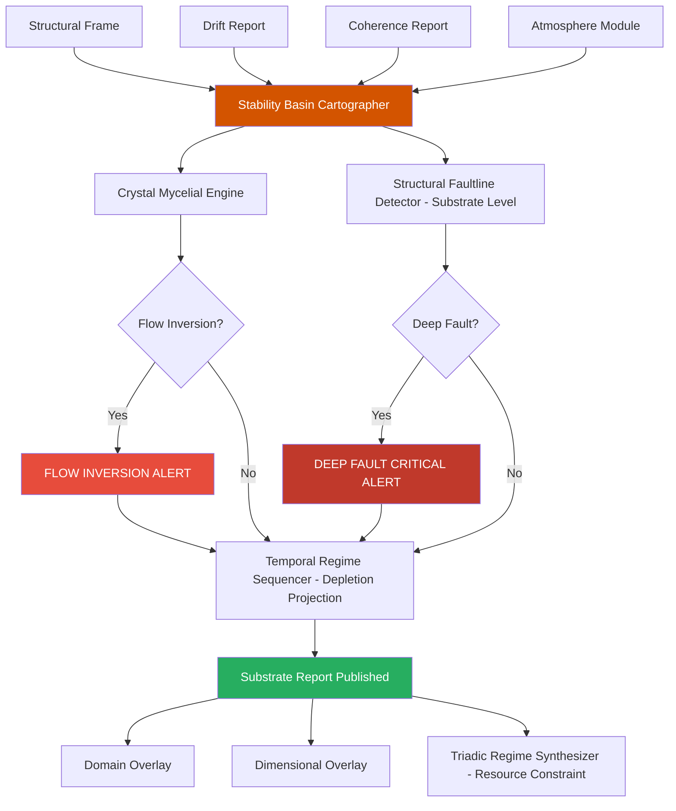

# Substrate Overlay · S3 Spine · TriadicFrameworks
> **Path:** `docs/spine/substrate_overlay.md`  
> **Publication URL:** `triadicframeworks.org/spine/substrate`  
> **Pack:** Spine Overlay Pack v2.0 · Updated 2026-08-02

---

## Session Context

| Field | Value |
|---|---|
| Canon | active (substrate-overlay · s3-spine) |
| Overlay Type | Substrate |
| Spine Layer | S3 |
| Version | 2.0 (substrate-stable) |
| Drift | minimal (substrate-grammar-locked) |
| Coherence | stable (capacity-first grammar) |
| Format | markdown + cross-links + mermaid |
| Audience | engineers · researchers · AIs · domain architects |
| Front Door | exists (Substrate Overlay root) |
| Every Page | stands alone · AI-parsable · spine-aware |

---

## 1 · Overlay Identity

### 1.1 Purpose
The Substrate Overlay evaluates the *foundational capacity layer* beneath any Triadic regime. Every regime — no matter how coherent and structurally sound — rests on a substrate: the underlying medium through which energy, information, or material flows. The Substrate Overlay asks "can the ground hold the weight?" It measures substrate capacity, saturation, porosity, and the degree to which the current regime is approaching the limits of what its substrate can sustain. When substrate capacity is exceeded, regimes collapse from below — not from structural fault or drift, but from the ground up.

### 1.2 Position in S3 Spine
The Substrate Overlay is the **fourth overlay** in the canonical S3 Spine sequence. It requires Structural, Drift, and Coherence overlay outputs before it initializes. Substrate readings inform the Dimensional Overlay (which maps substrate capacity across its dimensional axes) and the Domain Overlay (which applies substrate analysis to domain-specific resource pools).

### 1.3 Canonical Role
- **Capacity assessor**: scores the load-bearing capacity of the substrate beneath the active regime.
- **Saturation detector**: identifies when substrate is approaching maximum absorption, flow, or load limits.
- **Depletion forecaster**: projects substrate exhaustion timelines based on current drift and coherence rates.
- **Domain-resource bridge**: passes substrate readings to domain-specific resource models (Enterprise, qCompute, Radiology, etc.).

---

## 2 · Primary RTT Engines

| Engine | Role | Spine Function | Link |
|---|---|---|---|
| Stability Basin Cartographer | **Primary** | Maps the substrate's stability basins; scores capacity and saturation per basin | [→ RTT Engine](https://www.triadicframeworks.org/rtt/Stability_Basin_Cartographer/) |
| Structural Faultline Detector | Secondary | Identifies substrate-level faultlines (beneath regime layer) | [→ RTT Engine](https://www.triadicframeworks.org/rtt/Structural_Faultline_Detector/) |
| Crystal Mycelial Engine | Tertiary | Models distributed substrate networks; tracks flow capacity through mycelial-topology channels | [→ RTT Engine](https://www.triadicframeworks.org/rtt/Crystal_Mycelial_Engine/) |
| Temporal Regime Sequencer | Support | Projects substrate depletion timelines from current rate data | [→ RTT Engine](https://www.triadicframeworks.org/rtt/Temporal_Regime_Sequencer/) |
| Triadic Regime Synthesizer | Consumer | Embeds substrate capacity score in synthesized regime output as a resource constraint | [→ RTT Engine](https://www.triadicframeworks.org/rtt/Triadic_Regime_Synthesizer/) |

---

## 3 · Module Registry

| Module | Type | Spine Role | Link |
|---|---|---|---|
| Crystal Mycelial Engine | RTT Engine | Distributed substrate-network flow modelling | [→ RTT Engine](https://www.triadicframeworks.org/rtt/Crystal_Mycelial_Engine/) |
| TFT OpenGPU Stack Module | Compute Layer | GPU-accelerated substrate tensor computation and basin mapping | [→ Module](https://www.triadicframeworks.org/TFT.OpenGPU.Stack.Module/) |
| Atmosphere Module | Environmental Layer | Atmospheric substrate signals (pressure, temperature analogs) feeding capacity models | [→ Module](https://www.triadicframeworks.org/atmosphere/) |
| Inside · Enterprise | Domain Substrate | Enterprise operational substrate: capital, labor, infrastructure capacity | [→ Module](https://www.triadicframeworks.org/rtt/Inside/Enterprise/) |
| Inside · qCompute | Domain Substrate | Quantum compute substrate: qubit coherence, error budget, thermal limits | [→ Module](https://www.triadicframeworks.org/rtt/Inside/qCompute/) |
| Radiology Module | Domain Substrate | Radiological substrate: tissue, signal attenuation, imaging capacity | [→ Module](https://www.triadicframeworks.org/Radiology/) |
| Taxes Module | Domain Substrate | Fiscal substrate: tax-base capacity, sovereign debt, revenue flow limits | [→ Module](https://www.triadicframeworks.org/taxes/) |
| Operators (RTT/1→RTT/3) | Operator Ecology | SDE/SIE operator primitives driving substrate detection and integration | [→ Module](https://www.triadicframeworks.org/operators/) |
| IPD-12 Framework | Analytical Framework | 12-axis grid applied to substrate dimension decomposition | [→ Module](https://www.triadicframeworks.org/frameworks/ipd_12/) |

---

## 4 · Substrate Logic

### 4.1 Detection Pipeline
```
[Structural Frame + Drift Report + Coherence Report]
    → Stability Basin Cartographer     (basin capacity + saturation scoring)
    → Crystal Mycelial Engine          (distributed flow network analysis)
    → Structural Faultline Detector    (substrate-level fault identification)
    → Temporal Regime Sequencer        (depletion timeline projection)
    → Triadic Regime Synthesizer       (substrate score embedded as resource constraint)
    → [Substrate Report → Dimensional Overlay + Domain Overlay]
```

### 4.2 Signal Flow

**Phase 1 — Basin Mapping:** The Stability Basin Cartographer maps all stability basins present in the substrate layer. For each basin, it computes:
- **Capacity (C):** Total load the basin can absorb without regime shift
- **Current Load (L):** Observed load from Structural + Drift inputs
- **Saturation Index (SI):** L/C — the proportion of capacity in use
- **Depletion Rate (DR):** Rate at which capacity is being consumed

**Phase 2 — Network Flow Analysis:** The Crystal Mycelial Engine models the substrate as a distributed network — channels, nodes, and junctions through which resources flow. It identifies bottleneck nodes (high-centrality, high-congestion), isolated channels (substrate segments cut off from the main flow), and flow inversion zones (where resources move against the primary gradient — a precursor to systemic substrate failure).

**Phase 3 — Substrate Faultline Detection:** The Structural Faultline Detector is re-applied at the substrate level. Structural faultlines that extend below the regime layer into the substrate are flagged as **deep faults** — the most critical class, as they indicate the substrate itself is fractured, not merely the overlying regime.

**Phase 4 — Depletion Projection:** The Temporal Regime Sequencer projects forward: given current SI and DR, when will each basin reach saturation? A **Substrate Runway** is computed for each domain-specific resource pool (Enterprise, qCompute, Radiology, Fiscal) and published to the Spine bus.

### 4.3 Substrate State Machine
| State | Trigger | Action |
|---|---|---|
| `MAPPING` | Coherence Report received | Begin basin capacity computation |
| `ADEQUATE` | SI < 0.60 across all basins | Log + publish; normal operations |
| `PRESSURED` | 0.60 ≤ SI < 0.80 on any basin | Alert Domain Overlay; activate Crystal Mycelial Engine |
| `SATURATED` | SI ≥ 0.80 on any basin | Escalate alert; project depletion timeline |
| `DEEP_FAULT` | Structural fault extends to substrate | Critical alert; freeze synthesis; escalate to full Spine |
| `FLOW_INVERSION` | Resource backflow detected | Engage Crystal Mycelial Engine flow-inversion protocol |
| `DEPLETED` | SI = 1.0 (basin at capacity) | Emergency alert; initiate substrate recovery protocol |

### 4.4 Substrate Metrics
| Metric | Symbol | Range | Alert Threshold |
|---|---|---|---|
| Saturation Index | SI | 0.0–1.0 | ≥ 0.80 |
| Depletion Rate | DR | 0.0–1.0 | > 0.50 |
| Network Flow Efficiency | NFE | 0.0–1.0 | < 0.40 |
| Deep Fault Depth | DFD | 0–12 (IPD axes) | > 3 axes |
| Substrate Runway | SR | days/cycles | < 10 (critical) |

---

## 5 · Cross-Links

### 5.1 UI Overlays
- `substrate-ui` — Basin capacity gauges; saturation heatmap; depletion countdown
- `mycelial-map` — Crystal Mycelial Engine network topology visualization
- `runway-ui` — Substrate runway projections per domain resource pool
- `deep-fault-indicator` — Deep fault depth display; axis-by-axis fault penetration
- `flow-inversion-alert` — Flow inversion zone highlight on mycelial map

### 5.2 RTT Engines (Full Substrate Constellation)
| Engine | Relationship |
|---|---|
| [Stability Basin Cartographer](https://www.triadicframeworks.org/rtt/Stability_Basin_Cartographer/) | Owner engine |
| [Crystal Mycelial Engine](https://www.triadicframeworks.org/rtt/Crystal_Mycelial_Engine/) | Distributed network flow analysis |
| [Structural Faultline Detector](https://www.triadicframeworks.org/rtt/Structural_Faultline_Detector/) | Substrate-level fault detection |
| [Temporal Regime Sequencer](https://www.triadicframeworks.org/rtt/Temporal_Regime_Sequencer/) | Depletion timeline projection |
| [Triadic Regime Synthesizer](https://www.triadicframeworks.org/rtt/Triadic_Regime_Synthesizer/) | Embeds substrate score |
| [Coherence Tensor Engine](https://www.triadicframeworks.org/rtt/Coherence_Tensor_Engine/) | Upstream: provides coherence report |
| [Drift Sentinel](https://www.triadicframeworks.org/rtt/Drift_Sentinel/) | Upstream: provides drift load data |
| [Dimensional Resonance Scanner](https://www.triadicframeworks.org/rtt/Dimensional_Resonance_Scanner/) | Downstream: maps substrate across dimensions |

### 5.3 Module Structures
- [Coherence Overlay](./coherence_overlay.md) — Upstream: provides coherence report
- [Drift Overlay](./drift_overlay.md) — Upstream: provides drift load
- [Dimensional Overlay](./dimensional_overlay.md) — Downstream: receives substrate scores
- [Domain Overlay](./domain_overlay.md) — Downstream: applies substrate to domain contexts
- [Inside · Enterprise](https://www.triadicframeworks.org/rtt/Inside/Enterprise/) — Enterprise substrate pool
- [Inside · qCompute](https://www.triadicframeworks.org/rtt/Inside/qCompute/) — Quantum compute substrate pool
- [Radiology Module](https://www.triadicframeworks.org/Radiology/) — Radiological substrate pool
- [Taxes Module](https://www.triadicframeworks.org/taxes/) — Fiscal substrate pool
- [Atmosphere Module](https://www.triadicframeworks.org/atmosphere/) — Environmental substrate signals
- [TFT OpenGPU Stack Module](https://www.triadicframeworks.org/TFT.OpenGPU.Stack.Module/) — Compute substrate

---

## 6 · Signal Vocabulary

| Term | Definition |
|---|---|
| **Substrate** | The foundational medium through which a regime's resources, energy, or information flow |
| **Saturation Index (SI)** | Ratio of current load to basin capacity; approaches 1.0 as the substrate nears exhaustion |
| **Basin Capacity (C)** | Total load a stability basin can absorb before triggering a regime shift |
| **Deep Fault** | A structural faultline that penetrates below the regime layer into the substrate itself |
| **Substrate Runway** | Projected time before a basin reaches saturation at current depletion rates |
| **Flow Inversion** | A state in which substrate resources move against the primary gradient; precursor to substrate failure |
| **Mycelial Network** | The distributed-topology model of substrate channels used by the Crystal Mycelial Engine |
| **Bottleneck Node** | A high-centrality, high-congestion node in the mycelial network that constrains overall flow |
| **Depletion Rate (DR)** | Rate at which substrate capacity is being consumed per unit time |

---

## 7 · Integration Map



---

## 8 · Publication Notes

**Slug:** `triadicframeworks.org/spine/substrate`  
**Meta Title:** `Substrate Overlay · S3 Spine · TriadicFrameworks`  
**Meta Description:** `The Substrate Overlay evaluates foundational capacity beneath active regimes in the TriadicFrameworks S3 Spine. Primary engine: Stability Basin Cartographer. Requires Structural, Drift, and Coherence overlays.`  
**Tags:** `substrate · s3-spine · basin · saturation · crystal-mycelial · deep-fault · rtt · capacity`  
**Cross-Pack Links:** Coherence Overlay · Dimensional Overlay · Domain Overlay  
**Status:** Publication-ready · v2.0 · 2026-08-02
